# Raw data
```{r eval=FALSE}
data <- read.csv("/home/bambrozi/2_CORTISOL/Data/T4_Elora_Data_04_25_2024.csv")

# Replace "treated" with NA
data$T4Cortisol[data$T4Cortisol == "treated" | data$T4Cortisol == "Treated at T2" | data$T4Cortisol == "treated at T2"] <- NA
# Convert the column to numeric, coercing non-numeric values to NA
data$T4Cortisol <- as.numeric(as.character(data$T4Cortisol))
#Filtering only the lines with values
data <- data[!is.na(data$T4Cortisol),]
#creating new data file cleaned  
write.csv(data, "/home/bambrozi/2_CORTISOL/Data/data_clean.csv", row.names = F)

print(data)
```

# Continuous Phenotype

```{r eval=FALSE}
# Summary Statistics
summary(data$T4Cortisol)
# Histogram
hist(data$T4Cortisol, breaks = 20, main = "Histogram of T4 Cortisol", xlab = "T4 Cortisol")
# Boxplot
boxplot(data$T4Cortisol, main = "Boxplot of T4 Cortisol", ylab = "T4 Cortisol")
# Density Plot
plot(density(data$T4Cortisol), main = "Density Plot of T4 Cortisol", xlab = "T4 Cortisol", ylab = "Density")
# Calculate the theoretical quantiles
qqnorm(data$T4Cortisol, main = "QQ Plot of T4Cortisol", xlim = c(min(qqnorm(data$T4Cortisol)$x), max(qqnorm(data$T4Cortisol)$x)), ylim = c(min(qqnorm(data$T4Cortisol)$y), max(qqnorm(data$T4Cortisol)$y) + 2 * IQR(qqnorm(data$T4Cortisol)$y)))
# Add the QQ line
qqline(data$T4Cortisol, col = "red")
```


**Summary statistics**


**Histogram**


**Density**


**Box_Plot**


**qq_Plot**


**Shapiro-Wilk normality test**


## Categorical Phenotype

I received from Umesh a e-mail informing the three categories that the animals could be sorted based on their cortisol concentration.


```{r eval=FALSE}

data$Categorical <- ifelse(data$T4Cortisol >= 956, "H", 
                           ifelse(data$T4Cortisol <= 190.8, "L", "M"))

table(data$Categorical)
library(ggplot2)

# Reorder the levels of the 'Categorical' column
data$Categorical <- factor(data$Categorical, levels = c("L", "M", "H"))

# Create the histogram with reordered categories
ggplot(data, aes(x = Categorical, fill = Categorical)) +
  geom_bar() +
  labs(title = "Histogram of T4Cortisol by Category",
       x = "Category",
       y = "Frequency") +
  theme_minimal()

# Create the histogram
ggplot(data, aes(x = T4Cortisol, fill = Categorical)) +
  geom_histogram(binwidth = 50, color = "black", alpha = 0.7) + # Adjust binwidth as needed
  labs(title = "Histogram of T4Cortisol with Color by Category",
       x = "T4 Cortisol",
       y = "Frequency",
       fill = "Category") +
  scale_fill_manual(values = c("H" = "red", "M" = "blue", "L" = "green")) + # Adjust colors if needed
  theme_minimal()

# Create the density plot
ggplot(data, aes(x = T4Cortisol, fill = Categorical)) +
  geom_density(alpha = 0.3) +
  labs(title = "Density Plot of T4Cortisol with Color by Category",
       x = "T4Cortisol",
       y = "Density",
       fill = "Category") +
  scale_fill_manual(values = c("H" = "red", "M" = "blue", "L" = "green")) + # Adjust colors if needed
  theme_minimal()

# Create a density plot
ggplot(data, aes(x = T4Cortisol)) +
  geom_density() +
  geom_vline(xintercept = c(956, 190.8), linetype = "dashed", color = "red") +
  labs(title = "Density Plot of T4Cortisol with Vertical Lines",
       x = "T4Cortisol",
       y = "Density") +
  theme_minimal()
```

The animals were sorted in these three categories 
>H = Hight
>M = Medium
>L = Low


The individuals frequency distribution in theese categories are shown in the plots below


## Removing "outliers"

Observing the previous plots I tried to **remove the "outliers"** phenotypes above 1250, but the outcome from Shapiro test is still indicating no normality of the data.

```{r eval=FALSE}
library(tidyverse)

data_no_out <- filter(data, T4Cortisol < 1250)

# Create QQ plot
qqnorm(data_no_out$T4Cortisol, main = "QQ Plot of T4Cortisol", xlab = "Theoretical Quantiles", ylab = "Sample Quantiles")
qqline(data$T4Cortisol, col = "red")

boxplot(data_no_out$T4Cortisol, main = "Boxplot of T4 Cortisol", ylab = "T4 Cortisol")

hist(data_no_out$T4Cortisol, breaks = 20, main = "Histogram of T4 Cortisol", xlab = "T4 Cortisol")

shapiro.test(data$T4Cortisol)
```


# GENOTYPES

Lucas Alcântara sent me the path to the genotype and pedigree files:
/data/cgil/daiclu/6_Data/database/public_output/bruno


In this folder we found the following files:

<ul>
<li>**bruno_gntps.txt**: the file with the genotypes in  **012 format**
<li>**bruno_ids.csv**: file with elora_id, cdn_id, iid
<li>**bruno_ped.id.csv**: pedigree with cdn_id
<li>**bruno_ped.iid.csv**: pedigree with iid
</ul>

I made a copy of this files in a folder called **Raw_files**:

<span style="color: blue;">/home/bambrozi/2_CORTISOL/RawFiles</span>

This directory has two sub-directories:
<ul>
<li> Genotypes
<li> Pedigree
</ul>


## Transforming the Genotypes in 012 format to plink format

To perfome this I used two codes

1) Add "column names"
```{bash eval=F}
sed -i '1i id Call' genotypes.txt
```


2) Recode in python
```{python eval=FALSE, python.reticulate = FALSE}
filename = 'bruno_gntps.txt'

outputFileOpen = open('genoplink.ped','w')


recode = {'0':['C','C'] , '1':['A','C'] , '2':['A','A'] , '5':['0','0'] }
for line in open(filename,'r'):
    if 'Call' in line : continue


    ids, call = line.strip().split()
    genotypes = [ recode[geno012][0] +' '+ recode[geno012][1] for geno012 in call ]


    outputFileOpen.write("%s %s %s %s %s %s %s\n" % ('HO', ids, '0','0','0','-9',' '.join(genotypes)) )

```

Now I have a folder called **/home/bambrozi/2_CORTISOL/Geno_files** with the file named **genoplink.ped**

# GWAS

## Checking with Phenotyped Animals also have Genotype
```{r eval=FALSE}
library(data.table)

pheno <- read.csv("/home/bambrozi/2_CORTISOL/Data/data_clean.csv")
ped <- read.csv("/home/bambrozi/2_CORTISOL/RawFiles/Pedigree/bruno_ids.csv")
geno <- fread("/home/bambrozi/2_CORTISOL/Geno_files/genoplink.ped")
geno <- geno[,c("V2")]

#Bringing cdn_id to my phenotype file
#Generate a index with the match
matching_indices <- match(pheno$ID, ped$elora_id)
# Then, assign 'cdn_id' from 'ped' to 'pheno' where there are matches
pheno$cdn_id <- ifelse(!is.na(matching_indices), ped$cdn_id[matching_indices], NA)

#Making a phenotype file only with genotyped animals
pheno_genotyped <- pheno[pheno$cdn_id %in% geno$V2,] 

#check if all animals in this file are genotyped
checkk <- pheno_genotyped$cdn_id %in% geno$V2
sum(checkk)
```


## Generating a Phenotype file

The phenotype file should have three columns: FID, Animal_id, Phenotype

```{r eval=FALSE}
HO <- rep("HO", 252)

pheno_gwas <- as.data.frame(cbind(HO, pheno_genotyped$cdn_id, pheno_genotyped$T4Cortisol))

colnames(pheno_gwas) <- c("FID", "cdn_id", "cortisol")

pheno_gwas$cdn_id <-  as.numeric(pheno_gwas$cdn_id)
pheno_gwas$cortisol <- round(as.numeric(pheno_gwas$cortisol),2)

write.table(pheno_gwas, "/home/bambrozi/2_CORTISOL/GWAS/pheno_genotyped.txt", quote = F, row.names = F, col.names = T)
```

## Adjusting the SNP_map to .map
```{r eval=FALSE}
map <- fread("/data/cgil/daiclu/6_Data/database/public_output/bruno/DGVsnpinfo.2404.ho")
morgan <- data.frame(X0 = rep(0, 45101))
mapa=as.data.frame(cbind(map$chr, map$snp_name, morgan$X0, map$location))
head(mapa)
write.table(x = mapa, file = "/home/bambrozi/2_CORTISOL/Geno_files/genoplink.map", row.names = FALSE, col.names = FALSE, sep = "\t", quote = FALSE)
```

## Generating the bfiles

```{r eval=FALSE}
system("/home/local/bin/plink --cow --nonfounders --allow-no-sex --keep-allele-order --file /home/bambrozi/2_CORTISOL/Geno_files/genoplink --make-bed --out /home/bambrozi/2_CORTISOL/Geno_files/genoplink")
```

With the code above I generated the bfiles:
<ul>genoplink.bed
<li>genoplink.bim
<li>genoplink.fam
<li>genoplink.log
<li>genoplink.nosex
</ul>


# Quality Control

We ran the code below to perfom the QC

```{bash eval=F}
#!/bin/bash

DATA=/home/bambrozi/2_CORTISOL/Geno_files/genoplink
RESULT=/home/bambrozi/2_CORTISOL/Geno_files_after_QC/genoplink_clean

/home/local/bin/plink \
    --bfile ${DATA} \
    --cow \
    --allow-no-sex \
    --hwe 1e-5 \
    --maf 0.01 \
    --geno 0.1 \
    --mind 0.1 \
    --keep-allele-order \
    --make-bed \
    --out ${RESULT}
    
```


The server screen outcome is shown below.


After the Quality Control we ended up with

<ul>
<li> 252 samples
<li> 42,278 variants (SNPs)
</ul>

# KING

To check for duplicated individuals I performed the KINSHIP analysis using one script from Larissa Braga. Running the King Analysis on Plink.

```{bash eval = FALSE}
#!/bin/bash

DATA=/home/bambrozi/Extrm_ARS1_GrassHill_1/GENOTYPES/ONLY_GRASSHILL_AND_PHENO_after_QC/only_grasshill_and_pheno_clean
RESULT=/home/bambrozi/Extrm_ARS1_GrassHill_1/GENOTYPES/KING/result_king

plink2 \
    --bfile ${DATA} \
    --chr-set 29 \
    --make-king-table \
    --out ${RESULT}
```

This is the output screen on terminal:


The table below is the output <span style="color: blue;">/home/bambrozi/2_CORTISOL/Geno_files_after_KING/result_king.kin0</span> and have pairwise comparisons between all individuals. 


Now we should open in R and check for individuals with more than 0,354, to perform this we can use the code below, also provided by Larissa Braga:

```{r eval=FALSE}
setwd("/home/bambrozi/2_CORTISOL/Geno_files_after_KING")

relatedness="result_king.kin0" ## change accordingly!!

library(data.table)

print(relatedness)
rel=fread(relatedness, h = T)
head(rel)

print("Individuals with different identifications above the cut off of 0.354:")
dup=subset(rel, KINSHIP >= 0.354  & IID1!=IID2)
print(dup)
nrow(dup)

```

So the code above will provide this output if there is any duplicated individual.


**We do not have any duplicated individual**

So the file to be used are those in the directory <span style="color: blue;">/home/bambrozi/2_CORTISOL/Geno_files_after_QC</span>

>files:genoplink_clean

After Quality Control we didn't lost any animal, so we don't need to update our phenotype file

# PCA

Now before performing the PCA analysis we need to change the FID for those individuals that has phenotype = **1** for Nadia.


```{bash eval=F}
#!/bin/bash

DATA=/home/bambrozi/Extrm_ARS1_GrassHill_1/PCA/imput_pca
RESULT=/home/bambrozi/Extrm_ARS1_GrassHill_1/PCA/pca_result

plink \
    --bfile ${DATA} \
    --keep-allele-order \
    --chr-set 29 \
    --pca \
    --out ${RESULT}

```

The PCA output:


## PCA Plot

After generate the Eigenvalues and Eigenvectors I used the code below to generate the PCA Plot

```{r eval=FALSE}
setwd("/home/bambrozi/2_CORTISOL/PCA")

library(ggplot2) 
library(tidyverse)

##
# Visualize PCA results
###

# read in result files
eigenValues <- read_delim("pca_result.eigenval", delim = " ", col_names = F)
eigenVectors <- read_delim("pca_result.eigenvec", delim = " ", col_names = F)

## Proportion of variation captured by each vector
eigen_percent <- round((eigenValues / (sum(eigenValues))*100), 2)


# PCA plot
png("pca-plink.eng.png", width=5, height=5, units="in", res=300)
ggplot(data = eigenVectors) +
  geom_point(mapping = aes(x = X3, y = X4), color = "red", shape = 19, size = 1, alpha = 1) +
  geom_hline(yintercept = 0, linetype="dotted") +
  geom_vline(xintercept = 0, linetype="dotted") +
  labs(x = paste0("Principal component 1 (", eigen_percent[1,1], " %)"),
       y = paste0("Principal component 2 (", eigen_percent[2,1], " %)")) +
  theme_minimal()
dev.off()


# PCA plot with animal ids
png("pca-plink.eng.animals_id.png", width=50, height=50, units="in", res=300)
ggplot(data = eigenVectors) +
  geom_point(mapping = aes(x = X3, y = X4), color = "red", shape = 19, size = 5, alpha = 1) +
  geom_text(mapping = aes(x = X3, y = X4, label = X2), size = 2, hjust = 0, vjust = 0) +  # Add labels for animal IDs
  geom_hline(yintercept = 0, linetype="dotted") +
  geom_vline(xintercept = 0, linetype="dotted") +
  labs(x = paste0("Principal component 1 (", eigen_percent[1,1], " %)"),
       y = paste0("Principal component 2 (", eigen_percent[2,1], " %)")) +
  theme_minimal()
dev.off()
```


# GWAS on GCTA


```{bash eval=F}
#!/bin/bash

DATA=/home/bambrozi/2_CORTISOL/Geno_files_after_QC/genoplink_clean
RESULT=/home/bambrozi/2_CORTISOL/GWAS/GWAS_result
PHENO=/home/bambrozi/2_CORTISOL/GWAS/pheno_genotyped.txt

/home/local/bin/gcta \
    --bfile ${DATA} \
    --mlma-loco \
    --pheno ${PHENO} \
    --autosome-num 29 \
    --autosome \
    --out ${RESULT}

```

This is te output from the code above:


# 5%

## Manhattan Plot - Bonferroni 


```{r eval=FALSE}
gwas<- read.table(file = "/home/bambrozi/2_CORTISOL/GWAS/GWAS_result.loco.mlma", 
                  head=T, stringsAsFactors = F)
gwas$Chr<- as.factor(gwas$Chr)
gwas$logP<- -log10(gwas$p)
rmv<- which(gwas$logP == "NaN")
if (length(rmv) >=1) {gwas <- gwas[-rmv,]}
bonf<- -log10(0.05/nrow(gwas))

library(GHap)
ghap.manhattan(data=gwas,chr="Chr", bp="bp", y="logP", type="p", pch = 20, 
               cex=1, lwd=1, ylab="", xlab="Chromossomes", 
               main="GWAS Cortisol", backcolor="#F5EFE780", chr.ang=0,)
abline(h=(bonf), col="red2")
legend("topleft", col="red2", lwd=2, c("Bonferroni correction"), bty="n")

```

The code above creates a Manhattam Plot, the correction for multiple test is the Bonferroni correction


The code below will save information of Significant SNP.
```{r eval=FALSE}
library(tidyverse)

SNP_sig_bonf <- filter(gwas, logP > bonf)
write.table(SNP_sig_bonf, file = "/home/bambrozi/2_CORTISOL/GWAS/SNP_sig_Bonf.txt", 
            quote = FALSE, sep = "\t", row.names = FALSE, col.names = T)
```

Below we can see the 1 significant SNP for Bonferroni correction.


## FDR


```{r eval=FALSE}

gwas$bh <- p.adjust(gwas$p, method = "BH") #FDR 

```

The code below will create a file with the significant snp for FDR-BH

```{r eval=FALSE}
SNP_sig_BH <- filter(gwas, bh < 0.05)
write.table(SNP_sig_BH, file = "/home/bambrozi/2_CORTISOL/GWAS/SNP_sig_BH.txt", 
            quote = FALSE, sep = "\t", row.names = FALSE, col.names = T)
```

As outcome we can see that the FDR-BH method didn't increase the number of significant SNP.


## Corrected Bonferroni for genome independent segments

Now we are going to apply a correction for multiple testing modifying the Bonferroni test adjusting not for the total number of SNPs but for the number of the independent segments in the genome.

```{r eval=FALSE}
Genome_Assembly_ARS_UCD_1_2 <- read_tsv("/home/bambrozi/2_CORTISOL/GWAS/sequence_report_ARS-UCD1_2.tsv")

library(dplyr)
# Filter the rows and sum the Seq length column
# Assuming your data frame is named Genome_Assembly_ARS_UCD_1_2
L <- Genome_Assembly_ARS_UCD_1_2 %>%
  filter(`UCSC style name` %in% paste0("chr", 1:29)) %>%
  summarise(total_length = sum(`Seq length`)) %>%
  pull(total_length)

# Converting bases to Morgan (1Mb = 1cM (0,01 Morgan))
L_M <- L/10^8

# The Ne measure is based on the article bellow:
Ne <- 66 #(Makanjoula et al., 2020)

NeL <- Ne*L_M

# This is the number of independent segment in the genome.
Me <- (2*NeL)/log10(NeL)


gwas<- read.table(file = "/home/bambrozi/2_CORTISOL/GWAS/GWAS_result.loco.mlma", 
                  head=T, stringsAsFactors = F)

gwas$Chr<- as.factor(gwas$Chr)
gwas$logP<- -log10(gwas$p)
rmv<- which(gwas$logP == "NaN")
if (length(rmv) >=1) {gwas <- gwas[-rmv,]}

bonf<- -log10(0.05/Me)

library(GHap)
ghap.manhattan(data=gwas,chr="Chr", bp="bp", y="logP", type="p", pch = 20, 
               cex=1, lwd=1, ylab="", xlab="Chromossomes", 
               main="GWAS Cortisol", backcolor="#F5EFE780", chr.ang=0,)
abline(h=(bonf), col="red2")
legend("topleft", col="red2", lwd=2, c("Bonferroni corr. for ind. segments"), bty="n")


library(tidyverse)

SNP_sig_bonf_ind_seg <- filter(gwas, logP > bonf)
write.table(SNP_sig_bonf_ind_seg, file = "/home/bambrozi/2_CORTISOL/GWAS/SNP_sig_Bonf_ind_seg.txt", 
            quote = FALSE, sep = "\t", row.names = FALSE, col.names = T)

```


Below we can find the list of significant SNPs after the correction for Multiple Testing


# qqPlot

I performed the qqPlot analysis using the code below:

```{r eval=FALSE}
gwas<- read.table("GWAS_result.loco.mlma", h=T)
ps<- gwas$p
inflation <- function(ps) {
  chisq <- qchisq(1 - ps, 1)
  lambda <- median(chisq) / qchisq(0.5, 1)
  lambda
}
# Calculating the lambda -  the lambda statistic should be close to 1 if
#the points fall within the expected range, or greater than one if 
# the observed p-values are more significant than expected.
inflation(ps)

bonf<- -log10(0.05/nrow(gwas))

gwas$log<- -log10(gwas$p)

gg_qqplot <- function(ps, ci = 0.95) {
  n  <- length(ps)
  df <- data.frame(
    observed = -log10(sort(ps)),
    expected = -log10(ppoints(n)),
    clower   = -log10(qbeta(p = (1 - ci) / 2, shape1 = 1:n, shape2 = n:1)),
    cupper   = -log10(qbeta(p = (1 + ci) / 2, shape1 = 1:n, shape2 = n:1))
  )
  log10Pe <- expression(paste("Expected -log"[10], plain(P)))
  log10Po <- expression(paste("Observed -log"[10], plain(P)))
  ggplot(df) +
    geom_ribbon(
      mapping = aes(x = expected, ymin = clower, ymax = cupper),
      alpha = 0.1
    ) +
    geom_point(aes(expected, observed), shape = 1, size = 3) +
    geom_abline(intercept = 0, slope = 1, alpha = 0.5) +
    # geom_line(aes(expected, cupper), linetype = 2, size = 0.5) +
    # geom_line(aes(expected, clower), linetype = 2, size = 0.5) +
    xlab(log10Pe) +
    ylab(log10Po)
}

## plot -----
gg_qqplot(ps) +
  theme_bw(base_size = 24) +
  annotate(
    geom = "text",
    x = -Inf,
    y = Inf,
    hjust = -0.15,
    vjust = 1 + 0.15 * 3,
    label = sprintf("λ = %.2f", inflation(ps)),
    size = 8
  ) +
  theme(
    axis.ticks = element_line(size = 0.5),
    panel.grid = element_blank()
    # panel.grid = element_line(size = 0.5, color = "grey80")
  )

```

The outcome is the qqplot below, and the lambda value is **$\lambda$ = 1.03**


# VEP - Variant Effect Prediction

After insert all **rsID** on VEP the summary is shown below:


Bellow I'm gonna show the "genome view" for each SNP (variant) recovered from VEP:

<span style="color: red;">**rs42217767**</span>
*ps. this variant wasn't recovered automaticaly by VEP, so I typed the chr and position on the search area of the "genome viewer"* 
  

<span style="color: red;">**rs110031217**</span>
  

<span style="color: red;">**rs110991998**</span>
  

<span style="color: red;">**rs42089058**</span>
  

<span style="color: red;">**rs41644634**</span>
  

<span style="color: red;">**rs41567074**</span>
  

*ps. the unique reference genome available in the VEP is the ARS-UCD1.3, which is not a problem once it is working with the rsID, which for sure is our variant.*


# GALLO 

```{r eval=FALSE}
# GALLO

#import a QTL annotation file
qtl_UCD1_2 <- import_gff_gtf(db_file="/home/bambrozi/2_CORTISOL/GALLO/Animal_QTLdb_release53_cattleARS_UCD1.gff.gz",file_type="gff")

#import a gene annotation file
gene_UDC1_2 <- import_gff_gtf(db_file="/home/bambrozi/2_CORTISOL/GALLO/Bos_taurus.ARS-UCD1.2.110.gtf.gz",file_type="gtf")

#import MARKER files = the GWAS output
gwas <- read.table(file = "/home/bambrozi/2_CORTISOL/GWAS/SNP_sig_Bonf_ind_seg.txt", 
                   head=T, stringsAsFactors = F)

# Assuming "gwas" is your dataframe
gwas <- subset(gwas, select = c(Chr, SNP, bp))


colnames(gwas) <- c("CHR","SNP", "BP")


#FINDING GENES AND QTLs ARROUND THE MARKER

#FINDING GENES
out.genes <- find_genes_qtls_around_markers(db_file= gene_UDC1_2, 
                                            marker_file= gwas, 
                                            method = "gene",
                                            marker = "snp", 
                                            interval = 50000, 
                                            nThreads = NULL)

write.table(out.genes, file = "/home/bambrozi/2_CORTISOL/GALLO/out_genes_50k.txt", 
            quote = FALSE, sep = "\t", row.names = FALSE, col.names = T)

write.csv(out.genes, file = "/home/bambrozi/2_CORTISOL/GALLO/out_genes_50k.csv")

#FINDING QTLs

out.qtl <- find_genes_qtls_around_markers(db_file= qtl_UCD1_2, 
                                          marker_file= gwas, 
                                          method = "qtl",
                                          marker = "snp", 
                                          interval = 50000, 
                                          nThreads = NULL)


write.table(out.qtl, file = "/home/bambrozi/2_CORTISOL/GALLO/out_qtl_50k.txt", 
            quote = FALSE, sep = "\t", row.names = FALSE, col.names = T)

library(tidyverse)
out.qtl.clean <- select(out.qtl, c("CHR", "SNP", "BP", "QTL_type", "start_pos", "end_pos","QTL_ID"))
write.csv(out.qtl.clean, file = "/home/bambrozi/2_CORTISOL/GALLO/out_qtl_50k_clean.csv")


```


Dowloading the .gtf file from Ensembl
<https://useast.ensembl.org/info/data/ftp/index.html>

Downloading the .gff file from AnimalQTLdb
<https://www.animalgenome.org/cgi-bin/QTLdb/index>


The GALLO output are bellow:

**For GENES**
```{r echo=FALSE}
# Read the CSV file into a data frame
data <- read.csv("C:/Users/galin/OneDrive - University of Guelph/0.Post doc/4_Cortisol/Git_Cortisol/out_genes_50k.csv")

# Print the table using knitr::kable
knitr::kable(data)

```

**FOR QTLs**
```{r echo=FALSE}
# Read the CSV file into a data frame
data <- read.csv("C:/Users/galin/OneDrive - University of Guelph/0.Post doc/4_Cortisol/Git_Cortisol/out_qtl_50k_clean.csv")

# Print the table using knitr::kable
knitr::kable(data)

```

## QTL annotation on GALLO

**QTL type**
```{r eval=FALSE}
#GALLO
par(mar=c(8,20,8,8))
plot_qtl_info(out.qtl, qtl_plot = "qtl_type", cex=1)
```

  

**QTL type**
```{r eval=FALSE}
#GALLO
par(mar=c(10,20,10,10))
plot_qtl_info(out.qtl, qtl_plot = "qtl_name", qtl_class="Reproduction")

par(mar=c(10,20,10,10))
plot_qtl_info(out.qtl, qtl_plot = "qtl_name", qtl_class="Health")
```

**Reproduction**
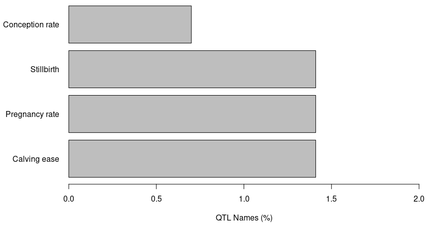  

**Health**
  

## QTL enrichment on GALLO

```{r eval=FALSE}
#GALLO
#QTL enrichment analysis 
out.enrich_qtl_name <-qtl_enrich(qtl_db= qtl_UCD1_2, 
                                 qtl_file= out.qtl, qtl_type = "Name",
                                 enrich_type = "genome", chr.subset = NULL, 
                                 padj = "fdr",nThreads = 2)


# Sorting the dataframe in ascending order of adj.pval
sorted_df <- out.enrich_qtl_name[order(out.enrich_qtl_name$adj.pval), ]

write.csv(sorted_df,"/home/bambrozi/2_CORTISOL/GALLO/out_enrich_qtl_genome_name.csv")

out.enrich_qtl_type <-qtl_enrich(qtl_db= qtl_UCD1_2, 
                                 qtl_file= out.qtl, qtl_type = "QTL_type",
                                 enrich_type = "genome", chr.subset = NULL, 
                                 padj = "fdr",nThreads = 2)

sorted_df_type <- out.enrich_qtl_type[order(out.enrich_qtl_type$adj.pval), ]
write.csv(out.enrich_qtl_type,"/home/bambrozi/2_CORTISOL/GALLO/out_enrich_qtl_genome_type.csv")

#Plots

#Name

#Creating a new ID composed by the trait and the chromosome
out.enrich_qtl_name$ID<-paste(out.enrich_qtl_name$QTL," - ","CHR",out.enrich_qtl_name$CHR,sep="")

#Match the QTL classes and filtering the Reproduction related QTLs
out.enrich.filtered<-out.enrich_qtl_name[which(out.enrich_qtl_name$adj.pval<0.05),]

#Plotting the enrichment results for the QTL enrichment analysis
QTLenrich_plot(out.enrich.filtered, x="ID", pval="adj.pval")


#Type

#Creating a new ID composed by the trait and the chromosome
out.enrich_qtl_type$ID<-paste(out.enrich_qtl_type$QTL," - ","CHR",out.enrich_qtl_type$CHR,sep="")

#Match the QTL classes and filtering the Reproduction related QTLs
out.enrich.filtered_type<-out.enrich_qtl_type[which(out.enrich_qtl_type$adj.pval<0.05),]

#Plotting the enrichment results for the QTL enrichment analysis
QTLenrich_plot(out.enrich.filtered_type, x="ID", pval="adj.pval")


 
```

**QTL Enrichment outcomes**

**Enrichment by name** (enrichment analysis will be performed for each trait individually)
```{r echo=FALSE}
# Read the CSV file into a data frame
data <- read.csv("C:/Users/galin/OneDrive - University of Guelph/0.Post doc/4_Cortisol/Git_Cortisol/out_enrich_qtl_genome_name.csv")

# Print the table using knitr::kable
knitr::kable(data)

```

  

**Enrichment by QTL_type** (enrichment processes performed for the QTL classes)
```{r echo=FALSE}
# Read the CSV file into a data frame
data <- read.csv("C:/Users/galin/OneDrive - University of Guelph/0.Post doc/4_Cortisol/Git_Cortisol/out_enrich_qtl_genome_type.csv")

# Print the table using knitr::kable
knitr::kable(data)

```


 

# GPROFILER

online version: <https://biit.cs.ut.ee/gprofiler/gost>

I got a script from Julia Rodrigues about the R package GPROFILER to perform an enrichment of my Genes.
```{r eval=FALSE}
### enriquecimento genico
#install.packages("gprofiler2")
library(gprofiler2)

#Para conferir a lista de organism -> https://biit.cs.ut.ee/gprofiler/page/organism-list

#Obs: eu entro com os ids ENSOAR...
query <- read.table ("/home/bambrozi/2_CORTISOL/GALLO/out_genes_50k.txt", header = T)
query <- query[,c("gene_id")]

gene_enrich <- gost(
  query,
  organism = "btaurus", 
  ordered_query = FALSE,
  multi_query = FALSE,
  significant = TRUE,
  exclude_iea = FALSE,
  measure_underrepresentation = FALSE,
  evcodes = TRUE,
  user_threshold = 0.05,
  correction_method = c("fdr"),
  domain_scope = c("annotated"),
  numeric_ns = "",
  sources = NULL,
  as_short_link = FALSE,
  highlight = FALSE
)


#str(gene_enrich) # para ver o formato dos meus dados

#selecionando apenas as informações da lista que me interessam para fazer meu data.frame 
result_enrich <- data.frame(gene_enrich$result)
result_enrich <- data.frame(Category = result_enrich$source,
                            ID = result_enrich$term_id,
                            Term = result_enrich$term_name,
                            adj_pvalue = result_enrich$p_value,
                            id_ensembl = result_enrich$intersection)

write.table(result_enrich,"/home/bambrozi/2_CORTISOL/GPROFILER/gene_enrich.txt", col.names=TRUE, row.names=FALSE, sep="\t", quote=F)
write.csv(result_enrich,"/home/bambrozi/2_CORTISOL/GPROFILER/gene_enrich.csv")
```

Below we can se the significant terms of this enrichment (output):

```{r echo=FALSE}
# Read the CSV file into a data frame
data <- read.csv("C:/Users/galin/OneDrive - University of Guelph/0.Post doc/4_Cortisol/Git_Cortisol/gene_enrich.csv")

# Print the table using knitr::kable
knitr::kable(data)

```


## GPROFILER ON-LINE

From the online version of GPROFILER i got the following results.

**Legend**


Additionaly I perfomed a another version of this analysis but with **no eletronic GO annotation**


## Terms distribution Pie Chart
Now I'm gonna make a pie chart with the categories

```{r eval=FALSE}
library(ggplot2)

# Assuming sig_enrich$Category contains the categories
category_counts <- table(result_enrich$Category)

# Create a pie chart
pie_chart <- ggplot(data = NULL, aes(x = factor(1), fill = names(category_counts), y = as.numeric(category_counts))) +
  geom_bar(stat = "identity", width = 1) +
  coord_polar(theta = "y") +
  labs(title = "Distribution among terms",
       x = NULL,
       y = NULL,
       fill = "Category") +
  theme_void() +
  theme(legend.position = "right")

# Print the pie chart
print(pie_chart)

```

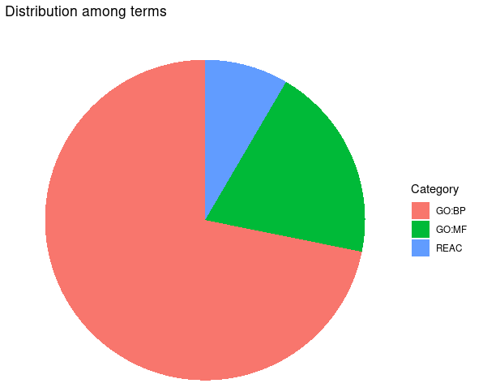


# Haplotype Blocks

First I need to generate the .ped file
```{bash eval=F}
#!/bin/bash

DATA=/home/bambrozi/2_CORTISOL/Geno_files_after_QC/genoplink_clean
RESULT=/home/bambrozi/2_CORTISOL/HAPLOBLOCK/inter_file

plink \
    --bfile ${DATA} \
    --cow \
    --recode \
    --out ${RESULT}
```


Second, is necessary to convert the .ped file to Linkage format:

```{bash eval=F}
#!/bin/bash

DATA=/home/bambrozi/2_CORTISOL/HAPLOBLOCK/inter_file
RESULT=/home/bambrozi/2_CORTISOL/HAPLOBLOCK/hapblock_in

plink \
    --file ${DATA} \
    --cow \
    --recode HV \
    --out ${RESULT}
```

The code above will generate a pair of files **.ped** and **.info** for each chromosome

I ran the **haploview** only for chromosome 11, 22, 26, 28 that are when the significant SNP are located.

As the LD Plot bring the SNP ordered, first I looked at */home/bambrozi/2_CORTISOL/GWAS/SNP_sig_Bonf_ind_seg.txt*, to know the SNP position, and then compare with the **Check Markers** tab in the haploview <span style="background-color:yellow">SNP position</span>
 x <span style="background-color:lightblue">SNP#</span> in plot
 
 


```{r echo=FALSE}
# Read the CSV file into a data frame
data <- read.csv("C:/Users/galin/OneDrive - University of Guelph/0.Post doc/4_Cortisol/Git_Cortisol/marker_info_gwas_haploview.csv")

# Print the table using knitr::kable
knitr::kable(data)

```

<span style="color: red;">The two significant SNPs from chromosome 26 fell within a Haploblock</span>.

**Chr 11** (SNP 680)
  

**Chr 22** (SNP 88)
  

**Chr 22** (SNP 762)
  

**Chr 26** (SNP 296 and 297)
  

**Chr 28** (SNP 701)
  


## BLOCK 10 in Chr 26

As we found an haploblock on chromosome 26 I decided take a look inside this block. So, on Haploview I checked the name and position of the first SNP of this block (292) and the last (300).

```{r echo=FALSE}
# Read the CSV file into a data frame
data <- read.csv("C:/Users/galin/OneDrive - University of Guelph/0.Post doc/4_Cortisol/Git_Cortisol/Block10_chr26_onlysnp.csv")

# Print the table using knitr::kable
knitr::kable(data)

```

Then I checked on **NCBI's Genome Data Viewer** which genes are inside this block, adding **50k before** the first SNP and **50K after** the last SNP.

This interval has 426,069bp and has this genes inside:

<ul>
<li>DNTT
<li>OPALIN
<li>TLL2
<li>TM9SF3
<li>PIK3AP1
</ul>

As you can see in the image below:

  


The genes *TLL2*, *TM9SF3* and *PIK3AP1* already were in the gene list from GALLO, but the genes **DNTT** and **OPALIN** were new!

I performed a GPROFILER analysis only for these genes spotted in this Block 10.


# 5 - 15%

After check the outcome for 5% of significance for SNPs, Prof. Flávio asked me to carry out again considering the interval between 5% and 15% of significance.

## Corrected Bonferroni for genome independent segments

Now we are going to apply a correction for multiple testing modifying the Bonferroni test adjusting not for the total number of SNPs but for the number of the independent segments in the genome.

```{r eval=FALSE}
Genome_Assembly_ARS_UCD_1_2 <- read_tsv("/home/bambrozi/2_CORTISOL/GWAS/sequence_report_ARS-UCD1_2.tsv")

library(dplyr)
# Filter the rows and sum the Seq length column
# Assuming your data frame is named Genome_Assembly_ARS_UCD_1_2
L <- Genome_Assembly_ARS_UCD_1_2 %>%
  filter(`UCSC style name` %in% paste0("chr", 1:29)) %>%
  summarise(total_length = sum(`Seq length`)) %>%
  pull(total_length)

# Converting bases to Morgan (1Mb = 1cM (0,01 Morgan))
L_M <- L/10^8

# The Ne measure is based on the article bellow:
Ne <- 66 #(Makanjoula et al., 2020)

NeL <- Ne*L_M

# This is the number of independent segment in the genome.
Me <- (2*NeL)/log10(NeL)


gwas<- read.table(file = "/home/bambrozi/2_CORTISOL/GWAS/GWAS_result.loco.mlma", 
                  head=T, stringsAsFactors = F)

gwas$Chr<- as.factor(gwas$Chr)
gwas$logP<- -log10(gwas$p)
rmv<- which(gwas$logP == "NaN")
if (length(rmv) >=1) {gwas <- gwas[-rmv,]}

bonf05<- -log10(0.05/Me)
bonf15<- -log10(0.15/Me)

library(GHap)
ghap.manhattan(data=gwas,chr="Chr", bp="bp", y="logP", type="p", pch = 20, 
               cex=1, lwd=1, ylab="", xlab="Chromossomes", 
               main="GWAS Cortisol", backcolor="#F5EFE780", chr.ang=0,)
abline(h=(bonf05), col="black")
abline(h=(bonf15), col="red2")
legend("topleft", inset=c(0.05, 0.05), col="red2", lwd=2, 
       legend=c("15% sig. Bonferroni corr. for ind. segments"), bty="n")
legend("topleft", inset=c(0.05, 0.10), col="black", lwd=2, 
       legend=c("5% sig. Bonferroni corr. for ind. segments"), bty="n")

library(tidyverse)

#Recovering the significant SNPs > <5%
SNP_sig_bonf_ind_seg_5 <- filter(gwas, logP > bonf05)
write.csv(SNP_sig_bonf_ind_seg_5, file = "/home/bambrozi/2_CORTISOL/GWAS/SNP_sig_Bonf_ind_seg_5.csv")


#Recovering the significant SNPs > 15% and <5%
SNP_sig_bonf_ind_seg_5_15 <- filter(gwas, logP > bonf15 & logP < bonf05)
write.csv(SNP_sig_bonf_ind_seg_5_15, file = "/home/bambrozi/2_CORTISOL/GWAS/SNP_sig_Bonf_ind_seg_5_15.csv")


#Recovering the significant SNPs > 15% 
SNP_sig_bonf_ind_seg_15 <- filter(gwas, logP > bonf15)
write.csv(SNP_sig_bonf_ind_seg_15, file = "/home/bambrozi/2_CORTISOL/GWAS/SNP_sig_Bonf_ind_seg_15.csv")
```


Below we can find the list of significant SNPs after the correction for Multiple Testing


```{r echo=FALSE}
# Read the CSV file into a data frame
data <- read.csv("C:/Users/galin/OneDrive - University of Guelph/0.Post doc/4_Cortisol/Git_Cortisol/SNP_sig_Bonf_ind_seg_COMPARISON.csv")

# Print the table using knitr::kable
knitr::kable(data)

```

To make easier to check the name of the significant SNPs I made the following Manhattan Plot

```{r eval=FALSE}
# Prepare the dataset
don <- gwas %>% 
  group_by(Chr) %>% 
  summarise(chr_len = max(bp)) %>% 
  mutate(tot = cumsum(as.numeric(chr_len)) - as.numeric(chr_len)) %>%
  select(-chr_len) %>%
  left_join(gwas, ., by = c("Chr" = "Chr")) %>%
  arrange(Chr, bp) %>%
  mutate(BPcum = as.numeric(bp) + tot) %>%
  mutate(is_highlight = ifelse(logP > bonf15, "yes", "no")) %>%
  mutate(is_annotate = ifelse(logP > bonf15, "yes", "no"))

# Remove rows with missing BPcum values
don <- don %>% filter(!is.na(BPcum))

# Prepare X axis
axisdf <- don %>% 
  group_by(Chr) %>% 
  summarize(center = (max(BPcum) + min(BPcum)) / 2)

# Find the maximum logP value for setting y-axis limits
max_logP <- max(don$logP, na.rm = TRUE)

# Make the plot
ggplot(don, aes(x = BPcum, y = logP)) +
  geom_point(aes(color = as.factor(Chr)), alpha = 0.8, size = 1.3) +
  scale_color_manual(values = rep(c("grey", "skyblue"), 22)) +
  scale_x_continuous(label = axisdf$Chr, breaks = axisdf$center) +
  scale_y_continuous(expand = c(0, 0), limits = c(0, max_logP + 1)) + # Set y-axis limit
  geom_hline(yintercept = bonf05, color = "black") +  # Add horizontal line for bonf05
  geom_hline(yintercept = bonf15, color = "red2") +   # Add horizontal line for bonf15
  geom_point(data = subset(don, is_highlight == "yes"), color = "orange", size = 2) +
  geom_text_repel(data = subset(don, is_annotate == "yes"), aes(label = SNP), size = 2) +
  annotate("text", x = Inf, y = Inf, label = "15% sig. Bonferroni corr. for ind. segments", 
           color = "red2", hjust = 1.1, vjust = 2, size = 3) +
  annotate("text", x = Inf, y = Inf, label = "5% sig. Bonferroni corr. for ind. segments", 
           color = "black", hjust = 1.1, vjust = 3.5, size = 3) +
  theme_bw() +
  theme(
    legend.position = "none",
    panel.border = element_blank(),
    panel.grid.major.x = element_blank(),
    panel.grid.minor.x = element_blank()
  ) +
  labs(title = "GWAS Cortisol", x = "Chromosomes", y = "-log10(p)")

```


Generating a file with the GWAS output and rsID  

```{r eval=FALSE}
library(tidyverse)

# Extracting SNP names to use in the SNPChimp
SNP_NAMES <- SNP_sig_bonf_ind_seg_15 %>% pull(SNP)
SNP_NAMES <- paste(SNP_NAMES, collapse = ", ")
print(SNP_NAMES)

# Copy this printed names and paste on SNPChimp

# Opening the SNPChimp output in R
rsID <- read_tsv("/home/bambrozi/2_CORTISOL/GWAS/SNPchimp_result_ind_seg_15.tsv")
rsID <- rsID[,c("rs","SNP_name")]

#Merging in one file the GWAS output and rsID
SNP_rsID_sig_bonf_ind_seg_15 <- merge(SNP_sig_bonf_ind_seg_15, rsID, by.x = "SNP", by.y = "SNP_name")
SNP_rsID_sig_bonf_ind_seg_15 <- SNP_rsID_sig_bonf_ind_seg_15[, c("rs", "SNP", "Chr", "bp", "A1", "A2", "Freq", "b", "se", "p", "logP")]
write.csv(SNP_rsID_sig_bonf_ind_seg_15, "/home/bambrozi/2_CORTISOL/GWAS/SNP_rsID_bonf_ind_seg_15.csv")
```

Bellow we can see the table with the SNP names and rsID for all significant SNPs with p-value lower than 0,15.

```{r echo=FALSE}
# Read the CSV file into a data frame
data <- read.csv("C:/Users/galin/OneDrive - University of Guelph/0.Post doc/4_Cortisol/Git_Cortisol/SNP_rsID_bonf_ind_seg_15.csv")

# Print the table using knitr::kable
knitr::kable(data)

```


# qqPlot

# GWAS on GCTA - considering BIRTH_YEAR and SAMPLING_DATE

```{r eval=FALSE}
pheno <- read.table("/home/bambrozi/2_CORTISOL/GWAS/pheno_genotyped.txt", header = T)
data_final <- read.csv("/home/bambrozi/2_CORTISOL/RawFiles/GEBVs_Elora/data_GEBVs_Cortisol_select_traits2.csv", header = T)
ids_eq <- read.csv("/home/bambrozi/2_CORTISOL/RawFiles/Pedigree/bruno_ids.csv", header = T)


# Create data_final$cdn_id by matching IDs with elora_id
data_final$cdn_id <- ids_eq$cdn_id[match(data_final$ID, ids_eq$elora_id)]
fixeff <- data_final[,c("ID", "BIRTH_YEAR", "Sampling_date", "cdn_id")]
fixeff <- fixeff[fixeff$cdn_id %in% pheno$cdn_id, ]
fixeff$FID <- "HO"
fixeff <- fixeff[, c("FID", "cdn_id", "BIRTH_YEAR", "Sampling_date")]

identical(fixeff$cdn_id, pheno$cdn_id)

write.table(fixeff, "/home/bambrozi/2_CORTISOL/GWAS/GWAS_plus_BY_Samp/fixeff.txt", quote = F, row.names = F, col.names = T)
```

```{bash eval=FALSE}
#!/bin/bash

DATA=/home/bambrozi/2_CORTISOL/Geno_files_after_QC/genoplink_clean
RESULT=/home/bambrozi/2_CORTISOL/GWAS/GWAS_plus_BY_Samp/GWAS_result
PHENO=/home/bambrozi/2_CORTISOL/GWAS/pheno_genotyped.txt
FIXEFF=/home/bambrozi/2_CORTISOL/GWAS/GWAS_plus_BY_Samp/fixeff.txt

/home/local/bin/gcta \
    --bfile ${DATA} \
    --mlma-loco \
    --pheno ${PHENO} \
    --qcovar ${FIXEFF} \
    --autosome-num 29 \
    --autosome \
    --out ${RESULT}

```

## Corrected Bonferroni for genome independent segments

Now we are going to apply a correction for multiple testing modifying the Bonferroni test adjusting not for the total number of SNPs but for the number of the independent segments in the genome.

```{r eval=FALSE}

Genome_Assembly_ARS_UCD_1_2 <- read_tsv("/home/bambrozi/2_CORTISOL/GWAS/sequence_report_ARS-UCD1_2.tsv")

library(dplyr)
# Filter the rows and sum the Seq length column
# Assuming your data frame is named Genome_Assembly_ARS_UCD_1_2
L <- Genome_Assembly_ARS_UCD_1_2 %>%
  filter(`UCSC style name` %in% paste0("chr", 1:29)) %>%
  summarise(total_length = sum(`Seq length`)) %>%
  pull(total_length)

# Converting bases to Morgan (1Mb = 1cM (0,01 Morgan))
L_M <- L/10^8

# The Ne measure is based on the article bellow:
Ne <- 66 #(Makanjoula et al., 2020)

NeL <- Ne*L_M

# This is the number of independent segment in the genome.
Me <- (2*NeL)/log10(NeL)


gwas<- read.table(file = "/home/bambrozi/2_CORTISOL/GWAS/GWAS_plus_BY_Samp/GWAS_result.loco.mlma", 
                  head=T, stringsAsFactors = F)

gwas$Chr<- as.factor(gwas$Chr)
gwas$logP<- -log10(gwas$p)
rmv<- which(gwas$logP == "NaN")
if (length(rmv) >=1) {gwas <- gwas[-rmv,]}

bonf<- -log10(0.05/Me)

library(GHap)
ghap.manhattan(data=gwas,chr="Chr", bp="bp", y="logP", type="p", pch = 20, 
               cex=1, lwd=1, ylab="", xlab="Chromossomes", 
               main="GWAS Cortisol", backcolor="#F5EFE780", chr.ang=0,)
abline(h=(bonf), col="red2")
legend("topleft", col="red2", lwd=2, c("Bonferroni corr. for ind. segments"), bty="n")


library(tidyverse)

SNP_sig_bonf_ind_seg <- filter(gwas, logP > bonf)
write.table(SNP_sig_bonf_ind_seg, file = "/home/bambrozi/2_CORTISOL/GWAS/GWAS_plus_BY_Samp/SNP_sig_Bonf_ind_seg.txt", 
            quote = FALSE, sep = "\t", row.names = FALSE, col.names = T)

write.csv(SNP_sig_bonf_ind_seg, "/home/bambrozi/2_CORTISOL/GWAS/GWAS_plus_BY_Samp/SNP_sig_Bonf_ind_seg2.csv")
```

The SNPs below are the significant after the correction above
```{r echo=FALSE}
# Read the CSV file into a data frame
data <- read.csv("C:/Users/galin/OneDrive - University of Guelph/0.Post doc/4_Cortisol/Git_Cortisol/SNP_sig_Bonf_ind_seg2.csv")

# Print the table using knitr::kable
knitr::kable(data)

```


Bellow we inserted  the **rsID** searched at SNPCHIMP

```{r echo=FALSE}
# Read the CSV file into a data frame
data <- read.csv("C:/Users/galin/OneDrive - University of Guelph/0.Post doc/4_Cortisol/Git_Cortisol/SNP_sig_Bonf_ind_seg2_rsID.csv")

# Print the table using knitr::kable
knitr::kable(data)

```

### Option 2: Manhattan Plot
```{r eval=FALSE}
gwas<- read.table(file = "/home/bambrozi/2_CORTISOL/GWAS/GWAS_plus_BY_Samp/GWAS_result.loco.mlma", 
                  head=T, stringsAsFactors = F)
# Prepare the dataset
don <- gwas %>% 
  group_by(Chr) %>% 
  summarise(chr_len = max(bp)) %>% 
  mutate(tot = cumsum(as.numeric(chr_len)) - as.numeric(chr_len)) %>%
  select(-chr_len) %>%
  left_join(gwas, ., by = c("Chr" = "Chr")) %>%
  arrange(Chr, bp) %>%
  mutate(BPcum = as.numeric(bp) + tot) %>%
  mutate(is_highlight = ifelse(logP > bonf, "yes", "no")) %>%
  mutate(is_annotate = ifelse(logP > bonf, "yes", "no"))

# Remove rows with missing BPcum values
don <- don %>% filter(!is.na(BPcum))

# Prepare X axis
axisdf <- don %>% 
  group_by(Chr) %>% 
  summarize(center = (max(BPcum) + min(BPcum)) / 2)

# Find the maximum logP value for setting y-axis limits
max_logP <- max(don$logP, na.rm = TRUE)

# Make the plot
ggplot(don, aes(x = BPcum, y = logP)) +
  geom_point(aes(color = as.factor(Chr)), alpha = 0.8, size = 1.3) +
  scale_color_manual(values = rep(c("grey", "skyblue"), 22)) +
  scale_x_continuous(label = axisdf$Chr, breaks = axisdf$center) +
  scale_y_continuous(expand = c(0, 0), limits = c(0, max_logP + 1)) + # Set y-axis limit
  geom_point(data = subset(don, is_highlight == "yes"), color = "orange", size = 2) +
  geom_text_repel(data = subset(don, is_annotate == "yes"), aes(label = SNP), size = 2) +
  theme_bw() +
  theme(
    legend.position = "none",
    panel.border = element_blank(),
    panel.grid.major.x = element_blank(),
    panel.grid.minor.x = element_blank()
  ) +
  labs(title = "GWAS Cortisol", x = "Chromosomes", y = "-log10(p)")

```


# VEP - Variant Effect Prediction

After insert all **rsID** on VEP the summary is shown below:

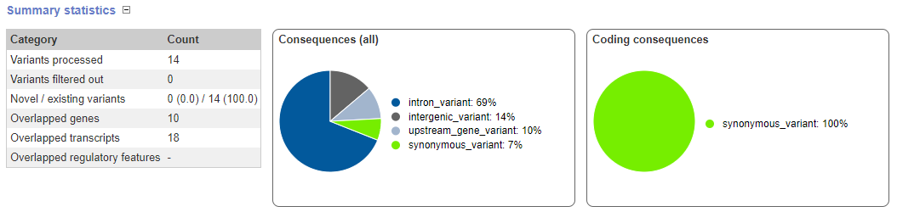

As can be seen, the VEP only analysed 14 variants

Bellow I'm gonna show the "genome view" for each SNP (variant) recovered from VEP:

<span style="color: red;">**rs41648479**</span>
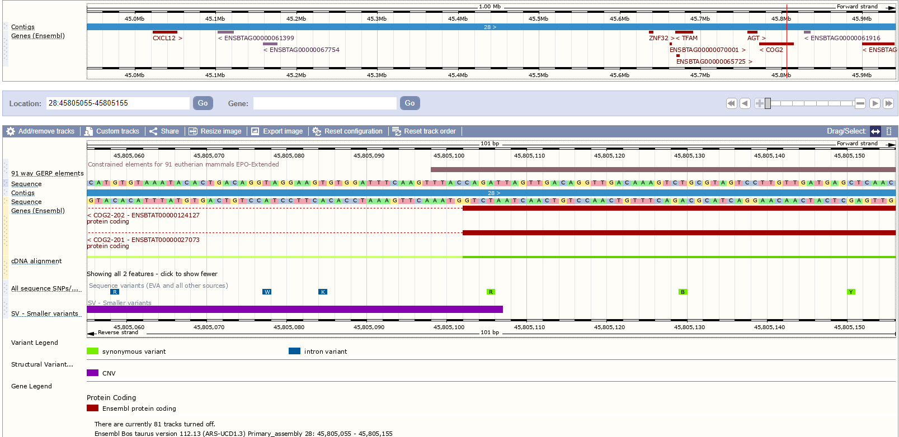  

<span style="color: red;">**rs41632223**</span>
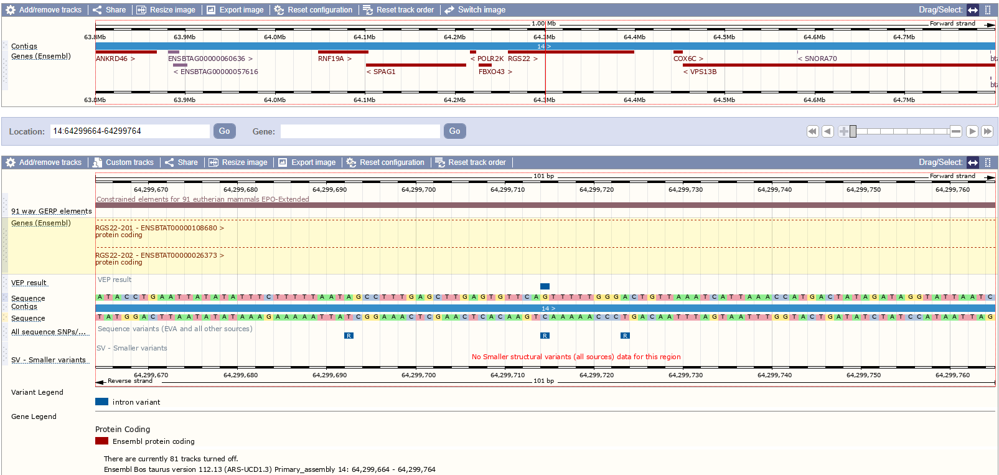  

<span style="color: red;">**rs41632193**</span>
  

<span style="color: red;">**rs42590312**</span>
  

<span style="color: red;">**rs42089058**</span>
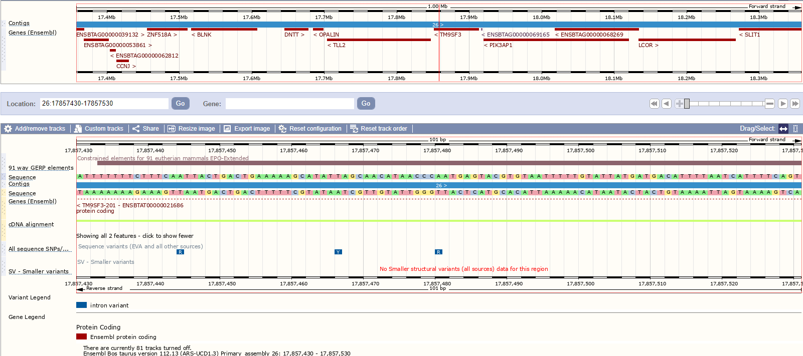  

<span style="color: red;">**rs41567074**</span>
  

<span style="color: red;">**rs41644634**</span>
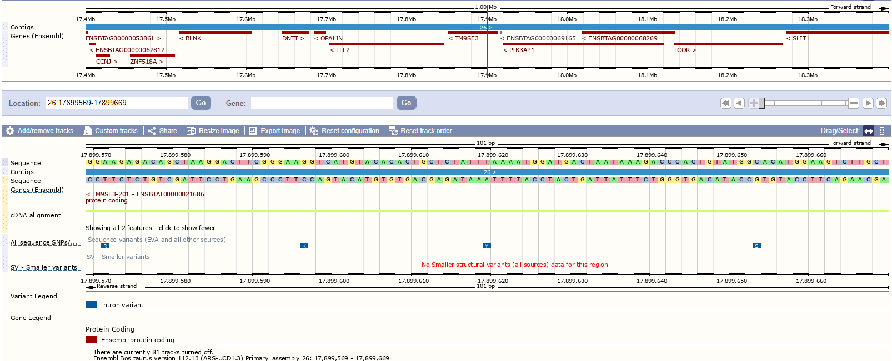 

<span style="color: red;">**rs41624254**</span>
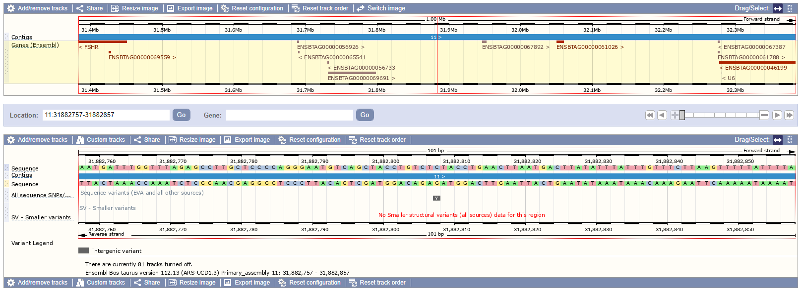 

<span style="color: red;">**rs109888380**</span>
 

<span style="color: red;">**rs41577586**</span>
  

<span style="color: red;">**rs109751680**</span>
  

<span style="color: red;">**rs110991998**</span>
 

<span style="color: red;">**rs110031217**</span>
 

<span style="color: red;">**rs109578343**</span>


*ps. the unique reference genome available in the VEP is the ARS-UCD1.3, which is not a problem once it is working with the rsID, which for sure is our variant.*

# VEP - With Birth_year and Sampling_date

After insert all **rsID** on VEP the summary is shown below:


As can be seen, the VEP only analysed 14 variants

Bellow I'm gonna show the "genome view" for each SNP (variant) recovered from VEP:

<span style="color: red;">**rs110031217**</span>
  

<span style="color: red;">**rs110991998**</span>
  

<span style="color: red;">**rs42089058**</span>
  

<span style="color: red;">**rs41644634**</span>
  

<span style="color: red;">**rs41567074**</span>
  


*ps. the unique reference genome available in the VEP is the ARS-UCD1.3, which is not a problem once it is working with the rsID, which for sure is our variant.*


# GALLO 

```{r eval=FALSE}
# GALLO

#import a QTL annotation file
qtl_UCD1_2 <- import_gff_gtf(db_file="/home/bambrozi/2_CORTISOL/GALLO/Animal_QTLdb_release53_cattleARS_UCD1.gff.gz",file_type="gff")

#import a gene annotation file
gene_UDC1_2 <- import_gff_gtf(db_file="/home/bambrozi/2_CORTISOL/GALLO/Bos_taurus.ARS-UCD1.2.110.gtf.gz",file_type="gtf")

#import MARKER files = the GWAS output
gwas <- read.csv(file = "/home/bambrozi/2_CORTISOL/GWAS/SNP_sig_Bonf_ind_seg_15.csv")

# Assuming "gwas" is your dataframe
gwas <- subset(gwas, select = c(Chr, SNP, bp))


colnames(gwas) <- c("CHR","SNP", "BP")


#FINDING GENES AND QTLs ARROUND THE MARKER

#FINDING GENES
out.genes <- find_genes_qtls_around_markers(db_file= gene_UDC1_2, 
                                            marker_file= gwas, 
                                            method = "gene",
                                            marker = "snp", 
                                            interval = 50000, 
                                            nThreads = NULL)

write.table(out.genes, file = "/home/bambrozi/2_CORTISOL/GALLO/Bonf_5_15/out_genes_50k_15.txt", 
            quote = FALSE, sep = "\t", row.names = FALSE, col.names = T)

write.csv(out.genes, file = "/home/bambrozi/2_CORTISOL/GALLO/Bonf_5_15/out_genes_50k_15.csv")

#FINDING QTLs

out.qtl <- find_genes_qtls_around_markers(db_file= qtl_UCD1_2, 
                                          marker_file= gwas, 
                                          method = "qtl",
                                          marker = "snp", 
                                          interval = 50000, 
                                          nThreads = NULL)


write.table(out.qtl, file = "/home/bambrozi/2_CORTISOL/GALLO/Bonf_5_15/out_qtl_50k_15.txt", 
            quote = FALSE, sep = "\t", row.names = FALSE, col.names = T)

library(tidyverse)
out.qtl.clean <- select(out.qtl, c("CHR", "SNP", "BP", "QTL_type", "start_pos", "end_pos","QTL_ID"))
write.csv(out.qtl.clean, file = "/home/bambrozi/2_CORTISOL/GALLO/Bonf_5_15/out_qtl_50k_clean_15.csv")
```


Dowloading the .gtf file from Ensembl
<https://useast.ensembl.org/info/data/ftp/index.html>

Downloading the .gff file from AnimalQTLdb
<https://www.animalgenome.org/cgi-bin/QTLdb/index>


The GALLO output are bellow:

**For GENES**
```{r echo=FALSE}
# Read the CSV file into a data frame
data <- read.csv("C:/Users/galin/OneDrive - University of Guelph/0.Post doc/4_Cortisol/Git_Cortisol/out_genes_50k_15.csv")

# Print the table using knitr::kable
knitr::kable(data)

```

**FOR QTLs**
```{r echo=FALSE}
# Read the CSV file into a data frame
data <- read.csv("C:/Users/galin/OneDrive - University of Guelph/0.Post doc/4_Cortisol/Git_Cortisol/out_qtl_50k_clean_15.csv")

# Print the table using knitr::kable
knitr::kable(data)

```

## QTL annotation on GALLO

**QTL type**
```{r eval=FALSE}
#GALLO
par(mar=c(8,20,8,8))
plot_qtl_info(out.qtl, qtl_plot = "qtl_type", cex=1)
```

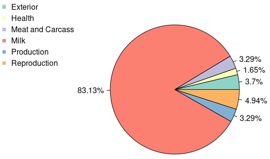  

**QTL type**
```{r eval=FALSE}
#GALLO
par(mar=c(10,20,10,10))
plot_qtl_info(out.qtl, qtl_plot = "qtl_name", qtl_class="Reproduction")

par(mar=c(10,20,10,10))
plot_qtl_info(out.qtl, qtl_plot = "qtl_name", qtl_class="Health")
```

**Reproduction**
  

**Health**
  

## QTL enrichment on GALLO

```{r eval=FALSE}
#QTL enrichment analysis 
out.enrich_qtl_name <-qtl_enrich(qtl_db= qtl_UCD1_2, 
                                 qtl_file= out.qtl, qtl_type = "Name",
                                 enrich_type = "genome", chr.subset = NULL, 
                                 padj = "fdr",nThreads = 2)


# Sorting the dataframe in ascending order of adj.pval
sorted_df <- out.enrich_qtl_name[order(out.enrich_qtl_name$adj.pval), ]

write.csv(sorted_df,"/home/bambrozi/2_CORTISOL/GALLO/Bonf_5_15/out_enrich_qtl_genome_name_15.csv")

out.enrich_qtl_type <-qtl_enrich(qtl_db= qtl_UCD1_2, 
                                 qtl_file= out.qtl, qtl_type = "QTL_type",
                                 enrich_type = "genome", chr.subset = NULL, 
                                 padj = "fdr",nThreads = 2)

sorted_df_type <- out.enrich_qtl_type[order(out.enrich_qtl_type$adj.pval), ]
write.csv(out.enrich_qtl_type,"/home/bambrozi/2_CORTISOL/GALLO/Bonf_5_15/out_enrich_qtl_genome_type_15.csv")

#Plots

#Name

#Creating a new ID composed by the trait and the chromosome
out.enrich_qtl_name$ID<-paste(out.enrich_qtl_name$QTL," - ","CHR",out.enrich_qtl_name$CHR,sep="")

#Match the QTL classes and filtering the Reproduction related QTLs
out.enrich.filtered<-out.enrich_qtl_name[which(out.enrich_qtl_name$adj.pval<0.05),]

#Plotting the enrichment results for the QTL enrichment analysis
QTLenrich_plot(out.enrich.filtered, x="ID", pval="adj.pval")


#Type

#Creating a new ID composed by the trait and the chromosome
out.enrich_qtl_type$ID<-paste(out.enrich_qtl_type$QTL," - ","CHR",out.enrich_qtl_type$CHR,sep="")

#Match the QTL classes and filtering the Reproduction related QTLs
out.enrich.filtered_type<-out.enrich_qtl_type[which(out.enrich_qtl_type$adj.pval<0.05),]

#Plotting the enrichment results for the QTL enrichment analysis
QTLenrich_plot(out.enrich.filtered_type, x="ID", pval="adj.pval")
```

**QTL Enrichment outcomes**

**Enrichment by name** (enrichment analysis will be performed for each trait individually)
```{r echo=FALSE}
# Read the CSV file into a data frame
data <- read.csv("C:/Users/galin/OneDrive - University of Guelph/0.Post doc/4_Cortisol/Git_Cortisol/out_enrich_qtl_genome_name_15.csv")

# Print the table using knitr::kable
knitr::kable(data)

```

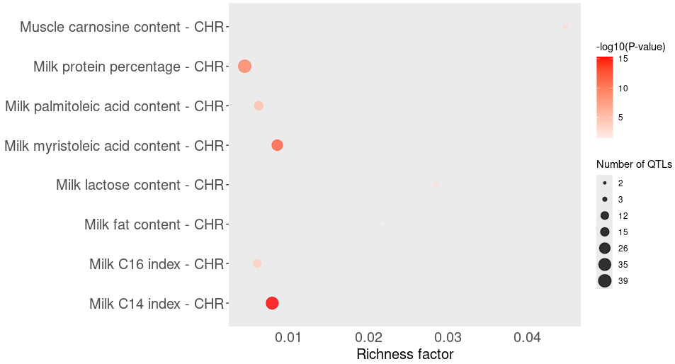  

**Enrichment by QTL_type** (enrichment processes performed for the QTL classes)
```{r echo=FALSE}
# Read the CSV file into a data frame
data <- read.csv("C:/Users/galin/OneDrive - University of Guelph/0.Post doc/4_Cortisol/Git_Cortisol/out_enrich_qtl_genome_type_15.csv")

# Print the table using knitr::kable
knitr::kable(data)

```

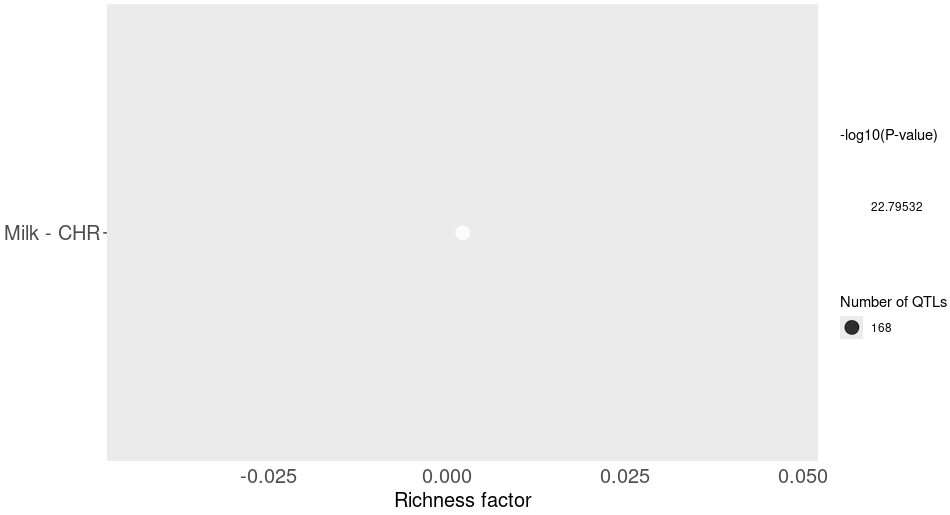 

# GALLO - with Birth_Year and Sampling_Date

```{r eval=FALSE}
# GALLO

#import a QTL annotation file
qtl_UCD1_2 <- import_gff_gtf(db_file="/home/bambrozi/2_CORTISOL/GALLO/Animal_QTLdb_release53_cattleARS_UCD1.gff.gz",file_type="gff")

#import a gene annotation file
gene_UDC1_2 <- import_gff_gtf(db_file="/home/bambrozi/2_CORTISOL/GALLO/Bos_taurus.ARS-UCD1.2.110.gtf.gz",file_type="gtf")

#import MARKER files = the GWAS output
gwas <- read.csv(file = "/home/bambrozi/2_CORTISOL/GWAS/GWAS_plus_BY_Samp/SNP_sig_Bonf_ind_seg.csv")

# Assuming "gwas" is your dataframe
gwas <- subset(gwas, select = c(Chr, SNP, bp))


colnames(gwas) <- c("CHR","SNP", "BP")


#FINDING GENES AND QTLs ARROUND THE MARKER

#FINDING GENES
out.genes <- find_genes_qtls_around_markers(db_file= gene_UDC1_2, 
                                            marker_file= gwas, 
                                            method = "gene",
                                            marker = "snp", 
                                            interval = 50000, 
                                            nThreads = NULL)

write.table(out.genes, file = "/home/bambrozi/2_CORTISOL/GALLO/GALLO_BY_SD/out_genes2.txt", 
            quote = FALSE, sep = "\t", row.names = FALSE, col.names = T)

write.csv(out.genes, file = "/home/bambrozi/2_CORTISOL/GALLO/GALLO_BY_SD/out_genes2.csv")

#FINDING QTLs

out.qtl <- find_genes_qtls_around_markers(db_file= qtl_UCD1_2, 
                                          marker_file= gwas, 
                                          method = "qtl",
                                          marker = "snp", 
                                          interval = 50000, 
                                          nThreads = NULL)


write.table(out.qtl, file = "/home/bambrozi/2_CORTISOL/GALLO/GALLO_BY_SD/out_qtl2.txt", 
            quote = FALSE, sep = "\t", row.names = FALSE, col.names = T)

library(tidyverse)
out.qtl.clean <- select(out.qtl, c("CHR", "SNP", "BP", "QTL_type", "start_pos", "end_pos","QTL_ID"))
write.csv(out.qtl.clean, file = "/home/bambrozi/2_CORTISOL/GALLO/GALLO_BY_SD/out_qtl_clean2.csv")
```


Dowloading the .gtf file from Ensembl
<https://useast.ensembl.org/info/data/ftp/index.html>

Downloading the .gff file from AnimalQTLdb
<https://www.animalgenome.org/cgi-bin/QTLdb/index>


The GALLO output are bellow:

**For GENES**
```{r echo=FALSE}
# Read the CSV file into a data frame
data <- read.csv("C:/Users/galin/OneDrive - University of Guelph/0.Post doc/4_Cortisol/Git_Cortisol/out_genes2.csv")

# Print the table using knitr::kable
knitr::kable(data)

```

**FOR QTLs**
```{r echo=FALSE}
# Read the CSV file into a data frame
data <- read.csv("C:/Users/galin/OneDrive - University of Guelph/0.Post doc/4_Cortisol/Git_Cortisol/out_qtl_clean2.csv")

# Print the table using knitr::kable
knitr::kable(data)

```

## QTL annotation on GALLO

**QTL type**
```{r eval=FALSE}
#GALLO
par(mar=c(8,20,8,8))
plot_qtl_info(out.qtl, qtl_plot = "qtl_type", cex=1)
```

  

**QTL type**
```{r eval=FALSE}
#GALLO
par(mar=c(10,20,10,10))
plot_qtl_info(out.qtl, qtl_plot = "qtl_name", qtl_class="Reproduction")

par(mar=c(10,20,10,10))
plot_qtl_info(out.qtl, qtl_plot = "qtl_name", qtl_class="Health")
```

**Reproduction**
  

**Health**
  

## QTL enrichment on GALLO

```{r eval=FALSE}
#QTL enrichment analysis 
out.enrich_qtl_name <-qtl_enrich(qtl_db= qtl_UCD1_2, 
                                 qtl_file= out.qtl, qtl_type = "Name",
                                 enrich_type = "genome", chr.subset = NULL, 
                                 padj = "fdr",nThreads = 2)


# Sorting the dataframe in ascending order of adj.pval
sorted_df <- out.enrich_qtl_name[order(out.enrich_qtl_name$adj.pval), ]

write.csv(sorted_df,"/home/bambrozi/2_CORTISOL/GALLO/GALLO_BY_SD/out_enrich_qtl_genome_name_2.csv")

out.enrich_qtl_type <-qtl_enrich(qtl_db= qtl_UCD1_2, 
                                 qtl_file= out.qtl, qtl_type = "QTL_type",
                                 enrich_type = "genome", chr.subset = NULL, 
                                 padj = "fdr",nThreads = 2)

sorted_df_type <- out.enrich_qtl_type[order(out.enrich_qtl_type$adj.pval), ]
write.csv(out.enrich_qtl_type,"/home/bambrozi/2_CORTISOL/GALLO/GALLO_BY_SD/out_enrich_qtl_genome_type_2.csv")


#Plots

#Name

#Creating a new ID composed by the trait and the chromosome
out.enrich_qtl_name$ID<-paste(out.enrich_qtl_name$QTL," - ","CHR",out.enrich_qtl_name$CHR,sep="")

#Match the QTL classes and filtering the Reproduction related QTLs
out.enrich.filtered<-out.enrich_qtl_name[which(out.enrich_qtl_name$adj.pval<0.05),]

#Plotting the enrichment results for the QTL enrichment analysis
dev.off()
QTLenrich_plot(out.enrich.filtered, x="ID", pval="adj.pval")


#Type

#Creating a new ID composed by the trait and the chromosome
out.enrich_qtl_type$ID<-paste(out.enrich_qtl_type$QTL," - ","CHR",out.enrich_qtl_type$CHR,sep="")

#Match the QTL classes and filtering the Reproduction related QTLs
out.enrich.filtered_type<-out.enrich_qtl_type[which(out.enrich_qtl_type$adj.pval<0.05),]

#Plotting the enrichment results for the QTL enrichment analysis
dev.off()
QTLenrich_plot(out.enrich.filtered_type, x="ID", pval="adj.pval")
```

**QTL Enrichment outcomes**

**Enrichment by name** (enrichment analysis will be performed for each trait individually)
```{r echo=FALSE}
# Read the CSV file into a data frame
data <- read.csv("C:/Users/galin/OneDrive - University of Guelph/0.Post doc/4_Cortisol/Git_Cortisol/out_enrich_qtl_genome_name_2.csv")

# Print the table using knitr::kable
knitr::kable(data)

```

  

**Enrichment by QTL_type** (enrichment processes performed for the QTL classes)
```{r echo=FALSE}
# Read the CSV file into a data frame
data <- read.csv("C:/Users/galin/OneDrive - University of Guelph/0.Post doc/4_Cortisol/Git_Cortisol/out_enrich_qtl_genome_type_2.csv")

# Print the table using knitr::kable
knitr::kable(data)

```

 

# GPROFILER ON-LINE with BY and SD

From the online version of GPROFILER i got the following results.

**Legend**


# Haplotype Blocks


First I need to generate the .ped file
```{bash eval=F}
#!/bin/bash

DATA=/home/bambrozi/2_CORTISOL/Geno_files_after_QC/genoplink_clean
RESULT=/home/bambrozi/2_CORTISOL/HAPLOBLOCK/inter_file

plink \
    --bfile ${DATA} \
    --cow \
    --recode \
    --out ${RESULT}
```


Second, is necessary to convert the .ped file to Linkage format:

```{bash eval=F}
#!/bin/bash

DATA=/home/bambrozi/2_CORTISOL/HAPLOBLOCK/inter_file
RESULT=/home/bambrozi/2_CORTISOL/HAPLOBLOCK/hapblock_in

plink \
    --file ${DATA} \
    --cow \
    --recode HV \
    --out ${RESULT}
```

The code above will generate a pair of files **.ped** and **.info** for each chromosome

I ran the **haploview** only for chromosome 03, 11, 14, 19, 20, 22, 23, 26 and 28 that are when the significant SNP are located.

As the LD Plot bring the SNP ordered, first I looked at */home/bambrozi/2_CORTISOL/GWAS/SNP_sig_Bonf_ind_seg_15.csv*, to know the SNP position, and then compare with the **Check Markers** tab in the haploview <span style="background-color:yellow">SNP position</span>
 x <span style="background-color:lightblue">SNP#</span> in plot
 
 


```{r echo=FALSE}
# Read the CSV file into a data frame
data <- read.csv("C:/Users/galin/OneDrive - University of Guelph/0.Post doc/4_Cortisol/Git_Cortisol/marker_info_gwas_haploview_15.csv")

# Print the table using knitr::kable
knitr::kable(data)

```

As can be observed in the column "Block",<span style="color: red;">four significant SNPs fell within a Haploblock</span>.

>rs41577586	(ARS-BFGL-NGS-29119)	- chr 19 - order 849 - Block 38
>rs41644634	(BTA-62125-no-rs) - chr	26 - order 297 - Block 10
>rs42089058	(BTB-00926636) - chr 26 - order 296 - Block 10
>rs41648479	(Hapmap43005-BTA-64606) - chr	28 - order 791 - Block 21

<span style="color: blue;">**Chr	3**	(SNP 1818)</span>


<span style="color: blue;">**Chr	11**	(SNP 674 and 680)</span>


<span style="color: blue;">**Chr	14**	(SNP 1196 and 1200)</span>


<span style="color: blue;">**Chr	19**	(SNP 713)</span>


<span style="color: blue;">**Chr	19**	(SNP 849)</span>


<span style="color: blue;">**Chr	20**	(SNP 232)</span>


<span style="color: blue;">**Chr	22**	(SNP 88)</span>


<span style="color: blue;">**Chr	22**	(SNP 762)</span>


<span style="color: blue;">**Chr	23**	(SNP 534)</span>


<span style="color: blue;">**Chr	26**	(SNP 296 and 297)</span>


<span style="color: blue;">**Chr	28**	(SNP 701)</span>


<span style="color: blue;">**Chr	28**	(SNP 773 and 791)</span>


# GWAS - EXTREME PHENO - WITH BY and SD

## Data preparation

I received from Umesh a e-mail informing the three categories that the animals could be sorted based on their cortisol concentration.


```{r eval=FALSE}

pheno <- read.table("/home/bambrozi/2_CORTISOL/GWAS/pheno_genotyped.txt", header = T)
data_final <- read.csv("/home/bambrozi/2_CORTISOL/RawFiles/GEBVs_Elora/data_GEBVs_Cortisol_select_traits2.csv", header = T)
ids_eq <- read.csv("/home/bambrozi/2_CORTISOL/RawFiles/Pedigree/bruno_ids.csv", header = T)


# Create an matrix with fixed effects with only those animals which also have phenotype and genotype
data_final$cdn_id <- ids_eq$cdn_id[match(data_final$ID, ids_eq$elora_id)]
fixeff <- data_final[,c("ID", "BIRTH_YEAR", "Sampling_date", "cdn_id")]
fixeff <- fixeff[fixeff$cdn_id %in% pheno$cdn_id, ]
fixeff$FID <- "HO"
fixeff <- fixeff[, c("FID", "cdn_id", "BIRTH_YEAR", "Sampling_date")]

# Now we are gona remove the intermediary animals from pheno object
pheno$Categorical <- ifelse(pheno$cortisol >= 956, "H", 
                           ifelse(pheno$cortisol <= 190.8, "L", "M"))
table(pheno$Categorical)
pheno <- pheno[pheno$Categorical != "M", ]
pheno <- pheno[, c("FID", "cdn_id", "cortisol")]

# Now we are going to remove from fixeff the animals which are not in pheno
fixeff <- fixeff[fixeff$cdn_id %in% pheno$cdn_id,]

#Checking if match the animals and order
identical(fixeff$cdn_id, pheno$cdn_id)

#Creating a file with animals to keep in the genotype file, we will use it on Plink
to_keep_geno <- pheno[, c("FID", "cdn_id")]

write.table(fixeff, "/home/bambrozi/2_CORTISOL/GWAS/EXTREM_PHENO_BY_SD/fixeff.txt", quote = F, row.names = F, col.names = T)
write.table(pheno, "/home/bambrozi/2_CORTISOL/GWAS/EXTREM_PHENO_BY_SD/pheno.txt", quote = F, row.names = F, col.names = T)
write.table(to_keep_geno, "/home/bambrozi/2_CORTISOL/GWAS/EXTREM_PHENO_BY_SD/to_keep_geno.txt", quote = F, row.names = F, col.names = F)

```

We ended up with  
H (Hight) = 34 animals  
L (Low)  = 37 animals
Total = 71 animals

On Plink we will remove all individuals from genotype files that are classified as Medium, keeping only the High and Low

```{bash eval= FALSE}
#!/bin/bash

DATA=/home/bambrozi/2_CORTISOL/Geno_files_after_QC/genoplink_clean
RESULT=/home/bambrozi/2_CORTISOL/GWAS/EXTREM_PHENO_BY_SD/geno_extreme
KEEP=/home/bambrozi/2_CORTISOL/GWAS/EXTREM_PHENO_BY_SD/to_keep_geno.txt

plink2 --bfile ${DATA} --keep ${KEEP} --chr-set 29 --make-bed --out ${RESULT}
```

## GWAS on GCTA

```{bash eval=FALSE}
#!/bin/bash

DATA=/home/bambrozi/2_CORTISOL/GWAS/EXTREM_PHENO_BY_SD/geno_extreme
RESULT=/home/bambrozi/2_CORTISOL/GWAS/EXTREM_PHENO_BY_SD/GWAS_result
PHENO=/home/bambrozi/2_CORTISOL/GWAS/EXTREM_PHENO_BY_SD/pheno.txt
FIXEFF=/home/bambrozi/2_CORTISOL/GWAS/EXTREM_PHENO_BY_SD/fixeff.txt

/home/local/bin/gcta \
    --bfile ${DATA} \
    --mlma-loco \
    --pheno ${PHENO} \
    --qcovar ${FIXEFF} \
    --autosome-num 29 \
    --autosome \
    --out ${RESULT}
```

After ran the GWAS above I got the following message from the GCTA:

<span style="color:red">**Error: analysis stopped because more than half of the variance components are constrained. The result would be unreliable. You may have a try of the option --reml-no-constrain.**</span>


As we got this error message, we needed to solve this problem, and for that we used the whole sample size (252 individuals) to estimate the variance components in GCTA, and after this, using this variance components from the whole sample we perfomed ths GWAS with the subset of individuals (34 High + 37 Low = 71)


## BLUPF90+ GWAS

To run ssGWAS on Blupf90+ suite, we will need 4 different softwares:

<ul>
<li> **renum**: just to renumerate the files and generate the renf90.par
<li> **preGSF90**: just to perfome a quality control with different parameter from the default.
<li> **blupf90+**: used to estimate VCE and generate Ainv and Ginv
<li> **postGSF90**: perform GWAS
</ul>

The tutorial for preGSF90 and postGSF90 we can find in the link bellow
<https://nce.ads.uga.edu/wiki/doku.php?id=readme.pregsf90#gwas_options_postgsf90>

According to the BLUPF90+ tutorial:

    ssGWAS is an iterative procedure with 2 steps:
    0) Quality control
    1) prediction of GEBV with ssGBLUP
    2) prediction of SNP marker effects based on the GEBV

### Files preparation

Preparing files to run Variance components estimation using REML with AI (Average Information) algorithm.

First you need to create a directory in your home directory, prepare and save the following files in:

<ul>
<li> Phenotype and Fixed effects file
<li> Pedigree file
<li> Genotype file
<li> BlupF90+ executable file
<li> RenumF90 executable file
<li> preGSf90 executable file
<li> postGSf90 executable file
<li> Parameter file
<ul>


#### Phenotype and Fixed effects file

The appearance of this file is like this:


**FIRST COLUMN** = Animal ID  
**SECOND COLUMN** = Phenotype  
**THIRD COLUMN** = Fixed Effect 1  
**FOURTH COLUMN** = Fixed Effect 2  

First we are going to generate a Phenotype_Fixed_Effect file with the whole sample (252 individuals) that we are going to use for the Variance Components Estimation.

To get in one file these four columns we need the following code:

```{r eval=FALSE}

fixeff <- read.table("/home/bambrozi/2_CORTISOL/GWAS/GWAS_plus_BY_Samp/fixeff.txt", header = T)
pheno <- read.table("/home/bambrozi/2_CORTISOL/GWAS/pheno_genotyped.txt", header = T)
ids_eq <- read.csv("/home/bambrozi/2_CORTISOL/RawFiles/Pedigree/bruno_ids.csv", header = T)

fixeff <- fixeff[, c("cdn_id", "BIRTH_YEAR", "Sampling_date")]
pheno <- pheno[,c("cdn_id", "cortisol")]

# Load necessary libraries
library(dplyr)

# Merge pheno and fixeff data frames
merged_data <- pheno %>% 
  left_join(fixeff, by = "cdn_id")


merged_data$iid <- ids_eq$iid[match(merged_data$cdn_id, ids_eq$cdn_id)]

merged_data <- merged_data[, c("iid", "cortisol", "BIRTH_YEAR", "Sampling_date")]

write.table(merged_data, "/home/bambrozi/2_CORTISOL/GWAS/BLUPF90/fenofix.txt", col.names = F, quote = F, row.names = F)

```


The file should be saved as text file, with separation by space and no columns names.

PS: if there are any **NA**, they sould be replaced by **9999**

#### Pedigree file

The appearance of this file is like this:

  

**FIRST COLUMN** = Animal ID  
**SECOND COLUMN** = Sire ID  
**THIRD COLUMN** = Dam ID  

The file should be saved as text file, with separation by space and no columns names.

We used the code below to remove the commas of a .csv file to a file with sepation by spaces.
```{bash eval=FALSE}
# to replace comma for space in the .csv file with the equivalence among IDs
sed -i 's/,/ /g' bruno_ids.csv
```

#### Genotype file

First we are going to generate a Genotype file with the whole sample (252 individuals) that we are going to use for the Variance Components Estimation.

The appearance of this file is like this:


**FIRST COLUMN** = Animal ID
**SECOND COLUMN** = Genotypes (0, 1 and 2 format)

The file should be saved as text file, with separation by space and no columns names.

We  used the code below to replace the cid for iid. First we merge using the second column of the firs file, and the first column of the second file. Then we use again the command awk to keep only the third and fifth columsn and sabe in a different object.


```{bash eval=FALSE}
# Using the awk function to merge the two files and the second awk to select only the 3rd and 5fh columns
awk 'FNR==NR {a[$2]=$0; next} {print a[$1], $0}' bruno_ids.csv bruno_gntps.txt | awk '{print$3,$5}' > bruno_gntps_iid
```

### Download the executable files

Download from this website <https://nce.ads.uga.edu/html/projects/programs/Linux/64bit/>:
<ul>
<li> BlupF90+ = we will use to estimate the Variance components and GEBVs
<li> renumF90 = we will use to renumerate the files
<li> preGSf90 = we will use to perform the Quality control
<li> postGSf90 = we will use for GWAS
<ul>

### SNP MAP

```{r eval = FALSE}
mapfile <- read.table("/home/bambrozi/2_CORTISOL/GWAS/BLUPF90/EXTREME_PHENO/DGVsnpinfo.2404.ho", header = T)

colnames(mapfile)

colnames(mapfile) <- c("SNP_ID", "CHR", "POS")

mapfile <- mapfile[,c("CHR", "POS", "SNP_ID")]

write.table(mapfile, "/home/bambrozi/2_CORTISOL/GWAS/BLUPF90/snpmap.txt", col.names = T, row.names = F, quote = F)
```


### Parameter file for Quality Control

But, before running the GEBV we will first perform one additional step to "CLEAN" our genotypes. Actually BLUPF90 by default perform a data cleaning with pre set parameters, but as HWE is not used by default, we will perform this additional step.

The Parameter card for this step is the parameter bellow:

/home/bambrozi/2_CORTISOL/GWAS/BLUPF90/renum_QC.par

```{bash eval= FALSE}

DATAFILE
fenofix.txt
TRAITS
2
FIELDS_PASSED TO OUTPUT

WEIGHT(S)

RESIDUAL_VARIANCE
1.0
EFFECT
3 cross numer
EFFECT
4 cross alpha
EFFECT
1 cross alpha
RANDOM
animal
FILE
bruno_ped_iid_blup.txt
FILE_POS
1 2 3 0 0
SNP_FILE
bruno_gntps_iid
PED_DEPTH
0
(CO)VARIANCES
1.0
OPTION outcallrate
OPTION saveCleanSNPs
OPTION minfreq 0.01
OPTION map_file snpmap.txt
OPTION excludeCHR 30 31
```

<ul>
<li> **DATAFILE**: bellow this line you need to inform the name of the file with phenotype and fixed effects. As before running BLUPF90 on server you are going to direct the terminal to the directory where all these files are placed you only need to inform the name.
<li> **TRAITS**: below this line you need to inform which column are the phenotype date in the previous file, in this example, 2.
<li> **FIELDS_PASSED TO OUTPUT**:
<li> **WEIGHT (S)**:
<li> **RESIDUAL VARIANCE**: for the firs run you need to inform the value of 1.0, for the second you can pick the variance from the firs run's output.
<li> **EFFECT**: you will inform your first effect, in this example, Birth Year, which is in the column 3, and the word **cross numer** because is a number.
<li> **EFFECT**: you should provide the next effect, in this example, sample date, as sample date has one non numeric character you should inform as **cross alpha**, in this example column 4.
<li> **EFFECT**: now I'm providing my animal ID information, in this example column 1, and again **cross alpha** because has number and letters in the ID. I'm also informing that this effect is **RANDOM**, and that is my **animal** effect.
<li> **FILE**: bellow this line I need to provide the pedigree file. Again, as I'm already in the directory which contain the pedigree file I only need to provide the file name.
<li> **FILE-POS**: Here I'll inform which columns should be considered in the pedigree file, in this situation, **1 2 3 0 0**.
<li> **PED_DEPTH**: Now we can inform the depth we want the software considers the pedigree, or if we leave **0** it will the maximum possible.
<li> **(CO) VARIANCES**: Here you should provide the Variance/Co-variance matrix, like as for residual variance in the first run we set up to 0 in this example that we don´t have to imagine any co-variance, but if you know that exist variance among you effects you shoul set up **XXX** for ....
<li> **OPTION outcallrate**: Save the call rate information on SNP markers in the file.
<li> **OPTION saveCleanSNPs**: This option generates 4 new files. We assume snpfile as a marker file.
<ul>
<li> snpfile_clean = new SNP marker file.
<li> snpfile_clean_XrefID = new cross-reference file.
<li> snpfile_SNPs_removed = a list of removed markers.
<li> snpfile_Animals_removed = a list of removed animals.
</ul>
<li> **OPTION minfreq 0.01**: Minimum allele frequency to retain the marker.
<li> **OPTION map_file snpmap.txt**: This option will upload the SNP MAP
<li> **OPTION excludeCHR 30 31**: This option will remove **sexual chromosome** that is the 30 and 31
</ul>

To run any softwere from Blupf90 suit we will perfom always in this way:

1. Go to the server you wanna run this analysis, for instance, **grand**
```{bash eval=F}
ssh grand
```

2. Now go to the directory you have created to run this analysis where that set of files are placed.
```{bash eval = F}
cd /home/bambrozi/2_CORTISOL/GWAS/BLUPF90
```

3. Make the renumF90 and BlupF90+ files executables
```{bash eval=F}
chmod +x renumf90
chmod +x blupf90+
```

4. Run renumF90
```{bash eval=F}
./renumf90
```

When you run the code above, it will ask you the name of your parameter card, for this step is **renum_QC.par**.

The command above will generate couple files, among them **renf90.par**

We modified **renf90.par** in:
<ul>
<li> renf90_DataClean.par
<li> renf90_VarCompEst.par
</ul>

The parameter card to perform the Quality Control is: 
/home/bambrozi/2_CORTISOL/GWAS/BLUPF90/renf90_DataClean.par

It will be run using the software pre **preGS90** to generate the Clean Genotype and SNP_MAP files after Quality Control.

```{bash eval= FALSE}
# BLUPF90 parameter file created by RENUMF90
DATAFILE
 renf90.dat
NUMBER_OF_TRAITS
           1
NUMBER_OF_EFFECTS
           3
OBSERVATION(S)
    1
WEIGHT(S)
 
EFFECTS: POSITIONS_IN_DATAFILE NUMBER_OF_LEVELS TYPE_OF_EFFECT[EFFECT NESTED]
 2         4 cross 
 3        23 cross 
 4      3724 cross 
RANDOM_RESIDUAL VALUES
   1.0000    
 RANDOM_GROUP
     3
 RANDOM_TYPE
 add_an_upginb
 FILE
renadd03.ped                                                                    
(CO)VARIANCES
   1.0000    
OPTION SNP_file bruno_gntps_iid
OPTION outcallrate
OPTION saveCleanSNPs
OPTION minfreq 0.01
OPTION map_file snpmap.txt
OPTION excludeCHR 30 31

```


The second parameter card used for Variance Components Estimation (VCE) is the following:
/home/bambrozi/2_CORTISOL/GWAS/BLUPF90/renf90_VarCompEst.par

It will be run using the software pre **blupf90+** to generate the VCE.

```{bash eval= FALSE}
# BLUPF90 parameter file created by RENUMF90
DATAFILE
 renf90.dat
NUMBER_OF_TRAITS
           1
NUMBER_OF_EFFECTS
           3
OBSERVATION(S)
    1
WEIGHT(S)
 
EFFECTS: POSITIONS_IN_DATAFILE NUMBER_OF_LEVELS TYPE_OF_EFFECT[EFFECT NESTED]
 2         4 cross 
 3        23 cross 
 4      3724 cross 
RANDOM_RESIDUAL VALUES
   1.0000    
 RANDOM_GROUP
     3
 RANDOM_TYPE
 add_an_upginb
 FILE
renadd03.ped                                                                    
(CO)VARIANCES
   1.0000    
OPTION SNP_file bruno_gntps_iid_clean
OPTION no_quality_control
OPTION method VCE
OPTION origID
OPTION missing 9999
OPTION se_covar_function H2_1 g_3_3_1_1/(g_3_3_1_1+r_1_1)


```

<ul>
<li> **OPTION SNP_file bruno_gntps_iid_clean**: we are going to inform the genotype file generated in the previous step (the Quality Control). Blup will create an file with the same name that the original genotype file, and add the sufix **_clean**
<li>**OPTION no_quality_control** we need to set up this option because we performed Quality Control in the previous step and now we don't need that Blupf90+ perform again. Blupf90+ by default perform quality control, so if we do not want, we need to specify.
<li> **OPTION method**: VCE (Variance Component Estimation).
<li> **OPTION OrigID**: this will keep the original ID informed.
<li> **OPTION missing 9999**: you are informing that missing values will appear as **9999**
<li> **OPTION se_covar_function**: H2_1 g_3_3_1_1/(g_3_3_1_1+r_1_1)
<ul> 
<li> **H2_1**: the name that your function will appear on the output files.
<li> **g_3_3**: you are asking for genetic variance estimation for the 3rd informed effect.
<li> **_1_1**: this effect is in the 1st column. 
<li> **/(g_3_3_1_1+r_1_1)**: to get the total phenotipic variance, you are summing to genetic variance the residual variance of the effect in column 1.
</ul>
</ul>

In the parameter card above, we remove the option for Quality Control and added options for Variance Components Estimation, for Missing data, for origID and for heritability estimation, but the MOST IMPORTANT PART is we need to change the OPTION SNP_FILE, replacing the original genotype file, for the "clean" version generated in the previous step.

The Variance Components will be placed in the file: 
/home/bambrozi/2_CORTISOL/GWAS/BLUPF90/blupf90.log

**blupf90.log**  
 


Now you should update you **renf90_VarCompEst.par** file with these informations from the .log file

Copy **Residual Variance** from blupf90.log and will paste on renf90_VarCompEst.par **RANDOM_RESIDUAL_VALUES**
Copy **Genetic variance for effect x** from blupf90.log and will paste on renf90_VarCompEst.par **(CO) VARIANCE**


If the **Residual Variance** and **Genetic variance for effect x** didn't change in your blupf90.log the analysis ended, but if this value vary, you should update again the renf90.par and run again blupf90+ until this values don't change more.


**blupf90.log**  
  

**Parameter card**  
  


Now that we have the Variance components we go for the next step:
<ul>
<li> Prediction of SNP marker effects based on the GEBV
<li> GWAS for High and Low cortisol animals
</ul>

To do this, I'll: 
<ul>
<li> generate the Phenotype_FixEff file like bellow
<li> generate the genotype file like bellow
<li> Perform the QUALITY CONTROL for the new (71 samples) genotype file
<li> Add the VCE from the 252 data set in the parameter card
<li> Generate the GEBV
<li> Run GWAS
</ul>

## Prediction of SNP marker effects based on the GEBV
### GWAS for High and Low cortisol animals

Now we'll run a new analysis using the Variance Components Estimation from the previous step to perform the GWAS.

To perform this first we need a Phenotype file, and a Genotype file only with the 71 animals (High=34 and Low=37)

#### Updating the files
##### Phenotype and Fixed Effects files

I used the code bellow to remove individuals with MEDIUM cortisol Phenotype 
```{r eval=FALSE}
phenofix <- read.table("/home/bambrozi/2_CORTISOL/GWAS/BLUPF90/fenofix.txt")


# Now we are gona remove the intermediary animals from pheno object
phenofix$Categorical <- ifelse(phenofix$V2 >= 956, "H", 
                            ifelse(phenofix$V2 <= 190.8, "L", "M"))
table(phenofix$Categorical)

phenofix <- phenofix[phenofix$Categorical != "M", ]

phenofix <- phenofix[, c("V1", "V2", "V3", "V4")]

write.table(phenofix, "/home/bambrozi/2_CORTISOL/GWAS/BLUPF90/EXTREME_PHENO/fenofix.txt", col.names = F, row.names = F, quote = F)

```

##### Genotype files
I used this command line bellow to remove the individuals with MEDIUM phenotypes.
```{bash eval= FALSE}
awk 'NR==FNR{ids[$1]; next} $1 in ids' fenofix.txt bruno_gntps_iid > bruno_gntps_iid_71
```

#### Running renum_QC.par

/home/bambrozi/2_CORTISOL/GWAS/BLUPF90/EXTREME_PHENO/renum_QC.par

```{bash eval = FALSE}
DATAFILE
fenofix.txt
TRAITS
2
FIELDS_PASSED TO OUTPUT

WEIGHT(S)

RESIDUAL_VARIANCE
77182
EFFECT
3 cross numer
EFFECT
4 cross alpha
EFFECT
1 cross alpha
RANDOM
animal
FILE
bruno_ped_iid_blup.txt
FILE_POS
1 2 3 0 0
SNP_FILE
bruno_gntps_iid_71
PED_DEPTH
0
(CO)VARIANCES
28212
OPTION outcallrate
OPTION saveCleanSNPs
OPTION minfreq 0.01
OPTION map_file snpmap.txt
OPTION excludeCHR 30 31
```


We modified **renf90.par** in e copies:
<ul>
<li> renf90_DataClean.par
<li> renf90_ssGWAS1_Ginv.par
<li> renf90_ssGWAS2_SNPeff.par
</ul>


#### Running renf90_DataClean.par for Quality Control

To run the parameter card bellow we are going to use the software **presGSf90**
/home/bambrozi/2_CORTISOL/GWAS/BLUPF90/EXTREME_PHENO/renf90_DataClean.par

```{bash eval = FALSE}
# BLUPF90 parameter file created by RENUMF90
DATAFILE
 renf90.dat
NUMBER_OF_TRAITS
           1
NUMBER_OF_EFFECTS
           3
OBSERVATION(S)
    1
WEIGHT(S)
 
EFFECTS: POSITIONS_IN_DATAFILE NUMBER_OF_LEVELS TYPE_OF_EFFECT[EFFECT NESTED]
 2         4 cross 
 3        22 cross 
 4      3724 cross 
RANDOM_RESIDUAL VALUES
   77182.    
 RANDOM_GROUP
     3
 RANDOM_TYPE
 add_an_upginb
 FILE
renadd03.ped                                                                    
(CO)VARIANCES
   28212.    
OPTION SNP_file bruno_gntps_iid_71
OPTION outcallrate
OPTION saveCleanSNPs
OPTION minfreq 0.01
OPTION map_file snpmap.txt
OPTION excludeCHR 30 31
```

#### Running renf90_ssGWAS1_Ginv.par for Ginv estimation

May be necessary to run the command bellow on the server
Setting the stack size to "unlimited" allows the program to allocate memory for these large structures without hitting stack limits. By removing stack size limits, BLUPF90 is less likely to encounter **segmentation faults** or memory allocation issues that arise when the stack space is insufficient for the computations needed.
```{bash eval = FALSE}
ulimit -s unlimited
```

The parameter card bellow we are going to run using the software **blupf90+**:

/home/bambrozi/2_CORTISOL/GWAS/BLUPF90/EXTREME_PHENO/renf90_ssGWAS1_Ginv.par

```{bash eval=FALSE}
# BLUPF90 parameter file created by RENUMF90
DATAFILE
 renf90.dat
NUMBER_OF_TRAITS
           1
NUMBER_OF_EFFECTS
           3
OBSERVATION(S)
    1
WEIGHT(S)
 
EFFECTS: POSITIONS_IN_DATAFILE NUMBER_OF_LEVELS TYPE_OF_EFFECT[EFFECT NESTED]
 2         4 cross 
 3        22 cross 
 4      3724 cross 
RANDOM_RESIDUAL VALUES
   77182.    
 RANDOM_GROUP
     3
 RANDOM_TYPE
 add_an_upginb
 FILE
renadd03.ped                                                                    
(CO)VARIANCES
   28212.    
OPTION SNP_file bruno_gntps_iid_71_clean
OPTION no_quality_control
OPTION origID
OPTION missing 9999
OPTION saveGInverse
OPTION saveA22Inverse
OPTION snp_p_value
```


#### Running renf90_ssGWAS2_SNPeff.par for GWAS

The parameter card bellow we are going to run using the software **postGSf90**:

```{bash eval= FALSE}
# BLUPF90 parameter file created by RENUMF90
DATAFILE
 renf90.dat
NUMBER_OF_TRAITS
           1
NUMBER_OF_EFFECTS
           3
OBSERVATION(S)
    1
WEIGHT(S)
 
EFFECTS: POSITIONS_IN_DATAFILE NUMBER_OF_LEVELS TYPE_OF_EFFECT[EFFECT NESTED]
 2         4 cross 
 3        22 cross 
 4      3724 cross 
RANDOM_RESIDUAL VALUES
   77182.    
 RANDOM_GROUP
     3
 RANDOM_TYPE
 add_an_upginb
 FILE
renadd03.ped                                                                    
(CO)VARIANCES
   28212.    
OPTION SNP_file bruno_gntps_iid_71_clean
OPTION origID
OPTION no_quality_control
OPTION readGInverse
OPTION readA22Inverse
OPTION map_file snpmap.txt_clean
OPTION snp_p_value
OPTION Manhattan_plot_R
OPTION Manhattan_plot 
```

This code will generate several files, among them:
<ul>
<li> **chrsnp_pval**: 
<ul>
<li> Column 1: trait
<li> Column 2: effect
<li> Column 3: -log10(p-value)
<li> Column 4: SNP
<li> Column 5: Chromosome
<li> Column 6: Position in bp
</ul>
<li> **Pft1e3.R**: a r-code to generate the Manhattan plot in R using the chrsnp_pval
</ul>


#### Manhattan Plots for BLUPF90 GWAS

##### Genome Independent Segment
To make the Manhattan Plot considering Genome Independent Segment we should run the code bellow. This code has part of the code in the file **Pft1e3.R**

```{r eval=FALSE}
Genome_Assembly_ARS_UCD_1_2 <- read_tsv("/home/bambrozi/2_CORTISOL/GWAS/sequence_report_ARS-UCD1_2.tsv")

library(dplyr)
# Filter the rows and sum the Seq length column
# Assuming your data frame is named Genome_Assembly_ARS_UCD_1_2
L <- Genome_Assembly_ARS_UCD_1_2 %>%
  filter(`UCSC style name` %in% paste0("chr", 1:29)) %>%
  summarise(total_length = sum(`Seq length`)) %>%
  pull(total_length)

# Converting bases to Morgan (1Mb = 1cM (0,01 Morgan))
L_M <- L/10^8

# The Ne measure is based on the article bellow:
Ne <- 66 #(Makanjoula et al., 2020)

NeL <- Ne*L_M

# This is the number of independent segment in the genome.
Me <- (2*NeL)/log10(NeL)


# Calculate Bonferroni threshold (already done)
bonf <- -log10(0.05 / Me)


setwd("/home/bambrozi/2_CORTISOL/GWAS/BLUPF90/EXTREME_PHENO")
# Read in and process data for Manhattan plot
yyy1 <- read.table("chrsnp_pval")
yyy <- yyy1[order(yyy1$V4), ]
zzz <- yyy[which(yyy$V1 == 1 & yyy$V2 == 3), ]
n <- nrow(zzz)
y <- zzz[, 4]
x <- zzz[, 3]
chr1 <- zzz[, 5]
chr <- NULL
pos <- NULL

for (i in unique(yyy$V5)) {
  zz <- yyy[yyy$V5 == i, ]
  key <- zz$V4
  medio <- round(nrow(zz) / 2, 0)
  z <- key[medio]
  pos <- c(pos, z)
}

chrn <- unique(yyy$V5)
one <- which(chr1 %% 4 == 0)
two <- which(chr1 %% 4 == 1)
three <- which(chr1 %% 4 == 2)
four <- which(chr1 %% 4 == 3)
chr[one] <- "darkgoldenrod"
chr[two] <- "darkorchid"
chr[three] <- "blue"
chr[four] <- "forestgreen"

# Create Manhattan plot with Bonferroni line and legend
pdf(file = "Pft1e3_manplot_with_bonf_ind_seg.pdf", family = "sans", height = 27.8, width = 50, pointsize = 20, bg = "white")
par(mfrow = c(1, 1), family = "sans", cex = 1.5, font = 2)
plot(y, x, xaxt = "n", main = "Manhattan Plot SNP p_value - Trait: 1 Effect: 3", xlab = "", ylab = "-log10(p-value)", pch = 20, xlim = c(1, n), ylim = c(0, max(x)), col = chr)

# Add Bonferroni line
abline(h = bonf, col = "red", lwd = 2, lty = 2)

# Add legend for Bonferroni line
legend("topright", legend = "Bonferroni correction for genome independent segments", col = "red", lwd = 2, lty = 2, cex = 1)

axis(1, at = pos, labels = chrn)
dev.off()

```


For additional analysis like Variant Effect Prediction (VEP) we need the rsID, to get the rsID we use the software SNPChimp which requires SNP_names, but the BLUPF90 output have only the Chromosome and Position of the SNPs, so we are going to perfome these two steps to get one file with t he significant SNPs + SNP_name + rsID

###### Step 01 = Bring the SNP name to GWAS output

For this analysis we have to build this new sheet bringing SNP ID from snpmap.txt
```{r eval=FALSE}
gwas = read.table("/home/bambrozi/2_CORTISOL/GWAS/BLUPF90/EXTREME_PHENO/chrsnp_pval")
colnames(gwas) <- c("V1", "V2", "LOG_P", "SNP", "CHR", "BP")
gwas <- filter(gwas, LOG_P >= bonf)

snpmap <- read.table("/home/bambrozi/2_CORTISOL/GWAS/BLUPF90/EXTREME_PHENO/snpmap.txt", header = T)

# Filter snpmap to only include rows that match the CHR and BP values in out_genes
filtered_snpmap <- snpmap[snpmap$CHR %in% gwas$CHR & snpmap$POS %in% gwas$BP, ]

# Merge the filtered snpmap with out_genes
gwas_snpname <- merge(gwas, filtered_snpmap[, c("CHR", "POS", "SNP_ID")], 
                   by.x = c("CHR", "BP"), by.y = c("CHR", "POS"), 
                   all.x = TRUE)

gwas_snpname <- gwas_snpname[,c("CHR", "BP", "LOG_P", "SNP_ID")]

write.csv(gwas_snpname, "/home/bambrozi/2_CORTISOL/GWAS/BLUPF90/EXTREME_PHENO/chrsnp_pval_SNPid_ind_seg_sig_BLUPF90.csv")
```


```{r echo=FALSE}
# Read the CSV file into a data frame
data <- read.csv("C:/Users/galin/OneDrive - University of Guelph/0.Post doc/4_Cortisol/Git_Cortisol/chrsnp_pval_SNPid_ind_seg_sig_BLUPF90.csv")

# Print the table using knitr::kable
knitr::kable(data)

```

###### Step 02 = Bring the rsID  to the file with SNP name.
After get the **rsID** from SNPCHIMP I produced this table with the code bellow:

```{r eval=FALSE}
rsid <- read.table("/home/bambrozi/2_CORTISOL/GWAS/BLUPF90/EXTREME_PHENO/SNPchimp_result_1723415732_BLUPF90GWAS.tsv", header = T)

merged <- merge(rsid, gwas_snpname, by.x ="SNP_name", by.y ="SNP_ID")

colnames(merged)

merged <- merged[,c("SNP_name", "rs", "CHR", "BP", "LOG_P")]

colnames(merged) <- c("SNP_name", "rsID", "CHR", "BP", "LOG_P")

write.csv(merged, "/home/bambrozi/2_CORTISOL/GWAS/BLUPF90/EXTREME_PHENO/gwas_ind_seg_sig_SNPname_rsID.csv")

```

```{r echo=FALSE}
# Read the CSV file into a data frame
data <- read.csv("C:/Users/galin/OneDrive - University of Guelph/0.Post doc/4_Cortisol/Git_Cortisol/gwas_ind_seg_sig_SNPname_rsID.csv")

# Print the table using knitr::kable
knitr::kable(data)

```


##### Plain Bonferroni
To build a Manhattan Plot using the **plain Bonferroni** we need to recalculate the object bonf.

```{r eval=FALSE}
# Calculate Bonferroni threshold (already done)
nsnps <- nrow(yyy)
bonf <- -log10(0.05 / nsnps)

# Create Manhattan plot with Bonferroni line and legend
pdf(file = "Pft1e3_manplot_with_plain_bonf.pdf", family = "sans", height = 27.8, width = 50, pointsize = 20, bg = "white")
par(mfrow = c(1, 1), family = "sans", cex = 1.5, font = 2)
plot(y, x, xaxt = "n", main = "Manhattan Plot SNP p_value - Trait: 1 Effect: 3", xlab = "", ylab = "-log10(p-value)", pch = 20, xlim = c(1, n), ylim = c(0, max(x)), col = chr)

# Add Bonferroni line
abline(h = bonf, col = "red", lwd = 2, lty = 2)

# Add legend for Bonferroni line
legend("topright", legend = "Bonferroni correction for genome independent segments", col = "red", lwd = 2, lty = 2, cex = 1)

axis(1, at = pos, labels = chrn)
dev.off()

```


##### FDR
Finally, to correct for multiple testing using FDR

```{r eval=FALSE}


yyy1$bh <- p.adjust(yyy1$p_value, method = "BH")

yyy1$p_value <- 10^(-yyy1$V3)

yyy1$bh <- p.adjust(yyy1$p_value, method = "BH")

SNP_sig_BH <- filter(yyy1, bh < 0.05)

write.table(SNP_sig_BH, file = "/home/bambrozi/2_CORTISOL/GWAS/BLUPF90/EXTREME_PHENO/SNP_sig_BH.txt", 
            quote = FALSE, sep = "\t", row.names = FALSE, col.names = T)

colnames(yyy1) <- c("V1", "V2", "logP", "V4", "Chr", "bp", "p", "bh")

gwas <- yyy1

# Prepare the dataset
don <- gwas %>% 
  group_by(Chr) %>% 
  summarise(chr_len = max(bp)) %>% 
  mutate(tot = cumsum(as.numeric(chr_len)) - as.numeric(chr_len)) %>%
  select(-chr_len) %>%
  left_join(gwas, ., by = c("Chr" = "Chr")) %>%
  arrange(Chr, bp) %>%
  mutate(BPcum = as.numeric(bp) + tot) %>%
  mutate(is_highlight = ifelse(bh < 0.05, "yes", "no")) %>%
  mutate(is_annotate = ifelse(bh < 0.05, "yes", "no"))

# Remove rows with missing BPcum values
don <- don %>% filter(!is.na(BPcum))

# Prepare X axis
axisdf <- don %>% 
  group_by(Chr) %>% 
  summarize(center = (max(BPcum) + min(BPcum)) / 2)

# Find the maximum logP value for setting y-axis limits
max_logP <- max(don$logP, na.rm = TRUE)

# Make the plot
ggplot(don, aes(x = BPcum, y = logP)) +
  geom_point(aes(color = as.factor(Chr)), alpha = 0.8, size = 1.3) +
  scale_color_manual(values = rep(c("grey", "skyblue"), 22)) +
  scale_x_continuous(label = axisdf$Chr, breaks = axisdf$center) +
  scale_y_continuous(expand = c(0, 0), limits = c(0, max_logP + 1)) + # Set y-axis limit
  geom_point(data = subset(don, is_highlight == "yes"), color = "orange", size = 2) +
  theme_bw() +
  theme(
    legend.position = "none",
    panel.border = element_blank(),
    panel.grid.major.x = element_blank(),
    panel.grid.minor.x = element_blank()
  ) +
  labs(title = "GWAS Cortisol", x = "Chromosomes", y = "-log10(p)")


```


## BLUPF90+ GALLO

```{r eval=FALSE}
Genome_Assembly_ARS_UCD_1_2 <- read_tsv("/home/bambrozi/2_CORTISOL/GWAS/sequence_report_ARS-UCD1_2.tsv")

library(dplyr)
# Filter the rows and sum the Seq length column
# Assuming your data frame is named Genome_Assembly_ARS_UCD_1_2
L <- Genome_Assembly_ARS_UCD_1_2 %>%
  filter(`UCSC style name` %in% paste0("chr", 1:29)) %>%
  summarise(total_length = sum(`Seq length`)) %>%
  pull(total_length)

# Converting bases to Morgan (1Mb = 1cM (0,01 Morgan))
L_M <- L/10^8

# The Ne measure is based on the article bellow:
Ne <- 66 #(Makanjoula et al., 2020)

NeL <- Ne*L_M

# This is the number of independent segment in the genome.
Me <- (2*NeL)/log10(NeL)


# Calculate Bonferroni threshold (already done)
bonf <- -log10(0.05 / Me)


# GALLO

#import a QTL annotation file
qtl_UCD1_2 <- import_gff_gtf(db_file="/home/bambrozi/2_CORTISOL/GALLO/Animal_QTLdb_release53_cattleARS_UCD1.gff.gz",file_type="gff")

#import a gene annotation file
gene_UDC1_2 <- import_gff_gtf(db_file="/home/bambrozi/2_CORTISOL/GALLO/Bos_taurus.ARS-UCD1.2.110.gtf.gz",file_type="gtf")

#import MARKER files = the GWAS output
gwas = read.table("/home/bambrozi/2_CORTISOL/GWAS/BLUPF90/EXTREME_PHENO/chrsnp_pval")
colnames(gwas) <- c("V1", "V2", "LOG_P", "SNP", "CHR", "BP")
gwas <- filter(gwas, LOG_P >= bonf)


#FINDING GENES AND QTLs ARROUND THE MARKER

#FINDING GENES
out.genes <- find_genes_qtls_around_markers(db_file= gene_UDC1_2, 
                                            marker_file= gwas, 
                                            method = "gene",
                                            marker = "snp", 
                                            interval = 50000, 
                                            nThreads = NULL)

write.table(out.genes, file = "/home/bambrozi/2_CORTISOL/GALLO/GWAS_BLUPF90/out_genes_50k.txt", 
            quote = FALSE, sep = "\t", row.names = FALSE, col.names = T)

write.csv(out.genes, file = "/home/bambrozi/2_CORTISOL/GALLO/GWAS_BLUPF90/out_genes_50k.csv")

#FINDING QTLs

out.qtl <- find_genes_qtls_around_markers(db_file= qtl_UCD1_2, 
                                          marker_file= gwas, 
                                          method = "qtl",
                                          marker = "snp", 
                                          interval = 50000, 
                                          nThreads = NULL)


write.table(out.qtl, file = "/home/bambrozi/2_CORTISOL/GALLO/GWAS_BLUPF90/out_qtl_50k.txt", 
            quote = FALSE, sep = "\t", row.names = FALSE, col.names = T)

library(tidyverse)
out.qtl.clean <- select(out.qtl, c("CHR", "SNP", "BP", "QTL_type", "start_pos", "end_pos","QTL_ID"))
write.csv(out.qtl.clean, file = "/home/bambrozi/2_CORTISOL/GALLO/GWAS_BLUPF90/out_qtl_50k_clean.csv")

```


The GALLO output are bellow:

**For GENES**
```{r echo=FALSE}
# Read the CSV file into a data frame
data <- read.csv("C:/Users/galin/OneDrive - University of Guelph/0.Post doc/4_Cortisol/Git_Cortisol/out_genes_50k_BlupGWAS.csv")

# Print the table using knitr::kable
knitr::kable(data)

```

**FOR QTLs**
```{r echo=FALSE}
# Read the CSV file into a data frame
data <- read.csv("C:/Users/galin/OneDrive - University of Guelph/0.Post doc/4_Cortisol/Git_Cortisol/out_qtl_50k_clean_BlupGWAS.csv")

# Print the table using knitr::kable
knitr::kable(data)

```

**QTL type**
```{r eval=FALSE}
#plotting the percentage of each QTL class annoatted
oldpar <- par(mar=c(1,15,0.5,1))
plot_qtl_info(out.qtl, qtl_plot = "qtl_type", cex=1.5)
```


**Production QTLs**
```{r eval=FALSE}
#Setting margin parameter to better fit the axis labels
oldpar<-par(mar=c(5,20,1,1))
#plotting the percentage of each trait annoatted as a Reproduction QTL
plot_qtl_info(out.qtl, qtl_plot = "qtl_name", qtl_class="Production")
```


**Reproduction QTLs**
```{r eval=FALSE}
#Setting margin parameter to better fit the axis labels
oldpar<-par(mar=c(5,20,1,1))
#plotting the percentage of each trait annoatted as a Reproduction QTL
plot_qtl_info(out.qtl, qtl_plot = "qtl_name", qtl_class="Reproduction")
```

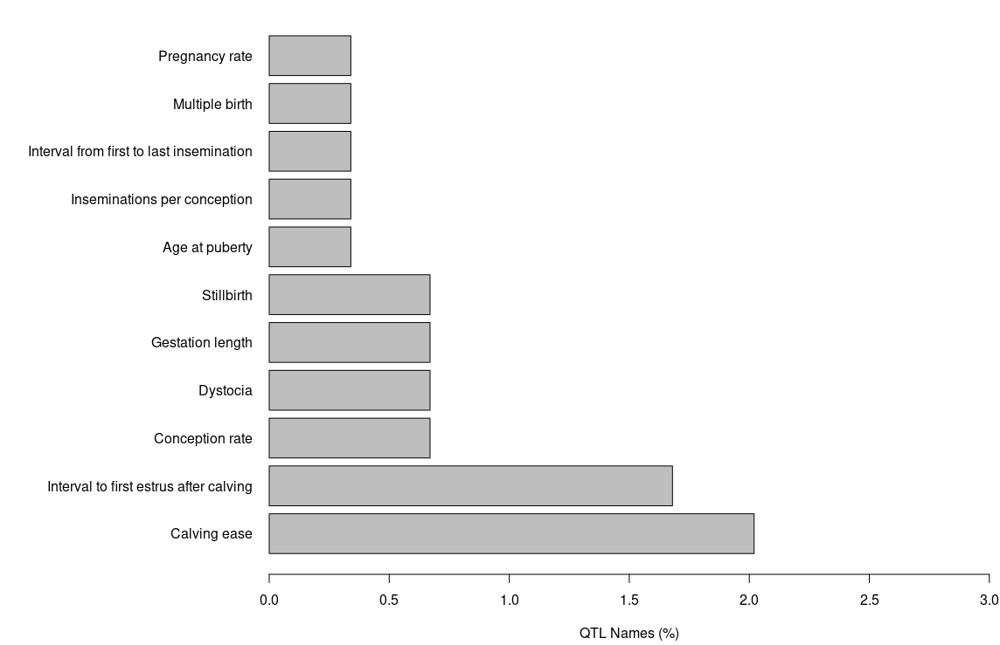

**Milk QTLs**
```{r eval=FALSE}
#Setting margin parameter to better fit the axis labels
oldpar<-par(mar=c(5,20,1,1))
#plotting the percentage of each trait annoatted as a Reproduction QTL
plot_qtl_info(out.qtl, qtl_plot = "qtl_name", qtl_class="Milk")
```


**Meat and Carcass QTLs**
```{r eval=FALSE}
#Setting margin parameter to better fit the axis labels
oldpar<-par(mar=c(5,20,1,1))
#plotting the percentage of each trait annoatted as a Reproduction QTL
plot_qtl_info(out.qtl, qtl_plot = "qtl_name", qtl_class=""Meat_and_Carcass"")
```

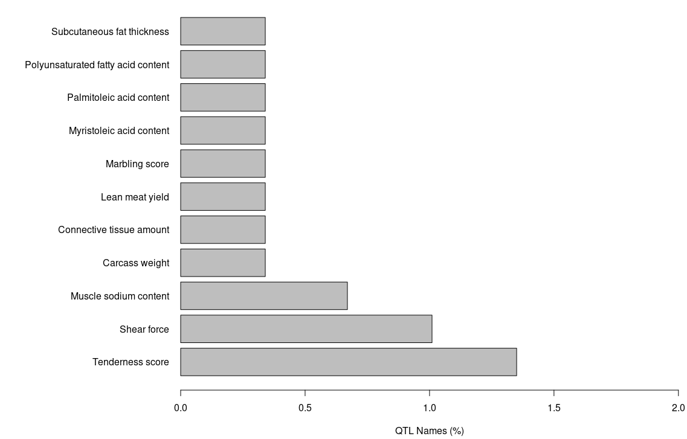

**Health QTLs**
```{r eval=FALSE}
#Setting margin parameter to better fit the axis labels
oldpar<-par(mar=c(5,20,1,1))
#plotting the percentage of each trait annoatted as a Reproduction QTL
plot_qtl_info(out.qtl, qtl_plot = "qtl_name", qtl_class="Health")
```

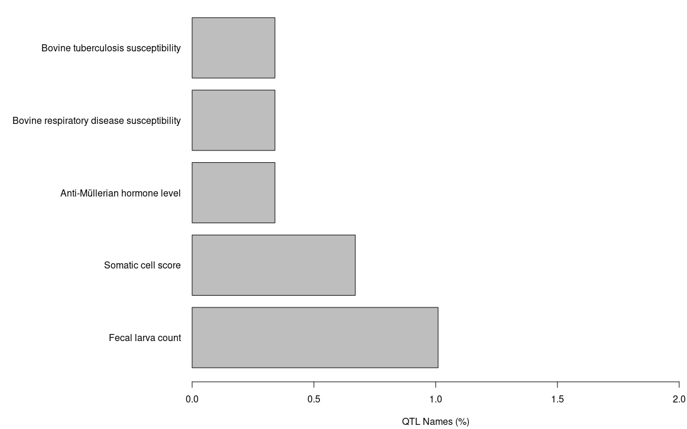

**Exterior QTLs**
```{r eval=FALSE}
#Setting margin parameter to better fit the axis labels
oldpar<-par(mar=c(5,20,1,1))
#plotting the percentage of each trait annoatted as a Reproduction QTL
plot_qtl_info(out.qtl, qtl_plot = "qtl_name", qtl_class="Exterior")
```


### QTL enrichment on GALLO

```{r eval=FALSE}
#QTL enrichment analysis 
out.enrich_qtl_name <-qtl_enrich(qtl_db= qtl_UCD1_2, 
                                 qtl_file= out.qtl, qtl_type = "Name",
                                 enrich_type = "genome", chr.subset = NULL, 
                                 padj = "fdr",nThreads = 2)


# Sorting the dataframe in ascending order of adj.pval
sorted_df <- out.enrich_qtl_name[order(out.enrich_qtl_name$adj.pval), ]

write.csv(sorted_df,"/home/bambrozi/2_CORTISOL/GALLO/GWAS_BLUPF90/out_enrich_qtl_genome_name.csv")

out.enrich_qtl_type <-qtl_enrich(qtl_db= qtl_UCD1_2, 
                                 qtl_file= out.qtl, qtl_type = "QTL_type",
                                 enrich_type = "genome", chr.subset = NULL, 
                                 padj = "fdr",nThreads = 2)

sorted_df_type <- out.enrich_qtl_type[order(out.enrich_qtl_type$adj.pval), ]
write.csv(out.enrich_qtl_type,"/home/bambrozi/2_CORTISOL/GALLO/GWAS_BLUPF90/out_enrich_qtl_genome_type.csv")


#Plots

#Name

#Creating a new ID composed by the trait and the chromosome
out.enrich_qtl_name$ID<-paste(out.enrich_qtl_name$QTL," - ","CHR",out.enrich_qtl_name$CHR,sep="")

#Match the QTL classes and filtering the Reproduction related QTLs
out.enrich.filtered<-out.enrich_qtl_name[which(out.enrich_qtl_name$adj.pval<0.05),]

#Plotting the enrichment results for the QTL enrichment analysis
dev.off()
QTLenrich_plot(out.enrich.filtered, x="ID", pval="adj.pval")


#Type

#Creating a new ID composed by the trait and the chromosome
out.enrich_qtl_type$ID<-paste(out.enrich_qtl_type$QTL," - ","CHR",out.enrich_qtl_type$CHR,sep="")

#Match the QTL classes and filtering the Reproduction related QTLs
out.enrich.filtered_type<-out.enrich_qtl_type[which(out.enrich_qtl_type$adj.pval<0.05),]

#Plotting the enrichment results for the QTL enrichment analysis
dev.off()
QTLenrich_plot(out.enrich.filtered_type, x="ID", pval="adj.pval")

```


**QTL Enrichment outcomes**

**Enrichment by name** (enrichment analysis will be performed for each trait individually)
```{r echo=FALSE}
# Read the CSV file into a data frame
data <- read.csv("C:/Users/galin/OneDrive - University of Guelph/0.Post doc/4_Cortisol/Git_Cortisol/out_enrich_qtl_genome_name_BLUP_GWAS.csv")

# Print the table using knitr::kable
knitr::kable(data)

```

  

**Enrichment by QTL_type** (enrichment processes performed for the QTL classes)
```{r echo=FALSE}
# Read the CSV file into a data frame
data <- read.csv("C:/Users/galin/OneDrive - University of Guelph/0.Post doc/4_Cortisol/Git_Cortisol/out_enrich_qtl_genome_type_BLUP_GWAS.csv")

# Print the table using knitr::kable
knitr::kable(data)

```

 


## BLUPF90+ GPROFILER ON-LINE

From the online version of GPROFILER i got the following results.

**Legend**


## BLUPF90+ VEP


rs110079750


rs109276211


rs109631116


rs42029843


rs110428837


rs110081798


rs110160157


rs110038841


rs109868537


rs110565206


rs42751504


rs110121846


rs110935391


rs109584097


rs41585925


rs110506037


rs109273103


rs109575643


rs43305418


rs43377276


rs43691687


rs41764450


rs42305073
No

rs42462935
No

rs42752353


rs81154019
No

rs41645754


rs41566051


rs41636137


rs41615935


rs29026778


rs29013980


rs29023486


rs29027498
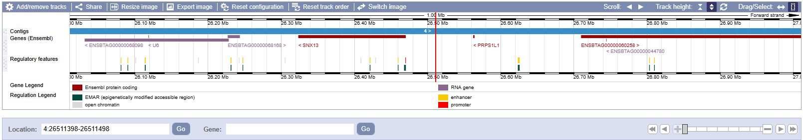

rs29017061


rs29018741


rs29013301


rs29012492
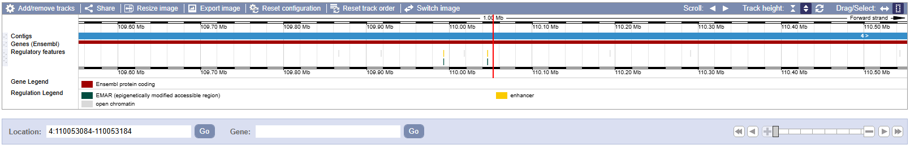

It is interesting that 3 significant SNPs falled in the same gene CSMD2 on chromosome 3
rs109868537
rs42751504
rs42752353


For the gene CNTNAP2 on chromosome 4 also have 2 significant SNPs
rs41566051
rs29012492


#### WINDOWS
#### Running renf90_ssGWAS2_SNPeff_w.par for GWAS (WINDOWS)

The parameter card bellow we are going to run using the software **postGSf90**:

renf90_ssGWAS2_SNPeff_W_10.par
```{bash eval= FALSE}
# BLUPF90 parameter file created by RENUMF90
DATAFILE
renf90.dat
NUMBER_OF_TRAITS
           1
NUMBER_OF_EFFECTS
           3
OBSERVATION(S)
    1
WEIGHT(S)
 
EFFECTS: POSITIONS_IN_DATAFILE NUMBER_OF_LEVELS TYPE_OF_EFFECT[EFFECT NESTED]
 2         4 cross 
 3        22 cross 
 4      3724 cross 
RANDOM_RESIDUAL VALUES
   77182.    
 RANDOM_GROUP
     3
 RANDOM_TYPE
 add_an_upginb
 FILE
renadd03.ped                                                                    
(CO)VARIANCES
   28212.    
OPTION SNP_file bruno_gntps_iid_71_clean
OPTION origID
OPTION no_quality_control
OPTION readGInverse
OPTION readA22Inverse
OPTION map_file snpmap.txt_clean
OPTION snp_p_value
OPTION Manhattan_plot_R
OPTION Manhattan_plot
OPTION SNP_moving_average 10
OPTION windows_variance 10 

```


This code will generate several files, among them:
<ul>
<li> **chrsnp_pval**: which has the -log10(pvalue) the 3rd column
<li> **Pft1e3.R**: a r-code to generate the Manhattan plot in R
</ul>


#### Manhattan Plots for BLUPF90 GWAS

##### Genome Independent Segment
To make the Manhattan Plot considering Genome Independent Segment we should run the code bellow. This code has part of the code in the file **Pft1e3.R**

```{r eval=FALSE}
Genome_Assembly_ARS_UCD_1_2 <- read_tsv("/home/bambrozi/2_CORTISOL/GWAS/sequence_report_ARS-UCD1_2.tsv")

library(dplyr)
# Filter the rows and sum the Seq length column
# Assuming your data frame is named Genome_Assembly_ARS_UCD_1_2
L <- Genome_Assembly_ARS_UCD_1_2 %>%
  filter(`UCSC style name` %in% paste0("chr", 1:29)) %>%
  summarise(total_length = sum(`Seq length`)) %>%
  pull(total_length)

# Converting bases to Morgan (1Mb = 1cM (0,01 Morgan))
L_M <- L/10^8

# The Ne measure is based on the article bellow:
Ne <- 66 #(Makanjoula et al., 2020)

NeL <- Ne*L_M

# This is the number of independent segment in the genome.
Me <- (2*NeL)/log10(NeL)


# Calculate Bonferroni threshold (already done)
bonf <- -log10(0.05 / Me)


setwd("/home/bambrozi/2_CORTISOL/GWAS/BLUPF90/EXTREME_PHENO")
# Read in and process data for Manhattan plot
yyy1 <- read.table("chrsnp_pval")
yyy <- yyy1[order(yyy1$V4), ]
zzz <- yyy[which(yyy$V1 == 1 & yyy$V2 == 3), ]
n <- nrow(zzz)
y <- zzz[, 4]
x <- zzz[, 3]
chr1 <- zzz[, 5]
chr <- NULL
pos <- NULL

for (i in unique(yyy$V5)) {
  zz <- yyy[yyy$V5 == i, ]
  key <- zz$V4
  medio <- round(nrow(zz) / 2, 0)
  z <- key[medio]
  pos <- c(pos, z)
}

chrn <- unique(yyy$V5)
one <- which(chr1 %% 4 == 0)
two <- which(chr1 %% 4 == 1)
three <- which(chr1 %% 4 == 2)
four <- which(chr1 %% 4 == 3)
chr[one] <- "darkgoldenrod"
chr[two] <- "darkorchid"
chr[three] <- "blue"
chr[four] <- "forestgreen"

# Create Manhattan plot with Bonferroni line and legend
pdf(file = "Pft1e3_manplot_with_bonf_ind_seg.pdf", family = "sans", height = 27.8, width = 50, pointsize = 20, bg = "white")
par(mfrow = c(1, 1), family = "sans", cex = 1.5, font = 2)
plot(y, x, xaxt = "n", main = "Manhattan Plot SNP p_value - Trait: 1 Effect: 3", xlab = "", ylab = "-log10(p-value)", pch = 20, xlim = c(1, n), ylim = c(0, max(x)), col = chr)

# Add Bonferroni line
abline(h = bonf, col = "red", lwd = 2, lty = 2)

# Add legend for Bonferroni line
legend("topright", legend = "Bonferroni correction for genome independent segments", col = "red", lwd = 2, lty = 2, cex = 1)

axis(1, at = pos, labels = chrn)
dev.off()

```


For additional analysis like Variant Effect Prediction (VEP) we need the rsID, to get the rsID we use the software SNPChimp which requires SNP_names, but the BLUPF90 output have only the Chromosome and Position of the SNPs, so we are going to perfome these two steps to get one file with t he significant SNPs + SNP_name + rsID


### Results

We have 2 different output files

1) Variance components: blupf90.log  


In this file we can find the heritabilit (SD) and for instance the convergence (similarity)

2) Solutions: solutions.orig  
In this file we will find the solutions (results) for each effect

In our example:

<ul>
<li> **EFFECT 1**: Birth Year, has 4 levels (2018, 2019, 2020 and 2021), and the solution that for this fixed effect is how much each level add.
<li> **EFFECT 2**: Sampling date, has 23 levels, and the solutions
<li> **EFFECT 3**: Animal random effect, has one for each animal and it is the EBV or GEBV.


### Variance components estimation with the whole sample
We'LL estimate the GRM on GCTA fro all 252 animals.

First I will need to build a 

### GWAS


Now we'll estimate the Variance Components for all 252 animals on BLUPF90+
With the Variance Components Estimations we'll perform a GWAS on BLUPF90+ only for the animals with Extreme Phenotypes.


### Corrected Bonferroni for genome independent segments

Now we are going to apply a correction for multiple testing modifying the Bonferroni test adjusting not for the total number of SNPs but for the number of the independent segments in the genome.

```{r eval=FALSE}

Genome_Assembly_ARS_UCD_1_2 <- read_tsv("/home/bambrozi/2_CORTISOL/GWAS/sequence_report_ARS-UCD1_2.tsv")

library(dplyr)
# Filter the rows and sum the Seq length column
# Assuming your data frame is named Genome_Assembly_ARS_UCD_1_2
L <- Genome_Assembly_ARS_UCD_1_2 %>%
  filter(`UCSC style name` %in% paste0("chr", 1:29)) %>%
  summarise(total_length = sum(`Seq length`)) %>%
  pull(total_length)

# Converting bases to Morgan (1Mb = 1cM (0,01 Morgan))
L_M <- L/10^8

# The Ne measure is based on the article bellow:
Ne <- 66 #(Makanjoula et al., 2020)

NeL <- Ne*L_M

# This is the number of independent segment in the genome.
Me <- (2*NeL)/log10(NeL)


gwas<- read.table(file = "/home/bambrozi/2_CORTISOL/GWAS/EXTREM_PHENO_BY_SD/GWAS_result_NO_CONSTRAIN.loco.mlma", 
                  head=T, stringsAsFactors = F)


gwas$Chr<- as.factor(gwas$Chr)
gwas$logP<- -log10(gwas$p)
rmv<- which(gwas$logP == "NaN")
if (length(rmv) >=1) {gwas <- gwas[-rmv,]}

bonf<- -log10(0.15/Me)

library(GHap)
ghap.manhattan(data=gwas,chr="Chr", bp="bp", y="logP", type="p", pch = 20, 
               cex=1, lwd=1, ylab="", xlab="Chromossomes", 
               main="GWAS Cortisol", backcolor="#F5EFE780", chr.ang=0,)
abline(h=(bonf), col="red2")
legend("topright", col="red2", lwd=2, c("Bonferroni corr. for ind. segments"), bty="n")


library(tidyverse)

SNP_sig_bonf_ind_seg <- filter(gwas, logP > bonf)
write.table(SNP_sig_bonf_ind_seg, file = "/home/bambrozi/2_CORTISOL/GWAS/EXTREM_PHENO_BY_SD/SNP_sig15_Bonf_ind_seg.txt", 
            quote = FALSE, sep = "\t", row.names = FALSE, col.names = T)

write.csv(SNP_sig_bonf_ind_seg, "/home/bambrozi/2_CORTISOL/GWAS/EXTREM_PHENO_BY_SD/SNP_sig15_Bonf_ind_seg.txt")

```

The SNPs below are the significant after the correction above
```{r echo=FALSE}
# Read the CSV file into a data frame
data <- read.csv("C:/Users/galin/OneDrive - University of Guelph/0.Post doc/4_Cortisol/Git_Cortisol/SNP_sig15_Bonf_ind_seg.csv")

# Print the table using knitr::kable
knitr::kable(data)

```


Bellow we inserted  the **rsID** searched at SNPCHIMP

```{r echo=FALSE}
# Read the CSV file into a data frame
data <- read.csv("C:/Users/galin/OneDrive - University of Guelph/0.Post doc/4_Cortisol/Git_Cortisol/SNP_rsID_sig15_Bonf_ind_seg.csv")

# Print the table using knitr::kable
knitr::kable(data)

```

### GALLO

```{r eval=FALSE}
# GALLO

#import a QTL annotation file
qtl_UCD1_2 <- import_gff_gtf(db_file="/home/bambrozi/2_CORTISOL/GALLO/Animal_QTLdb_release53_cattleARS_UCD1.gff.gz",file_type="gff")

#import a gene annotation file
gene_UDC1_2 <- import_gff_gtf(db_file="/home/bambrozi/2_CORTISOL/GALLO/Bos_taurus.ARS-UCD1.2.110.gtf.gz",file_type="gtf")

#import MARKER files = the GWAS output
gwas <- read.csv(file = "/home/bambrozi/2_CORTISOL/GWAS/EXTREM_PHENO_BY_SD/SNP_sig15_Bonf_ind_seg.csv")

# Assuming "gwas" is your dataframe
gwas <- subset(gwas, select = c(Chr, SNP, bp))


colnames(gwas) <- c("CHR","SNP", "BP")


#FINDING GENES AND QTLs ARROUND THE MARKER

#FINDING GENES
out.genes <- find_genes_qtls_around_markers(db_file= gene_UDC1_2, 
                                            marker_file= gwas, 
                                            method = "gene",
                                            marker = "snp", 
                                            interval = 50000, 
                                            nThreads = NULL)

write.table(out.genes, file = "/home/bambrozi/2_CORTISOL/GALLO/EXTREM_PHENO_BY_SD/out_genes_extr_15.txt", 
            quote = FALSE, sep = "\t", row.names = FALSE, col.names = T)

write.csv(out.genes, file = "/home/bambrozi/2_CORTISOL/GALLO/EXTREM_PHENO_BY_SD/out_genes_extr_15.csv")

#FINDING QTLs

out.qtl <- find_genes_qtls_around_markers(db_file= qtl_UCD1_2, 
                                          marker_file= gwas, 
                                          method = "qtl",
                                          marker = "snp", 
                                          interval = 50000, 
                                          nThreads = NULL)


write.table(out.qtl, file = "/home/bambrozi/2_CORTISOL/GALLO/EXTREM_PHENO_BY_SD/out_qtl_extr_15.txt", 
            quote = FALSE, sep = "\t", row.names = FALSE, col.names = T)

library(tidyverse)
out.qtl.clean <- select(out.qtl, c("CHR", "SNP", "BP", "QTL_type", "start_pos", "end_pos","QTL_ID"))
write.csv(out.qtl.clean, file = "/home/bambrozi/2_CORTISOL/GALLO/EXTREM_PHENO_BY_SD/out_qtl_extr_15.csv")
```


The GALLO output are bellow:

**For GENES**
```{r echo=FALSE}
# Read the CSV file into a data frame
data <- read.csv("C:/Users/galin/OneDrive - University of Guelph/0.Post doc/4_Cortisol/Git_Cortisol/out_genes_extr_15.csv")

# Print the table using knitr::kable
knitr::kable(data)

```

**FOR QTLs**
```{r echo=FALSE}
# Read the CSV file into a data frame
data <- read.csv("C:/Users/galin/OneDrive - University of Guelph/0.Post doc/4_Cortisol/Git_Cortisol/out_qtl_extr_15.csv")

# Print the table using knitr::kable
knitr::kable(data)

```


#### QTL enrichment on GALLO

```{r eval=FALSE}
#QTL enrichment analysis 
out.enrich_qtl_name <-qtl_enrich(qtl_db= qtl_UCD1_2, 
                                 qtl_file= out.qtl, qtl_type = "Name",
                                 enrich_type = "genome", chr.subset = NULL, 
                                 padj = "fdr",nThreads = 2)


# Sorting the dataframe in ascending order of adj.pval
sorted_df <- out.enrich_qtl_name[order(out.enrich_qtl_name$adj.pval), ]

write.csv(sorted_df,"/home/bambrozi/2_CORTISOL/GALLO/EXTREM_PHENO_BY_SD/out_enrich_qtl_genome_name_extr_15.csv")

out.enrich_qtl_type <-qtl_enrich(qtl_db= qtl_UCD1_2, 
                                 qtl_file= out.qtl, qtl_type = "QTL_type",
                                 enrich_type = "genome", chr.subset = NULL, 
                                 padj = "fdr",nThreads = 2)

sorted_df_type <- out.enrich_qtl_type[order(out.enrich_qtl_type$adj.pval), ]
write.csv(out.enrich_qtl_type,"/home/bambrozi/2_CORTISOL/GALLO/EXTREM_PHENO_BY_SD/out_enrich_qtl_genome_type_extr_15.csv")


#Plots

#Name

#Creating a new ID composed by the trait and the chromosome
out.enrich_qtl_name$ID<-paste(out.enrich_qtl_name$QTL," - ","CHR",out.enrich_qtl_name$CHR,sep="")

#Match the QTL classes and filtering the Reproduction related QTLs
out.enrich.filtered<-out.enrich_qtl_name[which(out.enrich_qtl_name$adj.pval<0.05),]

#Plotting the enrichment results for the QTL enrichment analysis
dev.off()
QTLenrich_plot(out.enrich.filtered, x="ID", pval="adj.pval")


#Type

#Creating a new ID composed by the trait and the chromosome
out.enrich_qtl_type$ID<-paste(out.enrich_qtl_type$QTL," - ","CHR",out.enrich_qtl_type$CHR,sep="")

#Match the QTL classes and filtering the Reproduction related QTLs
out.enrich.filtered_type<-out.enrich_qtl_type[which(out.enrich_qtl_type$adj.pval<0.05),]

#Plotting the enrichment results for the QTL enrichment analysis
dev.off()
QTLenrich_plot(out.enrich.filtered_type, x="ID", pval="adj.pval")
```


**QTL Enrichment outcomes**

**Enrichment by name** (enrichment analysis will be performed for each trait individually)
```{r echo=FALSE}
# Read the CSV file into a data frame
data <- read.csv("C:/Users/galin/OneDrive - University of Guelph/0.Post doc/4_Cortisol/Git_Cortisol/out_enrich_qtl_genome_name_extr_15.csv")

# Print the table using knitr::kable
knitr::kable(data)

```

  

**Enrichment by QTL_type** (enrichment processes performed for the QTL classes)
```{r echo=FALSE}
# Read the CSV file into a data frame
data <- read.csv("C:/Users/galin/OneDrive - University of Guelph/0.Post doc/4_Cortisol/Git_Cortisol/out_enrich_qtl_genome_type_extr_15.csv")

# Print the table using knitr::kable
knitr::kable(data)

```

 

### gPROFILER online

From the online version of GPROFILER i got the following results.

**Legend**


# GWAS on GCTA

```{r eval=FALSE}
pheno <- read.table("/home/bambrozi/2_CORTISOL/GWAS/pheno_genotyped.txt", header = T)
data_final <- read.csv("/home/bambrozi/2_CORTISOL/RawFiles/GEBVs_Elora/data_GEBVs_Cortisol_select_traits2.csv", header = T)
ids_eq <- read.csv("/home/bambrozi/2_CORTISOL/RawFiles/Pedigree/bruno_ids.csv", header = T)


# Create data_final$cdn_id by matching IDs with elora_id
data_final$cdn_id <- ids_eq$cdn_id[match(data_final$ID, ids_eq$elora_id)]
fixeff <- data_final[,c("ID", "BIRTH_YEAR", "Sampling_date", "cdn_id")]
fixeff <- fixeff[fixeff$cdn_id %in% pheno$cdn_id, ]
fixeff$FID <- "HO"
fixeff <- fixeff[, c("FID", "cdn_id", "BIRTH_YEAR", "Sampling_date")]

identical(fixeff$cdn_id, pheno$cdn_id)

write.table(fixeff, "/home/bambrozi/2_CORTISOL/GWAS/GWAS_plus_BY_Samp/fixeff.txt", quote = F, row.names = F, col.names = T)
```

```{bash eval=FALSE}
#!/bin/bash

DATA=/home/bambrozi/2_CORTISOL/Geno_files_after_QC/genoplink_clean
RESULT=/home/bambrozi/2_CORTISOL/GWAS/GWAS_plus_BY_Samp/GWAS_result
PHENO=/home/bambrozi/2_CORTISOL/GWAS/pheno_genotyped.txt
FIXEFF=/home/bambrozi/2_CORTISOL/GWAS/GWAS_plus_BY_Samp/fixeff.txt

/home/local/bin/gcta \
    --bfile ${DATA} \
    --mlma-loco \
    --pheno ${PHENO} \
    --qcovar ${FIXEFF} \
    --autosome-num 29 \
    --autosome \
    --out ${RESULT}

```

## Corrected Bonferroni for genome independent segments

Now we are going to apply a correction for multiple testing modifying the Bonferroni test adjusting not for the total number of SNPs but for the number of the independent segments in the genome.

```{r eval=FALSE}
{r eval=FALSE}
Genome_Assembly_ARS_UCD_1_2 <- read_tsv("/home/bambrozi/2_CORTISOL/GWAS/sequence_report_ARS-UCD1_2.tsv")

library(dplyr)
# Filter the rows and sum the Seq length column
# Assuming your data frame is named Genome_Assembly_ARS_UCD_1_2
L <- Genome_Assembly_ARS_UCD_1_2 %>%
  filter(`UCSC style name` %in% paste0("chr", 1:29)) %>%
  summarise(total_length = sum(`Seq length`)) %>%
  pull(total_length)

# Converting bases to Morgan (1Mb = 1cM (0,01 Morgan))
L_M <- L/10^8

# The Ne measure is based on the article bellow:
Ne <- 66 #(Makanjoula et al., 2020)

NeL <- Ne*L_M

# This is the number of independent segment in the genome.
Me <- (2*NeL)/log10(NeL)


gwas<- read.table(file = "/home/bambrozi/2_CORTISOL/GWAS/GWAS_plus_BY_Samp/GWAS_result.loco.mlma", 
                  head=T, stringsAsFactors = F)

gwas$Chr<- as.factor(gwas$Chr)
gwas$logP<- -log10(gwas$p)
rmv<- which(gwas$logP == "NaN")
if (length(rmv) >=1) {gwas <- gwas[-rmv,]}

bonf<- -log10(0.05/Me)

library(GHap)
ghap.manhattan(data=gwas,chr="Chr", bp="bp", y="logP", type="p", pch = 20, 
               cex=1, lwd=1, ylab="", xlab="Chromossomes", 
               main="GWAS Cortisol", backcolor="#F5EFE780", chr.ang=0,)
abline(h=(bonf), col="red2")
legend("topleft", col="red2", lwd=2, c("Bonferroni corr. for ind. segments"), bty="n")


library(tidyverse)

SNP_sig_bonf_ind_seg <- filter(gwas, logP > bonf)
write.table(SNP_sig_bonf_ind_seg, file = "/home/bambrozi/2_CORTISOL/GWAS/GWAS_plus_BY_Samp/SNP_sig_Bonf_ind_seg.txt", 
            quote = FALSE, sep = "\t", row.names = FALSE, col.names = T)

write.csv(SNP_sig_bonf_ind_seg, "/home/bambrozi/2_CORTISOL/GWAS/GWAS_plus_BY_Samp/SNP_sig_Bonf_ind_seg2.csv")
```

The SNPs below are the significant after the correction above
```{r echo=FALSE}
# Read the CSV file into a data frame
data <- read.csv("C:/Users/galin/OneDrive - University of Guelph/0.Post doc/4_Cortisol/Git_Cortisol/SNP_sig_Bonf_ind_seg2.csv")

# Print the table using knitr::kable
knitr::kable(data)

```


Bellow we inserted  the **rsID** searched at SNPCHIMP

```{r echo=FALSE}
# Read the CSV file into a data frame
data <- read.csv("C:/Users/galin/OneDrive - University of Guelph/0.Post doc/4_Cortisol/Git_Cortisol/SNP_sig_Bonf_ind_seg2_rsID.csv")

# Print the table using knitr::kable
knitr::kable(data)

```

### Option 2: Manhattan Plot
```{r eval=FALSE}
gwas<- read.table(file = "/home/bambrozi/2_CORTISOL/GWAS/GWAS_plus_BY_Samp/GWAS_result.loco.mlma", 
                  head=T, stringsAsFactors = F)
# Prepare the dataset
don <- gwas %>% 
  group_by(Chr) %>% 
  summarise(chr_len = max(bp)) %>% 
  mutate(tot = cumsum(as.numeric(chr_len)) - as.numeric(chr_len)) %>%
  select(-chr_len) %>%
  left_join(gwas, ., by = c("Chr" = "Chr")) %>%
  arrange(Chr, bp) %>%
  mutate(BPcum = as.numeric(bp) + tot) %>%
  mutate(is_highlight = ifelse(logP > bonf, "yes", "no")) %>%
  mutate(is_annotate = ifelse(logP > bonf, "yes", "no"))

# Remove rows with missing BPcum values
don <- don %>% filter(!is.na(BPcum))

# Prepare X axis
axisdf <- don %>% 
  group_by(Chr) %>% 
  summarize(center = (max(BPcum) + min(BPcum)) / 2)

# Find the maximum logP value for setting y-axis limits
max_logP <- max(don$logP, na.rm = TRUE)

# Make the plot
ggplot(don, aes(x = BPcum, y = logP)) +
  geom_point(aes(color = as.factor(Chr)), alpha = 0.8, size = 1.3) +
  scale_color_manual(values = rep(c("grey", "skyblue"), 22)) +
  scale_x_continuous(label = axisdf$Chr, breaks = axisdf$center) +
  scale_y_continuous(expand = c(0, 0), limits = c(0, max_logP + 1)) + # Set y-axis limit
  geom_point(data = subset(don, is_highlight == "yes"), color = "orange", size = 2) +
  geom_text_repel(data = subset(don, is_annotate == "yes"), aes(label = SNP), size = 2) +
  theme_bw() +
  theme(
    legend.position = "none",
    panel.border = element_blank(),
    panel.grid.major.x = element_blank(),
    panel.grid.minor.x = element_blank()
  ) +
  labs(title = "GWAS Cortisol", x = "Chromosomes", y = "-log10(p)")

```


# VEP

After insert all **rsID** on VEP the summary is shown below:


As can be seen, the VEP only analysed 14 variants

Bellow I'm gonna show the "genome view" for each SNP (variant) recovered from VEP:

<span style="color: red;">**rs110031217**</span>
  

<span style="color: red;">**rs110991998**</span>
  

<span style="color: red;">**rs42089058**</span>
  

<span style="color: red;">**rs41644634**</span>
  

<span style="color: red;">**rs41567074**</span>
  


*ps. the unique reference genome available in the VEP is the ARS-UCD1.3, which is not a problem once it is working with the rsID, which for sure is our variant.*

# GALLO

```{r eval=FALSE}
# GALLO

#import a QTL annotation file
qtl_UCD1_2 <- import_gff_gtf(db_file="/home/bambrozi/2_CORTISOL/GALLO/Animal_QTLdb_release53_cattleARS_UCD1.gff.gz",file_type="gff")

#import a gene annotation file
gene_UDC1_2 <- import_gff_gtf(db_file="/home/bambrozi/2_CORTISOL/GALLO/Bos_taurus.ARS-UCD1.2.110.gtf.gz",file_type="gtf")

#import MARKER files = the GWAS output
gwas <- read.csv(file = "/home/bambrozi/2_CORTISOL/GWAS/GWAS_plus_BY_Samp/SNP_sig_Bonf_ind_seg.csv")

# Assuming "gwas" is your dataframe
gwas <- subset(gwas, select = c(Chr, SNP, bp))


colnames(gwas) <- c("CHR","SNP", "BP")


#FINDING GENES AND QTLs ARROUND THE MARKER

#FINDING GENES
out.genes <- find_genes_qtls_around_markers(db_file= gene_UDC1_2, 
                                            marker_file= gwas, 
                                            method = "gene",
                                            marker = "snp", 
                                            interval = 50000, 
                                            nThreads = NULL)

write.table(out.genes, file = "/home/bambrozi/2_CORTISOL/GALLO/GALLO_BY_SD/out_genes2.txt", 
            quote = FALSE, sep = "\t", row.names = FALSE, col.names = T)

write.csv(out.genes, file = "/home/bambrozi/2_CORTISOL/GALLO/GALLO_BY_SD/out_genes2.csv")

#FINDING QTLs

out.qtl <- find_genes_qtls_around_markers(db_file= qtl_UCD1_2, 
                                          marker_file= gwas, 
                                          method = "qtl",
                                          marker = "snp", 
                                          interval = 50000, 
                                          nThreads = NULL)


write.table(out.qtl, file = "/home/bambrozi/2_CORTISOL/GALLO/GALLO_BY_SD/out_qtl2.txt", 
            quote = FALSE, sep = "\t", row.names = FALSE, col.names = T)

library(tidyverse)
out.qtl.clean <- select(out.qtl, c("CHR", "SNP", "BP", "QTL_type", "start_pos", "end_pos","QTL_ID"))
write.csv(out.qtl.clean, file = "/home/bambrozi/2_CORTISOL/GALLO/GALLO_BY_SD/out_qtl_clean2.csv")
```


Dowloading the .gtf file from Ensembl
<https://useast.ensembl.org/info/data/ftp/index.html>

Downloading the .gff file from AnimalQTLdb
<https://www.animalgenome.org/cgi-bin/QTLdb/index>


The GALLO output are bellow:

**For GENES**
```{r echo=FALSE}
# Read the CSV file into a data frame
data <- read.csv("C:/Users/galin/OneDrive - University of Guelph/0.Post doc/4_Cortisol/Git_Cortisol/out_genes2.csv")

# Print the table using knitr::kable
knitr::kable(data)

```

**FOR QTLs**
```{r echo=FALSE}
# Read the CSV file into a data frame
data <- read.csv("C:/Users/galin/OneDrive - University of Guelph/0.Post doc/4_Cortisol/Git_Cortisol/out_qtl_clean2.csv")

# Print the table using knitr::kable
knitr::kable(data)

```

## QTL annotation on GALLO

**QTL type**
```{r eval=FALSE}
#GALLO
par(mar=c(8,20,8,8))
plot_qtl_info(out.qtl, qtl_plot = "qtl_type", cex=1)
```

  

**QTL type**
```{r eval=FALSE}
#GALLO
par(mar=c(10,20,10,10))
plot_qtl_info(out.qtl, qtl_plot = "qtl_name", qtl_class="Reproduction")

par(mar=c(10,20,10,10))
plot_qtl_info(out.qtl, qtl_plot = "qtl_name", qtl_class="Health")
```

**Reproduction**
  

**Health**
  

## QTL enrichment on GALLO

```{r eval=FALSE}
#QTL enrichment analysis 
out.enrich_qtl_name <-qtl_enrich(qtl_db= qtl_UCD1_2, 
                                 qtl_file= out.qtl, qtl_type = "Name",
                                 enrich_type = "genome", chr.subset = NULL, 
                                 padj = "fdr",nThreads = 2)


# Sorting the dataframe in ascending order of adj.pval
sorted_df <- out.enrich_qtl_name[order(out.enrich_qtl_name$adj.pval), ]

write.csv(sorted_df,"/home/bambrozi/2_CORTISOL/GALLO/GALLO_BY_SD/out_enrich_qtl_genome_name_2.csv")

out.enrich_qtl_type <-qtl_enrich(qtl_db= qtl_UCD1_2, 
                                 qtl_file= out.qtl, qtl_type = "QTL_type",
                                 enrich_type = "genome", chr.subset = NULL, 
                                 padj = "fdr",nThreads = 2)

sorted_df_type <- out.enrich_qtl_type[order(out.enrich_qtl_type$adj.pval), ]
write.csv(out.enrich_qtl_type,"/home/bambrozi/2_CORTISOL/GALLO/GALLO_BY_SD/out_enrich_qtl_genome_type_2.csv")


#Plots

#Name

#Creating a new ID composed by the trait and the chromosome
out.enrich_qtl_name$ID<-paste(out.enrich_qtl_name$QTL," - ","CHR",out.enrich_qtl_name$CHR,sep="")

#Match the QTL classes and filtering the Reproduction related QTLs
out.enrich.filtered<-out.enrich_qtl_name[which(out.enrich_qtl_name$adj.pval<0.05),]

#Plotting the enrichment results for the QTL enrichment analysis
dev.off()
QTLenrich_plot(out.enrich.filtered, x="ID", pval="adj.pval")


#Type

#Creating a new ID composed by the trait and the chromosome
out.enrich_qtl_type$ID<-paste(out.enrich_qtl_type$QTL," - ","CHR",out.enrich_qtl_type$CHR,sep="")

#Match the QTL classes and filtering the Reproduction related QTLs
out.enrich.filtered_type<-out.enrich_qtl_type[which(out.enrich_qtl_type$adj.pval<0.05),]

#Plotting the enrichment results for the QTL enrichment analysis
dev.off()
QTLenrich_plot(out.enrich.filtered_type, x="ID", pval="adj.pval")
```

**QTL Enrichment outcomes**

**Enrichment by name** (enrichment analysis will be performed for each trait individually)
```{r echo=FALSE}
# Read the CSV file into a data frame
data <- read.csv("C:/Users/galin/OneDrive - University of Guelph/0.Post doc/4_Cortisol/Git_Cortisol/out_enrich_qtl_genome_name_2.csv")

# Print the table using knitr::kable
knitr::kable(data)

```

  

**Enrichment by QTL_type** (enrichment processes performed for the QTL classes)
```{r echo=FALSE}
# Read the CSV file into a data frame
data <- read.csv("C:/Users/galin/OneDrive - University of Guelph/0.Post doc/4_Cortisol/Git_Cortisol/out_enrich_qtl_genome_type_2.csv")

# Print the table using knitr::kable
knitr::kable(data)

```

 

# GPROFILER ON-LINE

From the online version of GPROFILER i got the following results.

**Legend**


# Genetic Correlation

To assess the correlation between Cortisol phenotypes and Genomic Estimated Breeding Values (GEBVs), we opt for a linear regression instead of a standard correlation test. This decision is driven by the non-normal distribution of our Cortisol phenotypes, which violates the assumptions required for traditional correlation tests.

Linear regression offers a robust alternative as it does not necessitate normality for the dependent variable. By regressing GEBVs over Cortisol, we can model the relationship between these variables. Our aim is to estimate the regression coefficient, which serves as our correlation estimate.

Due to the violation of normality assumptions for the dependent variable (Cortisol), traditional correlation tests may not provide reliable results, particularly in assessing the significance of the correlation. Therefore, alternative approaches, such as linear regression, are preferred as they do not require the same assumptions about the distribution of the dependent variable. By using linear regression, we can still assess the relationship between Cortisol and GEBVs while accommodating the non-normality of Cortisol phenotypes.

The regression model can be represented as follows:
\[ y = \beta_0 + \beta_1 \times GEBV_{\text{Milk}} + \epsilon \]

Where:

- \( y \) represents Cortisol phenotypes.
- \( GEBV_{\text{Milk}} \) denotes the GEBV for Milk Yield.
- \( \beta_0 \) and \( \beta_1 \) are the intercept and regression coefficient, respectively.
- \( \epsilon \) represents the error term capturing unexplained variability.

This approach enables us to quantify the relationship between Cortisol and GEBVs, addressing the non-normality of Cortisol phenotypes while allowing for formal hypothesis testing of the correlation's significance.

## Data preparation

The first data I received from Lucas had only 135 animals out of 260 with values the other 125 had only NA
I shown this to Lucas
Lucas wrote to Alisson
Lucas sent me the missing animals
I merged this two files

```{r eval=FALSE}
rm(list = ls())

# Load the necessary library
library(dplyr)
library(tidyverse)

cortisol_260 <- read.csv("/home/bambrozi/2_CORTISOL/Data/data_clean.csv")

#This is the first dataframe with information for 135 animals and 125 NA
GEBVs1 <- read.csv("/home/bambrozi/2_CORTISOL/RawFiles/GEBVs_Elora/ebvs_elora.csv")
#This is the second file with information for the 125 NA animals
GEBVs2 <- read.csv("/home/bambrozi/2_CORTISOL/RawFiles/GEBVs_Elora/elora_missing_females_2404_06_11_2024.csv")
#This are de columns we can use because we know the meaning of the acronyms
GEBVs_to_use <- read.csv("/home/bambrozi/2_CORTISOL/RawFiles/GEBVs_Elora/ebv_names_lucas_06102024_BAG.csv")


sum(is.na(GEBVs1$MILK))
GEBVs1<- GEBVs1[which(is.na(GEBVs1[,"DHI_BARN_NAME"]) == F),]

sum(!is.na(GEBVs2$MILK))
GEBVs2<- GEBVs2[which(is.na(GEBVs2[,"DHI_BARN_NAME"]) == F),]

print(GEBVs1$DHI_BARN_NAME)
print(GEBVs2$DHI_BARN_NAME)

# Making the two dataframes with the same columns
# Remove elora_id and international_id from GEBVs1
GEBVs1 <- GEBVs1 %>% select(-elora_id, -international_id)

# Remove ANIMAL_ID from GEBVs2
GEBVs2 <- GEBVs2 %>% select(-ANIMAL_ID)

# Check if the two dataframes have the same columns
have_same_columns <- all(names(GEBVs1) == names(GEBVs2))

if (have_same_columns) {
  print("The dataframes have the same columns.")
} else {
  print("The dataframes do not have the same columns.")
}


# Check if the column names are in the same order
same_order <- identical(names(GEBVs1), names(GEBVs2))

if (same_order) {
  print("The columns are in the same order.")
} else {
  print("The columns are not in the same order.")
}

GEBVs_combined <- rbind(GEBVs1, GEBVs2)

# Sort the columns
sorted_cortisol_260 <- sort(cortisol_260$ID)
sorted_GEBVs_combined <- sort(GEBVs_combined$DHI_BARN_NAME)

# Check if the sorted columns have the same values
identical(sorted_cortisol_260, sorted_GEBVs_combined)

# Create a duplicate of the column 'DHI_BARN_NAME' and name it 'elora_id'
GEBVs_combined$elora_id <- GEBVs_combined$DHI_BARN_NAME

# Assuming GEBVs_combined is your data frame
GEBVs_combined <- GEBVs_combined %>%
  select(elora_id, DHI_BARN_NAME, everything())

write.csv(GEBVs_combined, "/home/bambrozi/2_CORTISOL/RawFiles/GEBVs_Elora/ebvs_elora_complete.csv")

# Merging the dataframe with Cortisol values, with the dataframe with GEBVs values
Merg_Cort_GEBVs <- merge(cortisol_260, GEBVs_combined, by.x = "ID", by.y = "elora_id")

write.csv(Merg_Cort_GEBVs, "/home/bambrozi/2_CORTISOL/RawFiles/GEBVs_Elora/Merged_Cortisol_GEBVs.csv")

#Opening the file with the GEBVs columns to use
Columns_to_use <- readLines("/home/bambrozi/2_CORTISOL/RawFiles/GEBVs_Elora/traits_to_use.txt")

colnames(Merg_Cort_GEBVs)[405] <- "IDD"

data <- select(Merg_Cort_GEBVs, ID, T4Cortisol, BIRTH_YEAR, all_of(Columns_to_use))

# The data below has the the 55 GEBVs + Cortisol data + Birth Year
write.csv(data, "/home/bambrozi/2_CORTISOL/RawFiles/GEBVs_Elora/data_GEBVs_Cortisol_select_traits.csv")

samp_date2 <- read.csv("/home/bambrozi/2_CORTISOL/Data/Elora animal_ids_kl_sampling_date.csv")

# Convert Sampling_date to Date using as.Date
samp_date$Sampling_date <- as.Date(samp_date$Sampling_date, format = "%m/%d/%Y")

table(samp_date$Sampling_date)

samp_date <- select(samp_date, Elora_id, Sampling_date)

# Check if data$ID and samp_dates$elora_id are identical in values and order
identical(data$ID, samp_date$Elora_id)

data_final <- merge(data, samp_date, by.x="ID", by.y="Elora_id")

data_final <- data_final %>%
  select(ID, T4Cortisol, BIRTH_YEAR, Sampling_date, everything())

# The data below has the the 55 GEBVs + Cortisol data + Birth Year + Sampling data
write.csv(data_final, "/home/bambrozi/2_CORTISOL/RawFiles/GEBVs_Elora/data_GEBVs_Cortisol_select_traits2.csv")

```

ps. I double checked by hand the select and merge process against the original tables received and is everything ok.

## Correlations - Linear Regression

### Test with one trait

```{r eval=FALSE}
# Fit the linear regression model
model <- lm(T4Cortisol ~ MILK, data = data)

# Summarize the model to get the regression coefficients and statistical summary
model_summary <- summary(model)

# Extract the desired statistics
multiple_r_squared <- model_summary$r.squared
adjusted_r_squared <- model_summary$adj.r.squared
f_statistic <- model_summary$fstatistic[1]
p_value <- pf(model_summary$fstatistic[1], model_summary$fstatistic[2], model_summary$fstatistic[3], lower.tail = FALSE)

# Combine the statistics into a data frame
results <- data.frame(
  Multiple_R_Squared = multiple_r_squared,
  Adjusted_R_Squared = adjusted_r_squared,
  F_Statistic = f_statistic,
  P_Value = p_value
)

# Save the results to a CSV file
write.csv(results, file = "/home/bambrozi/2_CORTISOL/Correlation/Results/regression_summary_milk.csv", row.names = FALSE)

# Plot the linear regression between T4Cortisol and MILK
ggplot(data, aes(x = MILK, y = T4Cortisol)) +
  geom_point() +  # Add points
  geom_smooth(method = "lm", se = FALSE, color = "blue") +  # Add linear regression line
  labs(title = "Linear Regression of T4Cortisol on MILK",
       x = "MILK",
       y = "T4Cortisol") +
  theme_minimal()

```

<span style="color: blue;">**Plot linear regression** Cortisol vs. Milk GEBV</span>


<span style="color: blue;">**Summary statistics**</span>
```{r echo=FALSE}
# Read the CSV file into a data frame
data <- read.csv("C:/Users/galin/OneDrive - University of Guelph/0.Post doc/4_Cortisol/Git_Cortisol/regression_summary_milk.csv")

# Print the table using knitr::kable
knitr::kable(data)

```


### Loop for all traits

As we have 54 GEBVs to fit a linear regression we designed a loop:

```{r eval=FALSE}
# Initialize a list to store the results
results_list <- list()

# Loop through columns 4 to ncol(data) for the GEBVs
for (i in 4:ncol(data)) {
  trait_name <- colnames(data)[i]
  
  # Fit the linear regression model
  model <- lm(data[[2]] ~ data[[i]], data = data)
  
  # Summarize the model
  model_summary <- summary(model)
  
  # Extract the desired statistics
  multiple_r_squared <- model_summary$r.squared
  adjusted_r_squared <- model_summary$adj.r.squared
  f_statistic <- model_summary$fstatistic[1] # F-statistic value
  f_num_df <- model_summary$fstatistic[2] # Numerator degrees of freedom
  f_den_df <- model_summary$fstatistic[3] # Denominator degrees of freedom
  p_value <- pf(f_statistic, f_num_df, f_den_df, lower.tail = FALSE) # P-value
  
  # Extract the coefficient and its p-value for the trait
  coef_summary <- coef(model_summary)
  trait_coef <- coef_summary[2, "Estimate"]  # Assumes the trait is the second predictor
  trait_p_value <- coef_summary[2, "Pr(>|t|)"]
  
  # Combine the statistics into a data frame
  result <- data.frame(
    Trait = trait_name,
    Multiple_R_Squared = multiple_r_squared,
    Adjusted_R_Squared = adjusted_r_squared,
    F_Statistic = f_statistic,
    P_Value = p_value,
    Coefficient = trait_coef,
    Coefficient_P_Value = trait_p_value
  )
  
  # Append the result to the results list
  results_list[[i - 3]] <- result
}

# Combine all results into a single data frame
results_df_0 <- do.call(rbind, results_list)

# Save the results to a CSV file
write.csv(results_df, file = "/home/bambrozi/2_CORTISOL/Correlation/Results/regression_summary_all_traits.csv", row.names = FALSE)

```

<span style="color: blue;">**Summary statistics for all Traits' GEBVs**</span>
```{r echo=FALSE}
# Read the CSV file into a data frame
data <- read.csv("C:/Users/galin/OneDrive - University of Guelph/0.Post doc/4_Cortisol/Git_Cortisol/regression_summary_all_traits.csv")

# Print the table using knitr::kable
knitr::kable(data)

```


Five out 54 traits GEBVs presented significant correlations with Cortisol:
<ul>
<li> BMR = Body Maintenance Requirements
<li> CO = Cystic ovaries
<li> MSL = Median Suspensory Ligament
<li> CTFS = Calving to First Service
<li> UT = Udder Texture
</ul>

### Adding BIRTH_YEAR  


#### Model Description

The regression model added the BY is shown bellow:

\[ y = \beta_0 + \beta_1 \times GEBV_{\text{Trait}} + BIRTH\_YEAR + \epsilon \]

Where:

- \( y \) represents Cortisol phenotypes.
- \( GEBV_{\text{Trait}} \) denotes the GEBV for the specific trait (e.g., Milk Yield).
- \( BIRTH\_YEAR \) is the birth year of the subjects, included as a factor.
- \( \beta_0 \) and \( \beta_1 \) are the intercept and regression coefficient, respectively.
- \( \epsilon \) represents the error term capturing unexplained variability.


The `BIRTH_YEAR` variable is converted to a factor to account for the categorical nature of birth years.


```{r eval=FALSE}

# Convert BIRTH_YEAR to a factor and rename
data$BIRTH_YEAR <- as.factor(data$BIRTH_YEAR)

# Initialize a list to store the results
results_list <- list()

# Loop through columns 3 to ncol(data) for the GEBVs
for (i in 4:ncol(data)) {
  trait_name <- colnames(data)[i]
  
  # Fit the linear regression model with BIRTH_YEAR as an additional predictor
  model <- lm(data[[2]] ~ data[[i]] + BIRTH_YEAR, data = data)
  
  # Summarize the model
  model_summary <- summary(model)
  
  # Extract the desired statistics
  multiple_r_squared <- model_summary$r.squared
  adjusted_r_squared <- model_summary$adj.r.squared
  f_statistic <- model_summary$fstatistic[1] # F-statistic value
  f_num_df <- model_summary$fstatistic[2] # Numerator degrees of freedom
  f_den_df <- model_summary$fstatistic[3] # Denominator degrees of freedom
  p_value <- pf(f_statistic, f_num_df, f_den_df, lower.tail = FALSE) # P-value
  
  # Extract the coefficient and its p-value for the trait
  coef_summary <- coef(model_summary)
  trait_coef <- coef_summary[2, "Estimate"]  # Assumes the trait is the second predictor
  trait_p_value <- coef_summary[2, "Pr(>|t|)"]
  
  # Combine the statistics into a data frame
  result <- data.frame(
    Trait = trait_name,
    Multiple_R_Squared = multiple_r_squared,
    Adjusted_R_Squared = adjusted_r_squared,
    F_Statistic = f_statistic,
    P_Value = p_value,
    Coefficient = trait_coef,
    Coefficient_P_Value = trait_p_value
  )
  
  # Append the result to the results list
  results_list[[i - 2]] <- result
}

# Combine all results into a single data frame
results_df <- do.call(rbind, results_list)

# Save the results to a CSV file
write.csv(results_df, file = "/home/bambrozi/2_CORTISOL/Correlation/Results/add_BY/regression_summary_all_traits_BY.csv", row.names = FALSE)

```

<span style="color: blue;">**Summary statistics for all Traits' GEBVs adding BIRTY_YEAR**</span>
```{r echo=FALSE}
# Read the CSV file into a data frame
data <- read.csv("C:/Users/galin/OneDrive - University of Guelph/0.Post doc/4_Cortisol/Git_Cortisol/regression_summary_all_traits_BY.csv")

# Print the table using knitr::kable
knitr::kable(data)

```

Fitting Birth_Year to the model made one more trait significativally correlated with cortisol and enhanced the proportio of variation explained by the model:
<ul>
<li> BMR = Body Maintenance Requirements
<li> CO = Cystic ovaries
<li> MSL = Median Suspensory Ligament
<li> CTFS = Calving to First Service
<li> UT = Udder Texture
<li> **IH = Interdigital Hyperplasia**
</ul>


Below we can check the improvement in the percentage of variation in Cortisol explained by the Trait_GEBVs + Birth_Year.

```{r eval=FALSE}
CORR_BY <- read.csv("/home/bambrozi/2_CORTISOL/Correlation/Results/add_BY/regression_summary_all_traits_BY.csv")

CORR_MIN <- read.csv("/home/bambrozi/2_CORTISOL/Correlation/Results/regression_summary_all_traits.csv")

CORR_BY <- CORR_BY[, c("Trait", "Adjusted_R_Squared"), drop = FALSE]

CORR_MIN <- CORR_MIN[, c("Trait", "Adjusted_R_Squared"), drop = FALSE]

colnames(CORR_BY)[colnames(CORR_BY) == "Adjusted_R_Squared"] <- "Adjusted_R_Squared_BY"

colnames(CORR_MIN)[colnames(CORR_MIN) == "Adjusted_R_Squared"] <- "Adjusted_R_Squared_MIN"

Corr_R2_comp <- merge(CORR_MIN, CORR_BY, by.x = "Trait", by.y = "Trait")

Corr_R2_comp$Absolute_Change <- Corr_R2_comp$Adjusted_R_Squared_BY - Corr_R2_comp$Adjusted_R_Squared_MIN

write.csv(Corr_R2_comp, "/home/bambrozi/2_CORTISOL/Correlation/Results/add_BY/absolute_improv_r2.csv")
```


```{r echo=FALSE}
# Read the CSV file into a data frame
data <- read.csv("C:/Users/galin/OneDrive - University of Guelph/0.Post doc/4_Cortisol/Git_Cortisol/absolute_improv_r2.csv")

# Print the table using knitr::kable
knitr::kable(data)

```
*Adjusted_R_Squared_Model_MIN = Model without Birth Year*  
*Adjusted_R_Squared_MIN.BY = Model adding Birth Year*


### Adding BIRTH_YEAR and SAMPLING DATE

The regression model added the **BY** and **SAMPLING DATE** is shown bellow:

\[ y = \beta_0 + \beta_1 \times GEBV_{\text{Trait}} + BIRTH\_YEAR + SAMPLING\_DATE + \epsilon \]

Where:

- \( y \) represents Cortisol phenotypes.
- \( GEBV_{\text{Trait}} \) denotes the GEBV for the specific trait (e.g., Milk Yield).
- \( BIRTH\_YEAR \) is the birth year of the subjects, included as a **factor**.
- \( SAMPLING\_DATE \) is the cortisol sampling date for the subjects, included as a **factor**.
- \( \beta_0 \) and \( \beta_1 \) are the intercept and regression coefficient, respectively.
- \( \epsilon \) represents the error term capturing unexplained variability.


The `SAMPLING_DATE` variable is also converted to a factor to account for the categorical nature of sampling date.

```{r eval=FALSE}
# Convert BIRTH_YEAR to a factor and rename
data_final$BIRTH_YEAR <- as.factor(data_final$BIRTH_YEAR)

# Convert Sampling_data to a factor and rename
data_final$Sampling_date <- as.factor(data_final$Sampling_date)

# Initialize a list to store the results
results_list <- list()

# Loop through columns 3 to ncol(data) for the GEBVs
for (i in 5:ncol(data_final)) {
  trait_name <- colnames(data_final)[i]
  
  # Fit the linear regression model with BIRTH_YEAR as an additional predictor
  model <- lm(data_final[[2]] ~ data_final[[i]] + data_final$BIRTH_YEAR + data_final$Sampling_date , data = data_final)
  
  # Summarize the model
  model_summary <- summary(model)
  
  # Extract the desired statistics
  multiple_r_squared <- model_summary$r.squared
  adjusted_r_squared <- model_summary$adj.r.squared
  f_statistic <- model_summary$fstatistic[1] # F-statistic value
  f_num_df <- model_summary$fstatistic[2] # Numerator degrees of freedom
  f_den_df <- model_summary$fstatistic[3] # Denominator degrees of freedom
  p_value <- pf(f_statistic, f_num_df, f_den_df, lower.tail = FALSE) # P-value
  
  # Extract the coefficient and its p-value for the trait
  coef_summary <- coef(model_summary)
  trait_coef <- coef_summary[2, "Estimate"]  # Assumes the trait is the second predictor
  trait_p_value <- coef_summary[2, "Pr(>|t|)"]
  
  # Combine the statistics into a data frame
  result <- data.frame(
    Trait = trait_name,
    Multiple_R_Squared = multiple_r_squared,
    Adjusted_R_Squared = adjusted_r_squared,
    F_Statistic = f_statistic,
    P_Value = p_value,
    Coefficient = trait_coef,
    Coefficient_P_Value = trait_p_value
  )
  
  # Append the result to the results list
  results_list[[i - 2]] <- result
}

# Combine all results into a single data frame
results_df <- do.call(rbind, results_list)

# Save the results to a CSV file
write.csv(results_df, file = "/home/bambrozi/2_CORTISOL/Correlation/Results/add_BY/regression_summary_all_traits_BY.csv", row.names = FALSE)
```

<span style="color: blue;">**Summary statistics for all Traits' GEBVs adding BIRTY_YEAR and SAMPLING_DATE**</span>
```{r echo=FALSE}
# Read the CSV file into a data frame
data <- read.csv("C:/Users/galin/OneDrive - University of Guelph/0.Post doc/4_Cortisol/Git_Cortisol/regression_summary_all_traits_BY_SampDt.csv")

# Print the table using knitr::kable
knitr::kable(data)

```


Fitting Birth_Year and Sampling_date to the model these are the traits with significant correlation:
<ul>
<li> CO = Cystic ovaries
<li> BMR = Body Maintenance Requirements
<li> LP = Lactation persistency
<li> MILK = Milk yield
<li> PROT = Protein yield
<li> UT = Udder Texture
</ul>

# Heritability estimation - BLUPF90

## Files preparation

Preparing files to run Variance components estimation using REML with AI (Average Information) algorithm.

First you need to create a directory in your home directory, prepare and save the following files in:

<ul>
<li> Phenotype and Fixed effects file
<li> Pedigree file
<li> Genotype file
<li> BlupF90+ executable file
<li> RenumF90 executable file
<li> Parameter file
<ul>


### Phenotype and Fixed effects file

The appearance of this file is like this:


**FIRST COLUMN** = Animal ID
**SECOND COLUMN** = Phenotype
**THIRD COLUMN** = Fixed Effect 1
**FOURTH COLUMN** = Fixed Effect 2

To get in one file these four columns we need the following code:

```{r eval=FALSE}

#File with equivalence among different ids
eq_ids <- read.csv("/home/bambrozi/2_CORTISOL/RawFiles/Pedigree/bruno_ids.csv")

# Genotype file with cid
geno <- read.table("/home/bambrozi/2_CORTISOL/Geno_files/genoplink.ped")

# Phenotipic file and fixed effects
data_final <- read.csv("/home/bambrozi/2_CORTISOL/RawFiles/GEBVs_Elora/data_GEBVs_Cortisol_select_traits2.csv")

# creating a pheno file with only ID, Cortisol, BY and Sam date columns
pheno <- data_final %>%
  select(ID, T4Cortisol, BIRTH_YEAR, Sampling_date)

# Create a new column iid and and bring the iid from eq_ids to geno file
pheno$iid <- eq_ids$iid[match(pheno$ID, eq_ids$elora_id)]

# organizing columns sequence and keep only iid
pheno <- pheno%>%
  select(iid, T4Cortisol, BIRTH_YEAR, Sampling_date)

# Create a new column geno$iid, and bring the iid from eq_ids to geno file
geno$iid <- eq_ids$iid[match(geno$V2, eq_ids$cdn_id)]

# organizing the columns sequence
library(dplyr)
geno <- geno %>%
  select(V1, V2, iid, everything())

# Keeping in the pheno file only the rows present also in geno file
pheno <- pheno %>%
  filter(iid %in% geno$iid)

write.table(pheno, "/home/bambrozi/2_CORTISOL/Heritability_BLUPF90/pheno_fix_eff.txt", sep = " ", col.names = FALSE, row.names = FALSE, quote = FALSE)

```


The file should be saved as text file, with separation by space and no columns names.

### Pedigree file

The appearance of this file is like this:


**FIRST COLUMN** = Animal ID
**SECOND COLUMN** = Sire ID
**THIRD COLUMN** = Dam ID

The file should be saved as text file, with separation by space and no columns names.

We used the code below to remove the commas of a .csv file to a file with sepation by spaces.
```{bash eval=FALSE}
# to replace comma for space in the .csv file with the equivalence among IDs
sed -i 's/,/ /g' bruno_ids.csv
```

### Genotype file

The appearance of this file is like this:


**FIRST COLUMN** = Animal ID
**SECOND COLUMN** = Genotypes (0, 1 and 2 format)

The file should be saved as text file, with separation by space and no columns names.

We  used the code below to replace the cid for iid. First we merge using the second column of the firs file, and the first column of the second file. Then we use again the command awk to keep only the third and fifth columsn and sabe in a different object.


```{bash eval=FALSE}
# Using the awk function to merge the two files and the second awk to select only the 3rd and 5fh columns
awk 'FNR==NR {a[$2]=$0; next} {print a[$1], $0}' bruno_ids.csv bruno_gntps.txt | awk '{print$3,$5}' > bruno_gntps_iid
```

### Download the executable files

Download from this website <https://nce.ads.uga.edu/html/projects/programs/Linux/64bit/>:
<ul>
<li> BlupF90+
<li> renumF90
<ul>

### Parameter file

The appearance of this file is like this:


<ul>
<li> **DATAFILE**: bellow this line you need to inform the name of the file with phenotype and fixed effects. As before running BLUPF90 on server you are going to direct the terminal to the directory where all these files are placed you only need to inform the name.
<li> **TRAITS**: below this line you need to inform which column are the phenotype date in the previous file, in this example, 2.
<li> **FIELDS_PASSED TO OUTPUT**:
<li> **WEIGHT (S)**:
<li> **RESIDUAL VARIANCE**: for the firs run you need to inform the value of 1.0, for the second you can pick the variance from the firs run's output.
<li> **EFFECT**: you will inform your first effect, in this example, Birth Year, which is in the column 3, and the word **cross numer** because is a number.
<li> **EFFECT**: you should provide the next effect, in this example, sample date, as sample date has one non numeric character you should inform as **cross alpha**, in this example column 4.
<li> **EFFECT**: now I'm providing my animal ID information, in this example column 1, and again **cross alpha** because has number and letters in the ID. I'm also informing that this effect is **RANDOM**, and that is my **animal** effect.
<li> **FILE**: bellow this line I need to provide the pedigree file. Again, as I'm already in the directory which contain the pedigree file I only need to provide the file name.
<li> **FILE-POS**: Here I'll inform which columns should be considered in the pedigree file, in this situation, **1 2 3 0 0**.
<li> **PED_DEPTH**: Now we can inform the depth we want the software considers the pedigree, or if we leave **0** it will the maximum possible.
<li> **(CO) VARIANCES**: Here you should provide the Variance/Co-variance matrix, like as for residual variance in the first run we set up to 0 in this example that we don´t have to imagine any co-variance, but if you know that exist variance among you effects you shoul set up **XXX** for ....
<li> **OPTION method**: VCE (Variance Component Estimation).
<li> **OPTION OrigID**: this will keep the original ID informed.
<li> **OPTION missing 9999**: you are informing that missing values will appear as **9999**
<li> **OPTION se_covar_function**: H2_1 g_3_3_1_1/(g_3_3_1_1+r_1_1)
<ul> 
<li> **H2_1**: the name that your function will appear on the output files.
<li> **g_3_3**: you are asking for genetic variance estimation for the 3rd informed effect.
<li> **_1_1**: this effect is in the 1st column. 
<li> **/(g_3_3_1_1+r_1_1)**: to get the total phenotipic variance, you are summing to genetic variance the residual variance of the effect in column 1.
<ul>
<ul>

## Running renumF90 and BlupF90+

1. Go to the server you wanna run this analysis, for instance, **grand**

2. Now go to the directory you have created to run this analysis where that set of files are placed.
```{bash eval=F}
ssh grand
```

3. Make the renumF90 and BlupF90+ files executables
```{bash eval=F}
chmod +x renumf90
chmod +x blupf90+
```

4. Run renumF90
```{bash eval=F}
./renumf90
```
When you run the code above, it will as you the name of your parameter card.

renumF90 will generate a new parameter card called **renf90.par**

5. Run blupf90+
```{bash eval=F}
./blupf90+
```
blupf90+ will ask you for parameter's card name, now you should provide with the new one **renf90.par**

blupF90+ will generate the **blupf90.log** file with the results.


Now you should update you **renf90.par** file with these informations from the .log file

Copy **Residual Variance** from blupf90.log and will paste on renf90.par **RANDOM_RESIDUAL_VALUES**
Copy **Genetic variance for effect x** from blupf90.log and will paste on renf90.par **(CO) VARIANCE**

6. 2nd blupf90+ run
```{bash eval=F}
./blupf90+
```
blupf90+ will ask you for parameter's card name, now you should provide with the UPDATED **renf90.par**

If the **Residual Variance** and **Genetic variance for effect x** didn't change in your blupf90.log the analysis ended, but if this value vary, you should update again the renf90.par and run again blupf90+ until this values don't change more.


## Running renumF90 and BlupF90+ adding GENOTYPES

The previous analysis considered only the pedigree, but now we can insert the genotype information. To perform this you need a new diretory called **Blup_Genomic** inside your previously created directory.

Now you need add the reference for your genotype file in your previous parameter file **renum.par** and save in this new sub-directory. 

The <span style="background-color: yellow;">highlighted</span> text show the added part.


Go to the sub-diretory

Note that as you are in the subdirectory, but your phenotype and fixed effect, pedigree and genotype files are still in the previous directory you need to add the  <span style="background-color: lightblue;">highlighted</span> part to inform the correct location


To run the renumf90 and blupf90+ you also need to add **../** to correct specify the location.
Run renumF90
```{bash eval=F}
./../renumf90
```

Run blupf90+
```{bash eval=F}
./../blupf90+
```

The steps for run, update parameter card, re-run are the same.

## Results

We have 2 different output files

1) Variance components: blupf90.log  


In this file we can find the heritabilit (SD) and for instance the convergence (similarity)

2) Solutions: solutions.orig  
In this file we will find the solutions (results) for each effect

In our example:

<ul>
<li> **EFFECT 1**: Birth Year, has 4 levels (2018, 2019, 2020 and 2021), and the solution that for this fixed effect is how much each level add.
<li> **EFFECT 2**: Sampling date, has 23 levels, and the solutions
<li> **EFFECT 3**: Animal random effect, has one for each animal and it is the EBV or GEBV.


# Storage 1


# GWAS - EXTREME PHENO - WITH BY and SD

## Data preparation

I received from Umesh a e-mail informing the three categories that the animals could be sorted based on their cortisol concentration.


```{r eval=FALSE}

pheno <- read.table("/home/bambrozi/2_CORTISOL/GWAS/pheno_genotyped.txt", header = T)
data_final <- read.csv("/home/bambrozi/2_CORTISOL/RawFiles/GEBVs_Elora/data_GEBVs_Cortisol_select_traits2.csv", header = T)
ids_eq <- read.csv("/home/bambrozi/2_CORTISOL/RawFiles/Pedigree/bruno_ids.csv", header = T)


# Create an matrix with fixed effects with only those animals which also have phenotype and genotype
data_final$cdn_id <- ids_eq$cdn_id[match(data_final$ID, ids_eq$elora_id)]
fixeff <- data_final[,c("ID", "BIRTH_YEAR", "Sampling_date", "cdn_id")]
fixeff <- fixeff[fixeff$cdn_id %in% pheno$cdn_id, ]
fixeff$FID <- "HO"
fixeff <- fixeff[, c("FID", "cdn_id", "BIRTH_YEAR", "Sampling_date")]

# Now we are gona remove the intermediary animals from pheno object
pheno$Categorical <- ifelse(pheno$cortisol >= 956, "H", 
                           ifelse(pheno$cortisol <= 190.8, "L", "M"))
table(pheno$Categorical)
pheno <- pheno[pheno$Categorical != "M", ]
pheno <- pheno[, c("FID", "cdn_id", "cortisol")]

# Now we are going to remove from fixeff the animals which are not in pheno
fixeff <- fixeff[fixeff$cdn_id %in% pheno$cdn_id,]

#Checking if match the animals and order
identical(fixeff$cdn_id, pheno$cdn_id)

#Creating a file with animals to keep in the genotype file, we will use it on Plink
to_keep_geno <- pheno[, c("FID", "cdn_id")]

write.table(fixeff, "/home/bambrozi/2_CORTISOL/GWAS/EXTREM_PHENO_BY_SD/fixeff.txt", quote = F, row.names = F, col.names = T)
write.table(pheno, "/home/bambrozi/2_CORTISOL/GWAS/EXTREM_PHENO_BY_SD/pheno.txt", quote = F, row.names = F, col.names = T)
write.table(to_keep_geno, "/home/bambrozi/2_CORTISOL/GWAS/EXTREM_PHENO_BY_SD/to_keep_geno.txt", quote = F, row.names = F, col.names = F)

```

We ended up with  
H (Hight) = 34 animals  
L (Low)  = 37 animals
Total = 71 animals

On Plink we will remove all individuals from genotype files that are classified as Medium, keeping only the High and Low

```{bash eval= FALSE}
#!/bin/bash

DATA=/home/bambrozi/2_CORTISOL/Geno_files_after_QC/genoplink_clean
RESULT=/home/bambrozi/2_CORTISOL/GWAS/EXTREM_PHENO_BY_SD/geno_extreme
KEEP=/home/bambrozi/2_CORTISOL/GWAS/EXTREM_PHENO_BY_SD/to_keep_geno.txt

plink2 --bfile ${DATA} --keep ${KEEP} --chr-set 29 --make-bed --out ${RESULT}
```

## GWAS on GCTA

```{bash eval=FALSE}
#!/bin/bash

DATA=/home/bambrozi/2_CORTISOL/GWAS/EXTREM_PHENO_BY_SD/geno_extreme
RESULT=/home/bambrozi/2_CORTISOL/GWAS/EXTREM_PHENO_BY_SD/GWAS_result
PHENO=/home/bambrozi/2_CORTISOL/GWAS/EXTREM_PHENO_BY_SD/pheno.txt
FIXEFF=/home/bambrozi/2_CORTISOL/GWAS/EXTREM_PHENO_BY_SD/fixeff.txt

/home/local/bin/gcta \
    --bfile ${DATA} \
    --mlma-loco \
    --pheno ${PHENO} \
    --qcovar ${FIXEFF} \
    --autosome-num 29 \
    --autosome \
    --out ${RESULT}
```

After ran the GWAS above I got the following message from the GCTA:

<span style="color:red">**Error: analysis stopped because more than half of the variance components are constrained. The result would be unreliable. You may have a try of the option --reml-no-constrain.**</span>


Than a ran this new code **with NO CONSTRAIN**

```{bash eval=FALSE}
#!/bin/bash

DATA=/home/bambrozi/2_CORTISOL/GWAS/EXTREM_PHENO_BY_SD/geno_extreme
RESULT=/home/bambrozi/2_CORTISOL/GWAS/EXTREM_PHENO_BY_SD/GWAS_result_NO_CONSTRAIN
PHENO=/home/bambrozi/2_CORTISOL/GWAS/EXTREM_PHENO_BY_SD/pheno.txt
FIXEFF=/home/bambrozi/2_CORTISOL/GWAS/EXTREM_PHENO_BY_SD/fixeff.txt

/home/local/bin/gcta \
    --bfile ${DATA} \
    --reml-no-constrain \
    --mlma-loco \
    --pheno ${PHENO} \
    --qcovar ${FIXEFF} \
    --autosome-num 29 \
    --autosome \
    --out ${RESULT}

```
 

### Corrected Bonferroni for genome independent segments

Now we are going to apply a correction for multiple testing modifying the Bonferroni test adjusting not for the total number of SNPs but for the number of the independent segments in the genome.

```{r eval=FALSE}

Genome_Assembly_ARS_UCD_1_2 <- read_tsv("/home/bambrozi/2_CORTISOL/GWAS/sequence_report_ARS-UCD1_2.tsv")

library(dplyr)
# Filter the rows and sum the Seq length column
# Assuming your data frame is named Genome_Assembly_ARS_UCD_1_2
L <- Genome_Assembly_ARS_UCD_1_2 %>%
  filter(`UCSC style name` %in% paste0("chr", 1:29)) %>%
  summarise(total_length = sum(`Seq length`)) %>%
  pull(total_length)

# Converting bases to Morgan (1Mb = 1cM (0,01 Morgan))
L_M <- L/10^8

# The Ne measure is based on the article bellow:
Ne <- 66 #(Makanjoula et al., 2020)

NeL <- Ne*L_M

# This is the number of independent segment in the genome.
Me <- (2*NeL)/log10(NeL)


gwas<- read.table(file = "/home/bambrozi/2_CORTISOL/GWAS/EXTREM_PHENO_BY_SD/GWAS_result_NO_CONSTRAIN.loco.mlma", 
                  head=T, stringsAsFactors = F)


gwas$Chr<- as.factor(gwas$Chr)
gwas$logP<- -log10(gwas$p)
rmv<- which(gwas$logP == "NaN")
if (length(rmv) >=1) {gwas <- gwas[-rmv,]}

bonf<- -log10(0.15/Me)

library(GHap)
ghap.manhattan(data=gwas,chr="Chr", bp="bp", y="logP", type="p", pch = 20, 
               cex=1, lwd=1, ylab="", xlab="Chromossomes", 
               main="GWAS Cortisol", backcolor="#F5EFE780", chr.ang=0,)
abline(h=(bonf), col="red2")
legend("topright", col="red2", lwd=2, c("Bonferroni corr. for ind. segments"), bty="n")


library(tidyverse)

SNP_sig_bonf_ind_seg <- filter(gwas, logP > bonf)
write.table(SNP_sig_bonf_ind_seg, file = "/home/bambrozi/2_CORTISOL/GWAS/EXTREM_PHENO_BY_SD/SNP_sig15_Bonf_ind_seg.txt", 
            quote = FALSE, sep = "\t", row.names = FALSE, col.names = T)

write.csv(SNP_sig_bonf_ind_seg, "/home/bambrozi/2_CORTISOL/GWAS/EXTREM_PHENO_BY_SD/SNP_sig15_Bonf_ind_seg.txt")

```

The SNPs below are the significant after the correction above
```{r echo=FALSE}
# Read the CSV file into a data frame
data <- read.csv("C:/Users/galin/OneDrive - University of Guelph/0.Post doc/4_Cortisol/Git_Cortisol/SNP_sig15_Bonf_ind_seg.csv")

# Print the table using knitr::kable
knitr::kable(data)

```


Bellow we inserted  the **rsID** searched at SNPCHIMP

```{r echo=FALSE}
# Read the CSV file into a data frame
data <- read.csv("C:/Users/galin/OneDrive - University of Guelph/0.Post doc/4_Cortisol/Git_Cortisol/SNP_rsID_sig15_Bonf_ind_seg.csv")

# Print the table using knitr::kable
knitr::kable(data)

```

### GALLO

```{r eval=FALSE}
# GALLO

#import a QTL annotation file
qtl_UCD1_2 <- import_gff_gtf(db_file="/home/bambrozi/2_CORTISOL/GALLO/Animal_QTLdb_release53_cattleARS_UCD1.gff.gz",file_type="gff")

#import a gene annotation file
gene_UDC1_2 <- import_gff_gtf(db_file="/home/bambrozi/2_CORTISOL/GALLO/Bos_taurus.ARS-UCD1.2.110.gtf.gz",file_type="gtf")

#import MARKER files = the GWAS output
gwas <- read.csv(file = "/home/bambrozi/2_CORTISOL/GWAS/EXTREM_PHENO_BY_SD/SNP_sig15_Bonf_ind_seg.csv")

# Assuming "gwas" is your dataframe
gwas <- subset(gwas, select = c(Chr, SNP, bp))


colnames(gwas) <- c("CHR","SNP", "BP")


#FINDING GENES AND QTLs ARROUND THE MARKER

#FINDING GENES
out.genes <- find_genes_qtls_around_markers(db_file= gene_UDC1_2, 
                                            marker_file= gwas, 
                                            method = "gene",
                                            marker = "snp", 
                                            interval = 50000, 
                                            nThreads = NULL)

write.table(out.genes, file = "/home/bambrozi/2_CORTISOL/GALLO/EXTREM_PHENO_BY_SD/out_genes_extr_15.txt", 
            quote = FALSE, sep = "\t", row.names = FALSE, col.names = T)

write.csv(out.genes, file = "/home/bambrozi/2_CORTISOL/GALLO/EXTREM_PHENO_BY_SD/out_genes_extr_15.csv")

#FINDING QTLs

out.qtl <- find_genes_qtls_around_markers(db_file= qtl_UCD1_2, 
                                          marker_file= gwas, 
                                          method = "qtl",
                                          marker = "snp", 
                                          interval = 50000, 
                                          nThreads = NULL)


write.table(out.qtl, file = "/home/bambrozi/2_CORTISOL/GALLO/EXTREM_PHENO_BY_SD/out_qtl_extr_15.txt", 
            quote = FALSE, sep = "\t", row.names = FALSE, col.names = T)

library(tidyverse)
out.qtl.clean <- select(out.qtl, c("CHR", "SNP", "BP", "QTL_type", "start_pos", "end_pos","QTL_ID"))
write.csv(out.qtl.clean, file = "/home/bambrozi/2_CORTISOL/GALLO/EXTREM_PHENO_BY_SD/out_qtl_extr_15.csv")
```


The GALLO output are bellow:

**For GENES**
```{r echo=FALSE}
# Read the CSV file into a data frame
data <- read.csv("C:/Users/galin/OneDrive - University of Guelph/0.Post doc/4_Cortisol/Git_Cortisol/out_genes_extr_15.csv")

# Print the table using knitr::kable
knitr::kable(data)

```

**FOR QTLs**
```{r echo=FALSE}
# Read the CSV file into a data frame
data <- read.csv("C:/Users/galin/OneDrive - University of Guelph/0.Post doc/4_Cortisol/Git_Cortisol/out_qtl_extr_15.csv")

# Print the table using knitr::kable
knitr::kable(data)

```


#### QTL enrichment on GALLO

```{r eval=FALSE}
#QTL enrichment analysis 
out.enrich_qtl_name <-qtl_enrich(qtl_db= qtl_UCD1_2, 
                                 qtl_file= out.qtl, qtl_type = "Name",
                                 enrich_type = "genome", chr.subset = NULL, 
                                 padj = "fdr",nThreads = 2)


# Sorting the dataframe in ascending order of adj.pval
sorted_df <- out.enrich_qtl_name[order(out.enrich_qtl_name$adj.pval), ]

write.csv(sorted_df,"/home/bambrozi/2_CORTISOL/GALLO/EXTREM_PHENO_BY_SD/out_enrich_qtl_genome_name_extr_15.csv")

out.enrich_qtl_type <-qtl_enrich(qtl_db= qtl_UCD1_2, 
                                 qtl_file= out.qtl, qtl_type = "QTL_type",
                                 enrich_type = "genome", chr.subset = NULL, 
                                 padj = "fdr",nThreads = 2)

sorted_df_type <- out.enrich_qtl_type[order(out.enrich_qtl_type$adj.pval), ]
write.csv(out.enrich_qtl_type,"/home/bambrozi/2_CORTISOL/GALLO/EXTREM_PHENO_BY_SD/out_enrich_qtl_genome_type_extr_15.csv")


#Plots

#Name

#Creating a new ID composed by the trait and the chromosome
out.enrich_qtl_name$ID<-paste(out.enrich_qtl_name$QTL," - ","CHR",out.enrich_qtl_name$CHR,sep="")

#Match the QTL classes and filtering the Reproduction related QTLs
out.enrich.filtered<-out.enrich_qtl_name[which(out.enrich_qtl_name$adj.pval<0.05),]

#Plotting the enrichment results for the QTL enrichment analysis
dev.off()
QTLenrich_plot(out.enrich.filtered, x="ID", pval="adj.pval")


#Type

#Creating a new ID composed by the trait and the chromosome
out.enrich_qtl_type$ID<-paste(out.enrich_qtl_type$QTL," - ","CHR",out.enrich_qtl_type$CHR,sep="")

#Match the QTL classes and filtering the Reproduction related QTLs
out.enrich.filtered_type<-out.enrich_qtl_type[which(out.enrich_qtl_type$adj.pval<0.05),]

#Plotting the enrichment results for the QTL enrichment analysis
dev.off()
QTLenrich_plot(out.enrich.filtered_type, x="ID", pval="adj.pval")
```


**QTL Enrichment outcomes**

**Enrichment by name** (enrichment analysis will be performed for each trait individually)
```{r echo=FALSE}
# Read the CSV file into a data frame
data <- read.csv("C:/Users/galin/OneDrive - University of Guelph/0.Post doc/4_Cortisol/Git_Cortisol/out_enrich_qtl_genome_name_extr_15.csv")

# Print the table using knitr::kable
knitr::kable(data)

```

  

**Enrichment by QTL_type** (enrichment processes performed for the QTL classes)
```{r echo=FALSE}
# Read the CSV file into a data frame
data <- read.csv("C:/Users/galin/OneDrive - University of Guelph/0.Post doc/4_Cortisol/Git_Cortisol/out_enrich_qtl_genome_type_extr_15.csv")

# Print the table using knitr::kable
knitr::kable(data)

```

 

### gPROFILER online

From the online version of GPROFILER i got the following results.

**Legend**


$$
H_3 = \begin{pmatrix}
14 & 15 \\
16 & 17 \\
18 & 19 \\
20 & 21
\end{pmatrix}
$$

