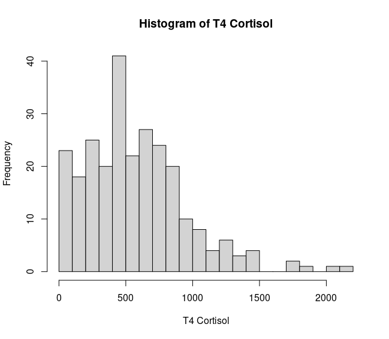
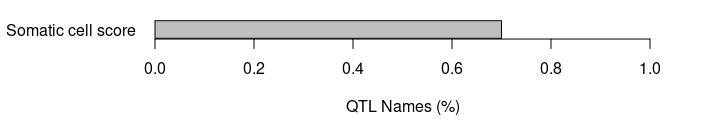
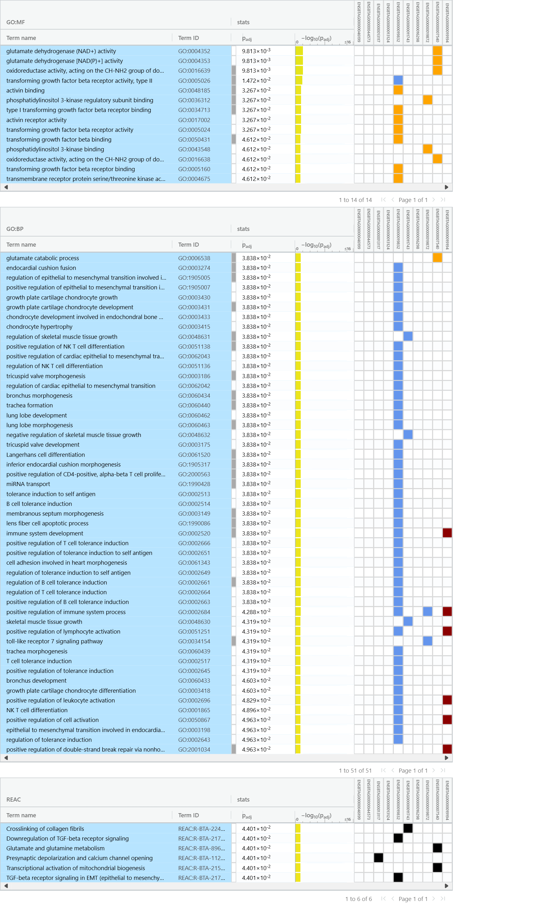

# Raw data
```{r eval=FALSE}
data <- read.csv("/home/bambrozi/2_CORTISOL/Data/T4_Elora_Data_04_25_2024.csv")

# Replace "treated" with NA
data$T4Cortisol[data$T4Cortisol == "treated" | data$T4Cortisol == "Treated at T2" | data$T4Cortisol == "treated at T2"] <- NA
# Convert the column to numeric, coercing non-numeric values to NA
data$T4Cortisol <- as.numeric(as.character(data$T4Cortisol))
#Filtering only the lines with values
data <- data[!is.na(data$T4Cortisol),]
#creating new data file cleaned  
write.csv(data, "/home/bambrozi/2_CORTISOL/Data/data_clean.csv", row.names = F)

print(data)
```

# Continuous Phenotype

```{r eval=FALSE}
# Summary Statistics
summary(data$T4Cortisol)
# Histogram
hist(data$T4Cortisol, breaks = 20, main = "Histogram of T4 Cortisol", xlab = "T4 Cortisol")
# Boxplot
boxplot(data$T4Cortisol, main = "Boxplot of T4 Cortisol", ylab = "T4 Cortisol")
# Density Plot
plot(density(data$T4Cortisol), main = "Density Plot of T4 Cortisol", xlab = "T4 Cortisol", ylab = "Density")
# Calculate the theoretical quantiles
qqnorm(data$T4Cortisol, main = "QQ Plot of T4Cortisol", xlim = c(min(qqnorm(data$T4Cortisol)$x), max(qqnorm(data$T4Cortisol)$x)), ylim = c(min(qqnorm(data$T4Cortisol)$y), max(qqnorm(data$T4Cortisol)$y) + 2 * IQR(qqnorm(data$T4Cortisol)$y)))
# Add the QQ line
qqline(data$T4Cortisol, col = "red")
```


**Summary statistics**


**Histogram**


**Density**


**Box_Plot**


**qq_Plot**


**Shapiro-Wilk normality test**


## Categorical Phenotype

I received from Umesh a e-mail informing the three categories that the animals could be sorted based on their cortisol concentration.


```{r eval=FALSE}

data$Categorical <- ifelse(data$T4Cortisol >= 956, "H", 
                           ifelse(data$T4Cortisol <= 190.8, "L", "M"))

table(data$Categorical)
library(ggplot2)

# Reorder the levels of the 'Categorical' column
data$Categorical <- factor(data$Categorical, levels = c("L", "M", "H"))

# Create the histogram with reordered categories
ggplot(data, aes(x = Categorical, fill = Categorical)) +
  geom_bar() +
  labs(title = "Histogram of T4Cortisol by Category",
       x = "Category",
       y = "Frequency") +
  theme_minimal()

# Create the histogram
ggplot(data, aes(x = T4Cortisol, fill = Categorical)) +
  geom_histogram(binwidth = 50, color = "black", alpha = 0.7) + # Adjust binwidth as needed
  labs(title = "Histogram of T4Cortisol with Color by Category",
       x = "T4 Cortisol",
       y = "Frequency",
       fill = "Category") +
  scale_fill_manual(values = c("H" = "red", "M" = "blue", "L" = "green")) + # Adjust colors if needed
  theme_minimal()

# Create the density plot
ggplot(data, aes(x = T4Cortisol, fill = Categorical)) +
  geom_density(alpha = 0.3) +
  labs(title = "Density Plot of T4Cortisol with Color by Category",
       x = "T4Cortisol",
       y = "Density",
       fill = "Category") +
  scale_fill_manual(values = c("H" = "red", "M" = "blue", "L" = "green")) + # Adjust colors if needed
  theme_minimal()

# Create a density plot
ggplot(data, aes(x = T4Cortisol)) +
  geom_density() +
  geom_vline(xintercept = c(956, 190.8), linetype = "dashed", color = "red") +
  labs(title = "Density Plot of T4Cortisol with Vertical Lines",
       x = "T4Cortisol",
       y = "Density") +
  theme_minimal()
```

The animals were sorted in these three categories 
>H = Hight
>M = Medium
>L = Low


The individuals frequency distribution in theese categories are shown in the plots below


## Removing "outliers"

Observing the previous plots I tried to **remove the "outliers"** phenotypes above 1250, but the outcome from Shapiro test is still indicating no normality of the data.

```{r eval=FALSE}
library(tidyverse)

data_no_out <- filter(data, T4Cortisol < 1250)

# Create QQ plot
qqnorm(data_no_out$T4Cortisol, main = "QQ Plot of T4Cortisol", xlab = "Theoretical Quantiles", ylab = "Sample Quantiles")
qqline(data$T4Cortisol, col = "red")

boxplot(data_no_out$T4Cortisol, main = "Boxplot of T4 Cortisol", ylab = "T4 Cortisol")

hist(data_no_out$T4Cortisol, breaks = 20, main = "Histogram of T4 Cortisol", xlab = "T4 Cortisol")

shapiro.test(data$T4Cortisol)
```


# GENOTYPES

Lucas Alcântara sent me the path to the genotype and pedigree files:
/data/cgil/daiclu/6_Data/database/public_output/bruno


In this folder we found the following files:

<ul>
<li>**bruno_gntps.txt**: the file with the genotypes in  **012 format**
<li>**bruno_ids.csv**: file with elora_id, cdn_id, iid
<li>**bruno_ped.id.csv**: pedigree with cdn_id
<li>**bruno_ped.iid.csv**: pedigree with iid
</ul>

I made a copy of this files in a folder called **Raw_files**:

<span style="color: blue;">/home/bambrozi/2_CORTISOL/RawFiles</span>

This directory has two sub-directories:
<ul>
<li> Genotypes
<li> Pedigree
</ul>


## Transforming the Genotypes in 012 format to plink format

To perfome this I used two codes

1) Add "column names"
```{bash eval=F}
sed -i '1i id Call' genotypes.txt
```


2) Recode in python
```{python eval=FALSE, python.reticulate = FALSE}
filename = 'bruno_gntps.txt'

outputFileOpen = open('genoplink.ped','w')


recode = {'0':['C','C'] , '1':['A','C'] , '2':['A','A'] , '5':['0','0'] }
for line in open(filename,'r'):
    if 'Call' in line : continue


    ids, call = line.strip().split()
    genotypes = [ recode[geno012][0] +' '+ recode[geno012][1] for geno012 in call ]


    outputFileOpen.write("%s %s %s %s %s %s %s\n" % ('HO', ids, '0','0','0','-9',' '.join(genotypes)) )

```

Now I have a folder called **/home/bambrozi/2_CORTISOL/Geno_files** with the file named **genoplink.ped**

# GWAS

## Checking with Phenotyped Animals also have Genotype
```{r eval=FALSE}
library(data.table)

pheno <- read.csv("/home/bambrozi/2_CORTISOL/Data/data_clean.csv")
ped <- read.csv("/home/bambrozi/2_CORTISOL/RawFiles/Pedigree/bruno_ids.csv")
geno <- fread("/home/bambrozi/2_CORTISOL/Geno_files/genoplink.ped")
geno <- geno[,c("V2")]

#Bringing cdn_id to my phenotype file
#Generate a index with the match
matching_indices <- match(pheno$ID, ped$elora_id)
# Then, assign 'cdn_id' from 'ped' to 'pheno' where there are matches
pheno$cdn_id <- ifelse(!is.na(matching_indices), ped$cdn_id[matching_indices], NA)

#Making a phenotype file only with genotyped animals
pheno_genotyped <- pheno[pheno$cdn_id %in% geno$V2,] 

#check if all animals in this file are genotyped
checkk <- pheno_genotyped$cdn_id %in% geno$V2
sum(checkk)
```


## Generating a Phenotype file

The phenotype file should have three columns: FID, Animal_id, Phenotype

```{r eval=FALSE}
HO <- rep("HO", 252)

pheno_gwas <- as.data.frame(cbind(HO, pheno_genotyped$cdn_id, pheno_genotyped$T4Cortisol))

colnames(pheno_gwas) <- c("FID", "cdn_id", "cortisol")

pheno_gwas$cdn_id <-  as.numeric(pheno_gwas$cdn_id)
pheno_gwas$cortisol <- round(as.numeric(pheno_gwas$cortisol),2)

write.table(pheno_gwas, "/home/bambrozi/2_CORTISOL/GWAS/pheno_genotyped.txt", quote = F, row.names = F, col.names = T)
```

## Adjusting the SNP_map to .map
```{r eval=FALSE}
map <- fread("/data/cgil/daiclu/6_Data/database/public_output/bruno/DGVsnpinfo.2404.ho")
morgan <- data.frame(X0 = rep(0, 45101))
mapa=as.data.frame(cbind(map$chr, map$snp_name, morgan$X0, map$location))
head(mapa)
write.table(x = mapa, file = "/home/bambrozi/2_CORTISOL/Geno_files/genoplink.map", row.names = FALSE, col.names = FALSE, sep = "\t", quote = FALSE)
```

## Generating the bfiles

```{r eval=FALSE}
system("/home/local/bin/plink --cow --nonfounders --allow-no-sex --keep-allele-order --file /home/bambrozi/2_CORTISOL/Geno_files/genoplink --make-bed --out /home/bambrozi/2_CORTISOL/Geno_files/genoplink")
```

With the code above I generated the bfiles:
<ul>genoplink.bed
<li>genoplink.bim
<li>genoplink.fam
<li>genoplink.log
<li>genoplink.nosex
</ul>


# Quality Control

We ran the code below to perfom the QC

```{bash eval=F}
#!/bin/bash

DATA=/home/bambrozi/2_CORTISOL/Geno_files/genoplink
RESULT=/home/bambrozi/2_CORTISOL/Geno_files_after_QC/genoplink_clean

/home/local/bin/plink \
    --bfile ${DATA} \
    --cow \
    --allow-no-sex \
    --hwe 1e-5 \
    --maf 0.01 \
    --geno 0.1 \
    --mind 0.1 \
    --keep-allele-order \
    --make-bed \
    --out ${RESULT}
    
```


The server screen outcome is shown below.


After the Quality Control we ended up with

<ul>
<li> 252 samples
<li> 42,278 variants (SNPs)
</ul>

# KING

To check for duplicated individuals I performed the KINSHIP analysis using one script from Larissa Braga. Running the King Analysis on Plink.

```{bash eval = FALSE}
#!/bin/bash

DATA=/home/bambrozi/Extrm_ARS1_GrassHill_1/GENOTYPES/ONLY_GRASSHILL_AND_PHENO_after_QC/only_grasshill_and_pheno_clean
RESULT=/home/bambrozi/Extrm_ARS1_GrassHill_1/GENOTYPES/KING/result_king

plink2 \
    --bfile ${DATA} \
    --chr-set 29 \
    --make-king-table \
    --out ${RESULT}
```

This is the output screen on terminal:


The table below is the output <span style="color: blue;">/home/bambrozi/2_CORTISOL/Geno_files_after_KING/result_king.kin0</span> and have pairwise comparisons between all individuals. 


Now we should open in R and check for individuals with more than 0,354, to perform this we can use the code below, also provided by Larissa Braga:

```{r eval=FALSE}
setwd("/home/bambrozi/2_CORTISOL/Geno_files_after_KING")

relatedness="result_king.kin0" ## change accordingly!!

library(data.table)

print(relatedness)
rel=fread(relatedness, h = T)
head(rel)

print("Individuals with different identifications above the cut off of 0.354:")
dup=subset(rel, KINSHIP >= 0.354  & IID1!=IID2)
print(dup)
nrow(dup)

```

So the code above will provide this output if there is any duplicated individual.


**We do not have any duplicated individual**

So the file to be used are those in the directory <span style="color: blue;">/home/bambrozi/2_CORTISOL/Geno_files_after_QC</span>

>files:genoplink_clean

After Quality Control we didn't lost any animal, so we don't need to update our phenotype file

# PCA

Now before performing the PCA analysis we need to change the FID for those individuals that has phenotype = **1** for Nadia.


```{bash eval=F}
#!/bin/bash

DATA=/home/bambrozi/Extrm_ARS1_GrassHill_1/PCA/imput_pca
RESULT=/home/bambrozi/Extrm_ARS1_GrassHill_1/PCA/pca_result

plink \
    --bfile ${DATA} \
    --keep-allele-order \
    --chr-set 29 \
    --pca \
    --out ${RESULT}

```

The PCA output:


### PCA Plot

After generate the Eigenvalues and Eigenvectors I used the code below to generate the PCA Plot

```{r eval=FALSE}
setwd("/home/bambrozi/2_CORTISOL/PCA")

library(ggplot2) 
library(tidyverse)

##
# Visualize PCA results
###

# read in result files
eigenValues <- read_delim("pca_result.eigenval", delim = " ", col_names = F)
eigenVectors <- read_delim("pca_result.eigenvec", delim = " ", col_names = F)

## Proportion of variation captured by each vector
eigen_percent <- round((eigenValues / (sum(eigenValues))*100), 2)


# PCA plot
png("pca-plink.eng.png", width=5, height=5, units="in", res=300)
ggplot(data = eigenVectors) +
  geom_point(mapping = aes(x = X3, y = X4), color = "red", shape = 19, size = 1, alpha = 1) +
  geom_hline(yintercept = 0, linetype="dotted") +
  geom_vline(xintercept = 0, linetype="dotted") +
  labs(x = paste0("Principal component 1 (", eigen_percent[1,1], " %)"),
       y = paste0("Principal component 2 (", eigen_percent[2,1], " %)")) +
  theme_minimal()
dev.off()


# PCA plot with animal ids
png("pca-plink.eng.animals_id.png", width=50, height=50, units="in", res=300)
ggplot(data = eigenVectors) +
  geom_point(mapping = aes(x = X3, y = X4), color = "red", shape = 19, size = 5, alpha = 1) +
  geom_text(mapping = aes(x = X3, y = X4, label = X2), size = 2, hjust = 0, vjust = 0) +  # Add labels for animal IDs
  geom_hline(yintercept = 0, linetype="dotted") +
  geom_vline(xintercept = 0, linetype="dotted") +
  labs(x = paste0("Principal component 1 (", eigen_percent[1,1], " %)"),
       y = paste0("Principal component 2 (", eigen_percent[2,1], " %)")) +
  theme_minimal()
dev.off()
```


# GWAS on GCTA


```{bash eval=F}
#!/bin/bash

DATA=/home/bambrozi/2_CORTISOL/Geno_files_after_QC/genoplink_clean
RESULT=/home/bambrozi/2_CORTISOL/GWAS/GWAS_result
PHENO=/home/bambrozi/2_CORTISOL/GWAS/pheno_genotyped.txt

/home/local/bin/gcta \
    --bfile ${DATA} \
    --mlma-loco \
    --pheno ${PHENO} \
    --autosome-num 29 \
    --autosome \
    --out ${RESULT}

```

This is te output from the code above:


## Manhattan Plot - Bonferroni 


```{r eval=FALSE}
gwas<- read.table(file = "/home/bambrozi/2_CORTISOL/GWAS/GWAS_result.loco.mlma", 
                  head=T, stringsAsFactors = F)
gwas$Chr<- as.factor(gwas$Chr)
gwas$logP<- -log10(gwas$p)
rmv<- which(gwas$logP == "NaN")
if (length(rmv) >=1) {gwas <- gwas[-rmv,]}
bonf<- -log10(0.05/nrow(gwas))

library(GHap)
ghap.manhattan(data=gwas,chr="Chr", bp="bp", y="logP", type="p", pch = 20, 
               cex=1, lwd=1, ylab="", xlab="Chromossomes", 
               main="GWAS Cortisol", backcolor="#F5EFE780", chr.ang=0,)
abline(h=(bonf), col="red2")
legend("topleft", col="red2", lwd=2, c("Bonferroni correction"), bty="n")

```

The code above creates a Manhattam Plot, the correction for multiple test is the Bonferroni correction


The code below will save information of Significant SNP.
```{r eval=FALSE}
library(tidyverse)

SNP_sig_bonf <- filter(gwas, logP > bonf)
write.table(SNP_sig_bonf, file = "/home/bambrozi/2_CORTISOL/GWAS/SNP_sig_Bonf.txt", 
            quote = FALSE, sep = "\t", row.names = FALSE, col.names = T)
```

Below we can see the 1 significant SNP for Bonferroni correction.


## FDR


```{r eval=FALSE}

gwas$bh <- p.adjust(gwas$p, method = "BH") #FDR 

```

The code below will create a file with the significant snp for FDR-BH

```{r eval=FALSE}
SNP_sig_BH <- filter(gwas, bh < 0.05)
write.table(SNP_sig_BH, file = "/home/bambrozi/2_CORTISOL/GWAS/SNP_sig_BH.txt", 
            quote = FALSE, sep = "\t", row.names = FALSE, col.names = T)
```

As outcome we can see that the FDR-BH method didn't increase the number of significant SNP.


## Corrected Bonferroni for genome independent segments

Now we are going to apply a correction for multiple testing modifying the Bonferroni test adjusting not for the total number of SNPs but for the number of the independent segments in the genome.

```{r eval=FALSE}
Genome_Assembly_ARS_UCD_1_2 <- read_tsv("/home/bambrozi/2_CORTISOL/GWAS/sequence_report_ARS-UCD1_2.tsv")

library(dplyr)
# Filter the rows and sum the Seq length column
# Assuming your data frame is named Genome_Assembly_ARS_UCD_1_2
L <- Genome_Assembly_ARS_UCD_1_2 %>%
  filter(`UCSC style name` %in% paste0("chr", 1:29)) %>%
  summarise(total_length = sum(`Seq length`)) %>%
  pull(total_length)

# Converting bases to Morgan (1Mb = 1cM (0,01 Morgan))
L_M <- L/10^8

# The Ne measure is based on the article bellow:
Ne <- 66 #(Makanjoula et al., 2020)

NeL <- Ne*L_M

# This is the number of independent segment in the genome.
Me <- (2*NeL)/log10(NeL)


gwas<- read.table(file = "/home/bambrozi/2_CORTISOL/GWAS/GWAS_result.loco.mlma", 
                  head=T, stringsAsFactors = F)

gwas$Chr<- as.factor(gwas$Chr)
gwas$logP<- -log10(gwas$p)
rmv<- which(gwas$logP == "NaN")
if (length(rmv) >=1) {gwas <- gwas[-rmv,]}

bonf<- -log10(0.05/Me)

library(GHap)
ghap.manhattan(data=gwas,chr="Chr", bp="bp", y="logP", type="p", pch = 20, 
               cex=1, lwd=1, ylab="", xlab="Chromossomes", 
               main="GWAS Cortisol", backcolor="#F5EFE780", chr.ang=0,)
abline(h=(bonf), col="red2")
legend("topleft", col="red2", lwd=2, c("Bonferroni corr. for ind. segments"), bty="n")


library(tidyverse)

SNP_sig_bonf_ind_seg <- filter(gwas, logP > bonf)
write.table(SNP_sig_bonf_ind_seg, file = "/home/bambrozi/2_CORTISOL/GWAS/SNP_sig_Bonf_ind_seg.txt", 
            quote = FALSE, sep = "\t", row.names = FALSE, col.names = T)

```


Below we can find the list of significant SNPs after the correction for Multiple Testing


# qqPlot

I performed the qqPlot analysis using the code below:

```{r eval=FALSE}
gwas<- read.table("GWAS_result.loco.mlma", h=T)
ps<- gwas$p
inflation <- function(ps) {
  chisq <- qchisq(1 - ps, 1)
  lambda <- median(chisq) / qchisq(0.5, 1)
  lambda
}
# Calculating the lambda -  the lambda statistic should be close to 1 if
#the points fall within the expected range, or greater than one if 
# the observed p-values are more significant than expected.
inflation(ps)

bonf<- -log10(0.05/nrow(gwas))

gwas$log<- -log10(gwas$p)

gg_qqplot <- function(ps, ci = 0.95) {
  n  <- length(ps)
  df <- data.frame(
    observed = -log10(sort(ps)),
    expected = -log10(ppoints(n)),
    clower   = -log10(qbeta(p = (1 - ci) / 2, shape1 = 1:n, shape2 = n:1)),
    cupper   = -log10(qbeta(p = (1 + ci) / 2, shape1 = 1:n, shape2 = n:1))
  )
  log10Pe <- expression(paste("Expected -log"[10], plain(P)))
  log10Po <- expression(paste("Observed -log"[10], plain(P)))
  ggplot(df) +
    geom_ribbon(
      mapping = aes(x = expected, ymin = clower, ymax = cupper),
      alpha = 0.1
    ) +
    geom_point(aes(expected, observed), shape = 1, size = 3) +
    geom_abline(intercept = 0, slope = 1, alpha = 0.5) +
    # geom_line(aes(expected, cupper), linetype = 2, size = 0.5) +
    # geom_line(aes(expected, clower), linetype = 2, size = 0.5) +
    xlab(log10Pe) +
    ylab(log10Po)
}

## plot -----
gg_qqplot(ps) +
  theme_bw(base_size = 24) +
  annotate(
    geom = "text",
    x = -Inf,
    y = Inf,
    hjust = -0.15,
    vjust = 1 + 0.15 * 3,
    label = sprintf("λ = %.2f", inflation(ps)),
    size = 8
  ) +
  theme(
    axis.ticks = element_line(size = 0.5),
    panel.grid = element_blank()
    # panel.grid = element_line(size = 0.5, color = "grey80")
  )

```

The outcome is the qqplot below, and the lambda value is **$\lambda$ = 1.03**


# GALLO 

```{r eval=FALSE}
# GALLO

#import a QTL annotation file
qtl_UCD1_2 <- import_gff_gtf(db_file="/home/bambrozi/2_CORTISOL/GALLO/Animal_QTLdb_release53_cattleARS_UCD1.gff.gz",file_type="gff")

#import a gene annotation file
gene_UDC1_2 <- import_gff_gtf(db_file="/home/bambrozi/2_CORTISOL/GALLO/Bos_taurus.ARS-UCD1.2.110.gtf.gz",file_type="gtf")

#import MARKER files = the GWAS output
gwas <- read.table(file = "/home/bambrozi/2_CORTISOL/GWAS/SNP_sig_Bonf_ind_seg.txt", 
                   head=T, stringsAsFactors = F)

# Assuming "gwas" is your dataframe
gwas <- subset(gwas, select = c(Chr, SNP, bp))


colnames(gwas) <- c("CHR","SNP", "BP")


#FINDING GENES AND QTLs ARROUND THE MARKER

#FINDING GENES
out.genes <- find_genes_qtls_around_markers(db_file= gene_UDC1_2, 
                                            marker_file= gwas, 
                                            method = "gene",
                                            marker = "snp", 
                                            interval = 50000, 
                                            nThreads = NULL)

write.table(out.genes, file = "/home/bambrozi/2_CORTISOL/GALLO/out_genes_50k.txt", 
            quote = FALSE, sep = "\t", row.names = FALSE, col.names = T)

write.csv(out.genes, file = "/home/bambrozi/2_CORTISOL/GALLO/out_genes_50k.csv")

#FINDING QTLs

out.qtl <- find_genes_qtls_around_markers(db_file= qtl_UCD1_2, 
                                          marker_file= gwas, 
                                          method = "qtl",
                                          marker = "snp", 
                                          interval = 50000, 
                                          nThreads = NULL)


write.table(out.qtl, file = "/home/bambrozi/2_CORTISOL/GALLO/out_qtl_50k.txt", 
            quote = FALSE, sep = "\t", row.names = FALSE, col.names = T)

library(tidyverse)
out.qtl.clean <- select(out.qtl, c("CHR", "SNP", "BP", "QTL_type", "start_pos", "end_pos","QTL_ID"))
write.csv(out.qtl.clean, file = "/home/bambrozi/2_CORTISOL/GALLO/out_qtl_50k_clean.csv")


```


Dowloading the .gtf file from Ensembl
<https://useast.ensembl.org/info/data/ftp/index.html>

Downloading the .gff file from AnimalQTLdb
<https://www.animalgenome.org/cgi-bin/QTLdb/index>


The GALLO output are bellow:

**For GENES**
```{r echo=FALSE}
# Read the CSV file into a data frame
data <- read.csv("C:/Users/galin/OneDrive - University of Guelph/0.Post doc/4_Cortisol/Git_Cortisol/out_genes_50k.csv")

# Print the table using knitr::kable
knitr::kable(data)

```

**FOR QTLs**
```{r echo=FALSE}
# Read the CSV file into a data frame
data <- read.csv("C:/Users/galin/OneDrive - University of Guelph/0.Post doc/4_Cortisol/Git_Cortisol/out_qtl_50k_clean.csv")

# Print the table using knitr::kable
knitr::kable(data)

```

## QTL annotation on GALLO

**QTL type**
```{r eval=FALSE}
#GALLO
par(mar=c(8,20,8,8))
plot_qtl_info(out.qtl, qtl_plot = "qtl_type", cex=1)
```

  

**QTL type**
```{r eval=FALSE}
#GALLO
par(mar=c(10,20,10,10))
plot_qtl_info(out.qtl, qtl_plot = "qtl_name", qtl_class="Reproduction")

par(mar=c(10,20,10,10))
plot_qtl_info(out.qtl, qtl_plot = "qtl_name", qtl_class="Health")
```

**Reproduction**
  

**Health**
  

## QTL enrichment on GALLO

```{r eval=FALSE}
#GALLO
#QTL enrichment analysis 
out.enrich_qtl_name <-qtl_enrich(qtl_db= qtl_UCD1_2, 
                                 qtl_file= out.qtl, qtl_type = "Name",
                                 enrich_type = "genome", chr.subset = NULL, 
                                 padj = "fdr",nThreads = 2)


# Sorting the dataframe in ascending order of adj.pval
sorted_df <- out.enrich_qtl_name[order(out.enrich_qtl_name$adj.pval), ]

write.csv(sorted_df,"/home/bambrozi/2_CORTISOL/GALLO/out_enrich_qtl_genome_name.csv")

out.enrich_qtl_type <-qtl_enrich(qtl_db= qtl_UCD1_2, 
                                 qtl_file= out.qtl, qtl_type = "QTL_type",
                                 enrich_type = "genome", chr.subset = NULL, 
                                 padj = "fdr",nThreads = 2)

sorted_df_type <- out.enrich_qtl_type[order(out.enrich_qtl_type$adj.pval), ]
write.csv(out.enrich_qtl_type,"/home/bambrozi/2_CORTISOL/GALLO/out_enrich_qtl_genome_type.csv")

#Plots

#Name

#Creating a new ID composed by the trait and the chromosome
out.enrich_qtl_name$ID<-paste(out.enrich_qtl_name$QTL," - ","CHR",out.enrich_qtl_name$CHR,sep="")

#Match the QTL classes and filtering the Reproduction related QTLs
out.enrich.filtered<-out.enrich_qtl_name[which(out.enrich_qtl_name$adj.pval<0.05),]

#Plotting the enrichment results for the QTL enrichment analysis
QTLenrich_plot(out.enrich.filtered, x="ID", pval="adj.pval")


#Type

#Creating a new ID composed by the trait and the chromosome
out.enrich_qtl_type$ID<-paste(out.enrich_qtl_type$QTL," - ","CHR",out.enrich_qtl_type$CHR,sep="")

#Match the QTL classes and filtering the Reproduction related QTLs
out.enrich.filtered_type<-out.enrich_qtl_type[which(out.enrich_qtl_type$adj.pval<0.05),]

#Plotting the enrichment results for the QTL enrichment analysis
QTLenrich_plot(out.enrich.filtered_type, x="ID", pval="adj.pval")


 
```

**QTL Enrichment outcomes**

**Enrichment by name** (enrichment analysis will be performed for each trait individually)
```{r echo=FALSE}
# Read the CSV file into a data frame
data <- read.csv("C:/Users/galin/OneDrive - University of Guelph/0.Post doc/4_Cortisol/Git_Cortisol/out_enrich_qtl_genome_name.csv")

# Print the table using knitr::kable
knitr::kable(data)

```

  

**Enrichment by QTL_type** (enrichment processes performed for the QTL classes)
```{r echo=FALSE}
# Read the CSV file into a data frame
data <- read.csv("C:/Users/galin/OneDrive - University of Guelph/0.Post doc/4_Cortisol/Git_Cortisol/out_enrich_qtl_genome_type.csv")

# Print the table using knitr::kable
knitr::kable(data)

```


 

# GPROFILER

online version: <https://biit.cs.ut.ee/gprofiler/gost>

I got a script from Julia Rodrigues about the R package GPROFILER to perform an enrichment of my Genes.
```{r eval=FALSE}
### enriquecimento genico
#install.packages("gprofiler2")
library(gprofiler2)

#Para conferir a lista de organism -> https://biit.cs.ut.ee/gprofiler/page/organism-list

#Obs: eu entro com os ids ENSOAR...
query <- read.table ("/home/bambrozi/2_CORTISOL/GALLO/out_genes_50k.txt", header = T)
query <- query[,c("gene_id")]

gene_enrich <- gost(
  query,
  organism = "btaurus", 
  ordered_query = FALSE,
  multi_query = FALSE,
  significant = TRUE,
  exclude_iea = FALSE,
  measure_underrepresentation = FALSE,
  evcodes = TRUE,
  user_threshold = 0.05,
  correction_method = c("fdr"),
  domain_scope = c("annotated"),
  numeric_ns = "",
  sources = NULL,
  as_short_link = FALSE,
  highlight = FALSE
)


#str(gene_enrich) # para ver o formato dos meus dados

#selecionando apenas as informações da lista que me interessam para fazer meu data.frame 
result_enrich <- data.frame(gene_enrich$result)
result_enrich <- data.frame(Category = result_enrich$source,
                            ID = result_enrich$term_id,
                            Term = result_enrich$term_name,
                            adj_pvalue = result_enrich$p_value,
                            id_ensembl = result_enrich$intersection)

write.table(result_enrich,"/home/bambrozi/2_CORTISOL/GPROFILER/gene_enrich.txt", col.names=TRUE, row.names=FALSE, sep="\t", quote=F)
write.csv(result_enrich,"/home/bambrozi/2_CORTISOL/GPROFILER/gene_enrich.csv")
```

Below we can se the significant terms of this enrichment (output):

```{r echo=FALSE}
# Read the CSV file into a data frame
data <- read.csv("C:/Users/galin/OneDrive - University of Guelph/0.Post doc/4_Cortisol/Git_Cortisol/gene_enrich.csv")

# Print the table using knitr::kable
knitr::kable(data)

```


## GPROFILER ON-LINE

From the online version of GPROFILER i got the following results.

**Legend**





Additionaly I perfomed a another version of this analysis but with **no eletronic GO annotation**


## Terms distribution Pie Chart
Now I'm gonna make a pie chart with the categories

```{r eval=FALSE}
library(ggplot2)

# Assuming sig_enrich$Category contains the categories
category_counts <- table(result_enrich$Category)

# Create a pie chart
pie_chart <- ggplot(data = NULL, aes(x = factor(1), fill = names(category_counts), y = as.numeric(category_counts))) +
  geom_bar(stat = "identity", width = 1) +
  coord_polar(theta = "y") +
  labs(title = "Distribution among terms",
       x = NULL,
       y = NULL,
       fill = "Category") +
  theme_void() +
  theme(legend.position = "right")

# Print the pie chart
print(pie_chart)

```

